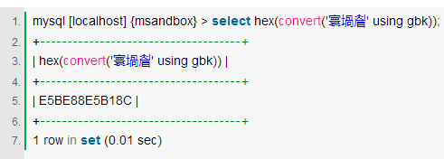

为什么要有字符集
================

我们在计算机屏幕上看到的是**实体化的文字**，而在计算机存储介质中存放的实际是**二进制的比特流**。那 么在这两者之间的**转换规则**就需要一个统一的标准，否则把我们的U盘插到老板的电脑上，文档就乱码了；小伙伴QQ上传过来的文件，在我们本地打开又乱码了。

[*http://os.51cto.com/art/201503/467929.htm*](http://os.51cto.com/art/201503/467929.htm)

什么是字符集
============

字符集就规定了某个文字对应的二进制数字存放方式（编码）和某串二进制数值代表了哪个文字（解 码）的转换关系。

为什么会有那么多字符集标准呢？
==============================

这个问题实际非常容易回答。问问自己为什么我们的插头拿到英国就不能用了呢？为什么显示器同时有 DVI，VGA，HDMI，DP这么多接口呢？很多规范和标准在最初制定时并不会意识到这将会是以后全球普适的准则，或者处于组织本身利益就想从本质上区 别于现有标准。于是，就产生了那么多具有相同效果但又不相互兼容的标准了。

![C:\\Users\\zhangjing1\\AppData\\Roaming\\Tencent\\Users\\463261929\\QQ\\WinTemp\\RichOle\\Q}\$JXH5@49U\_9ST@33UOT\]G.png](encoder_trietree_images/media/image1.png){width="4.53125in" height="1.75in"}

什么是字符编码
==============

字符集只是一个规则集合的名字，对应到真实生活中，字符集就是对某种语言的称呼。例如：英语，汉语，日语。对于一个字符集来说要正确编码转码一个字符需要三个关键元素：字库表（character repertoire）、编码字符集（coded character set）、字符编码（character encoding form）。

**字库表**: 是一个相当于所有可读或者可显示字符的数据库，字库表决定了整个字符集能够展现表示的所有字符的范围。

**编码字符集**，即用一个编码值 code point来表示一个字符在字库中的位置。

**字符编码**，将编码字符集和实际存储数值之间的转换关系。

一般来说都会直接将code point的值作为编码后的值直接存储。例如在ASCII中A在表中排第65位，而编码后A的数值是0100 0001也即十进制的65的二进制转换结果。

看到这里，可能很多读者都会有和我当初一样的疑问：字库表和编码字符集看来是必不可少的，那既然字库表中的每一个字符都有一个自己的序号，直接把序号作为存储内容就好了。为什么还要多此一举通过字符编码把序号转换成另外一种存储格式呢？

其实原因也比较容易理解：统一字库表的目的是为了能够涵盖世界上所有的字符，但实际使用过程中会发现真正用的上的字符相对整个字库表来说比例非常 低。例如中文地区的程序几乎不会需要日语字符，而一些英语国家甚至简单的ASCII字库表就能满足基本需求。而如果把每个字符都用字库表中的序号来存储的 话，每个字符就需要3个字节（这里以Unicode字库为例），这样对于原本用仅占一个字符的ASCII编码的英语地区国家显然是一个额外成本（存储体积 是原来的三倍）。算的直接一些，同样一块硬盘，用ASCII可以存1500篇文章，而用3字节Unicode序号存储只能存500篇。于是就出现了 UTF-8这样的变长编码。在UTF-8编码中原本只需要一个字节的ASCII字符，仍然只占一个字节。而像中文及日语这样的复杂字符就需要2个到3个字 节来存储。

UTF-8和Unicode的关系
====================

看完上面两个概念解释，那么解释UTF-8和Unicode的关系就比较简单了。Unicode就是上文中提到的编码字符集，而UTF-8就是字符 编码，即Unicode规则字库的一种实现形式。随着互联网的发展，对同一字库集的要求越来越迫切，Unicode标准也就自然而然的出现。它几乎涵盖了 各个国家语言可能出现的符号和文字，并将为他们编号。详见：[*Unicode on Wikipedia*](http://en.wikipedia.org/wiki/Unicode)。

Unicode的编号从0000开始一直到10FFFF共分为16个Plane，每个Plane中有65536(2\^16)个字符。而UTF-8则只实现了第一 个Plane，可见UTF-8虽然是一个当今接受度最广的字符集编码，但是它并没有涵盖整个Unicode的字库，这也造成了它在某些场景下对于特殊字符 的处理困难（下文会有提到）。

UTF-8编码简介
=============

为了更好的理解后面的实际应用，我们这里简单的介绍下UTF-8的编码实现方法。即UTF-8的物理存储和Unicode序号的转换关系。

UTF-8编码为变长编码。最小编码单位（code unit）为一个字节。一个字节的前1-3个bit为描述性部分，后面为实际序号部分。

如果一个字节的第一位为0，那么代表当前字符为单字节字符，占用一个字节的空间。0之后的所有部分（7个bit）代表在Unicode中的序号。

如果一个字节以110开头，那么代表当前字符为双字节字符，占用2个字节的空间。110之后的所有部分（7个bit）代表在Unicode中的序号。且第二个字节以10开头

如果一个字节以1110开头，那么代表当前字符为三字节字符，占用2个字节的空间。110之后的所有部分（7个bit）代表在Unicode中的序号。且第二、第三个字节以10开头

如果一个字节以10开头，那么代表当前字节为多字节字符的第二个字节。10之后的所有部分（6个bit）代表在Unicode中的序号。

具体每个字节的特征可见下表，其中x代表序号部分，把各个字节中的所有x部分拼接在一起就组成了在Unicode字库中的序号

{width="2.78125in" height="1.71875in"}

为什么会出现乱码
================

简单的说乱码的出现是因为：编码和解码时用了不同或者不兼容的字符集。对应到真实生活中，就好比是一个英国人为了表示祝福在纸上写了bless（编 码过程）。而一个法国人拿到了这张纸，由于在法语中bless表示受伤的意思，所以认为他想表达的是受伤（解码过程）。这个就是一个现实生活中的乱码情况。在计算机科学中一样，一个用UTF-8编码后的字符，用GBK去解码。由于两个字符集的字库表不一样，同一个汉字在两个字符表的位置也不同，最终就会 出现乱码。

如何识别乱码的本来想要表达的文字
================================

要从乱码字符中反解出原来的正确文字需要对各个字符集编码规则有较为深刻的掌握。但是原理很简单，这里用最常见的UTF-8被错误用GBK展示时的乱码为例，来说明具体反解和识别过程.

#### 第1步 编码

先通过GBK把乱码编码成二进制表达式。当然查表编码效率很低，我们也可以用以下SQL语句直接通过MySQL客户端做编码工作：

{width="5.114583333333333in" height="1.8333333333333333in"}

第2步 识别
==========

现在我们得到了**解码后的二进制字符串E5BE88E5B18C**。然后我们将它按字节拆开。\
Byte 1Byte 2Byte 3Byte 4Byte 5Byte 6\
E5 BE 88 E5 B1 8C

然后套用之前UTF-8编码介绍章节中总结出的规律，就不难发现这6个字节的数据符合UTF-8编码规则。如果整个数据流都符合这个规则的话，我们就能大胆假设乱码之前的编码字符集是UTF-8

第3步 解码
==========

然后我们就能拿着E5BE88E5B18C用UTF-8解码，查看乱码前的文字了。当然我们可以不查表直接通过SQL获得结果：

![C:\\Users\\zhangjing1\\AppData\\Roaming\\Tencent\\Users\\463261929\\QQ\\WinTemp\\RichOle\\J5I7\_9KG81\$\]KMK7NX\`5\[\~0.png](encoder_trietree_images/media/image4.png){width="6.072916666666667in" height="1.7395833333333333in"}

[GBK与 UTF-8编码](http://www.cnblogs.com/tmscnz/archive/2012/12/12/2815339.html)区别
====================================================================================

**GBK**是国家标准GB2312基础上扩容后兼容GB2312的标准。GBK的文字编码是用双字节来表示的，即不论中、英文字符均使用双字节来表示，为了区分中文，将其最高位都设定成1。GBK包含全部中文字符，是国家编码，通用性比UTF8差，不过UTF8占用的数据库比GBK大。

**UTF-8**：Unicode TransformationFormat-8bit，允许含BOM，但通常不含BOM。是用以解决国际上字符的一种多字节编码，**它对英文使用8位（即一个字节）**，**中文使用24为（三个字节）来编码**。UTF-8包含全世界所有国家需要用到的字符，是国际编码，通用性强。UTF-8编码的文字可以在各国支持UTF8字符集的浏览器上显示。如果是UTF8编码，则在外国人的英文IE上也能显示中文，他们无需下载IE的中文语言支持包。

UTF-8版本虽然具有良好的国际兼容性，但中文需要比GBK/BIG5版本多占用50%的数据库存储空间，因此并非推荐使用，仅供对国际兼容性有特殊要求的用户使用。简单地说：对于中文较多的网站，适宜用GBK编码节省数据库空间。对于英文较多的网站，适宜用UTF-8节省数据库空间。

[文件转换为utf-8编码（python小脚本） ](http://blog.csdn.net/csqazwsxedc/article/details/59186769)
=================================================================================================

手动方式
--------

1.  右键文件；

2.  以notepad++打开；

3.  更改文件编码；

4.  保存。

中英文混合字串的统一编码
========================

[*http://blog.csdn.net/qinbaby/article/details/23201883*](http://blog.csdn.net/qinbaby/article/details/23201883)

字典树
======

[*http://stevehanov.ca/blog/index.php?id=114*](http://stevehanov.ca/blog/index.php?id=114) 主要代码来源

**编辑距离（Edit Distance）**

又称Levenshtein距离，是指两个字串之间，由一个转成另一个所需的最少编辑操作次数。

许可的编辑操作包括将一个字符替换成另一个字符，插入一个字符，删除一个字符。

例如将kitten一字转成sitting：编辑距离=3

sitten （k→s）

sittin （e→i）

sitting （→g）

俄罗斯科学家Vladimir Levenshtein在1965年提出这个概念。
