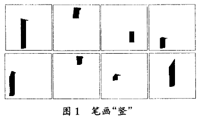
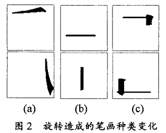
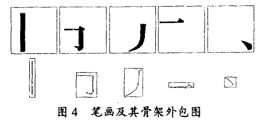
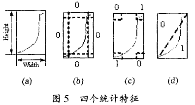
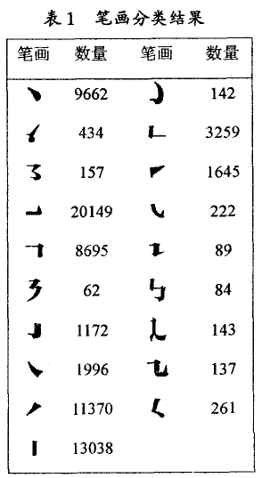
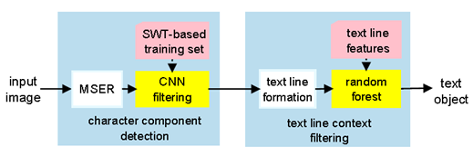
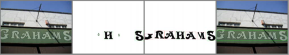
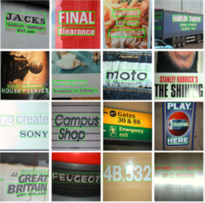

**文字（汉字）识别**——**浅谈笔画识别**

**·什么是笔画识别？**

在[字符识别](http://baike.baidu.com/item/%E5%AD%97%E7%AC%A6%E8%AF%86%E5%88%AB)系统中，用来将每一个[字符](http://baike.baidu.com/item/%E5%AD%97%E7%AC%A6)分解成某几种预定组分的方法。然后利用分析出的各个组分的顺序、相对位置和数目来识别这些字符。

**·中文字符（汉字）的笔画**

笔画是指汉字书写时不间断地一次连续写成的一个线条，它是汉字的最小构成单位，可分为横折、横、竖、竖钩、撇、点、这几类（一、丨、丿和丶），具体细分可达40种。

{width="2.962687007874016in" height="1.7239720034995625in"}

**·按笔画识别的难点**

1.  汉字中有很多字，有相同的笔画（不考虑顺序的情况下），按简单笔画归纳不能区别它们，比如“工”“干”，在按组成单位归纳的时候，这两个汉字都是2个“一”，一个“丨”，单纯用元素数量统计来区分汉字并不能满足识别。

2.  笔画的种类繁多，即使同一字体的同一笔画，在不同汉字或者同一汉字的不同位置都有可能发生局部变形甚至整体几何形状的改变，图1是笔画“竖”的八种不同形态。

3.  有的笔画区别仅仅是旋转角度不同，如图2所示，2(a)为“撇”和“捺”，2(b)为“横”和“竖”，2(c)为“横折”和“竖折”。笔画的特征易变、有交叠并且区分度不大，这使得识别笔画与识别一般的简单几何形状不同，单靠统计方法或者结构特征方法难以区分。由于笔画形状的多变性和旋转相关性，经过实验，许多形状识别的常规方法，如：模板匹配、不变矩、傅里叶描述子，自回归模型等都不适用。因此，目前存在的比较成熟的字处理系统的汉字结构信息库大多采用人工分拣和识别，依靠长期积累和修正。

**·基于笔画的文字识别方法**

1.  *基于笔画和笔顺的识别*

除了每个汉字的笔画特征，笔顺也是决定性的特征，交叉的笔画会产生笔顺，所以我们可以将文字分为有交叉的和没有交叉的。在有交叉笔画的情况下，判断线条是否平行或相交。在没有交叉笔画的情况下，没有交叉的情况下其笔顺先后的判断可以依据笔划的中点位置进行判定。

——**分析：笔画和笔顺的文字识别方法适合于手写板上对实时输入的识别，但是针对图像内的自然场景文字的识别没有很好的效果，因为无法得知笔顺信息。**

1.  *基于笔画图像的识别*

笔画图像中包含有文字形态的四大特征：纵横比，四边码，四角码和投影。

**纵横比**：骨架外包图的长宽比值，这个特征的计算十分简单，但是在描述笔画大致形状方面非常有效。

**四边码**：在图形四周各划一条带，计算各带内的像素，做归一化处理，并量化成四个离散值。（如图5b）

**四角码**：根据壁画分布特点，截取图形四个角，计算各自内部的像素，并除以四角面积做归一化处理，量化成离散值（图5c）。

**投影**：做两条对角线，分别在每个三角分割区域内垂直对角方向投影，将投影结果相加，除以对角线长度做归一化处理，并量化成两个离散值。

除了四大特征，还有文字的拓扑结构需要建立，笔画的位置关系可用八个方向描述：北，西北，西，西南，南，东南，东，东北。

-   利用综合分类法，先预处理汉字轮廓图形得到汉字笔画；

-   然后基于笔画骨架采用统计方法获得纵横比、四边码、四角码、投影四个特征向量，对笔画进行粗分类；

-   最后跟踪笔画轮廓，获取关键点特征，进行细分类，对粗分类过程中的误分笔画进一步处理，获得了较高的分类正确率。

-   笔画类型和拓扑关系是下一步进行汉字语义规则描述的基础，具有十分重要的意义。值得一提的是，笔画细化过程会产生畸变和噪音，影响统计的正确性，因此可在细化之前进行低通滤波以平滑图像和弱化细节，使细化之后的骨架具有更强的分类特性。

——**分析：传统算法提取文字图形的形状和拓扑结构具有一定的局限性，可以考虑根据文字图形的结构原理，通过深度学习（神经网络）学习这些特征，以便于文字识别任务。**

**·深度学习 & 文字笔画**

*原文 : 《A Robust Hierachical Detection Method For Scene Text Baed On Convolutional Neural Networks》*

提出了一种结合卷积神经网络和随机森林统计[算法](http://lib.csdn.net/base/datastructure)对字符进行编组的算法。该论文的主要创新点为利用了卷积神经网络对字符进行二分类，根据随机森林分类文本行特征以及文本行的一致性属性对文本进行编组实现。如下图为论文提出的方法框架。 

CNN网络的输入为输入图像的部分区域，CNN网络输出文本行信息作为随机森林分类器的输入，进而实现不同文本不同尺度的文字编组。在CNN网络基础上，论文增加了候选字符的笔画特征，对于不同语言的文本是普适的。该方法的一个依据在于统一的文本基本具有统一的笔画宽度，实质上就是对于每个可能属于文字部分的像素点和它最有可能所属的笔画建立联系，如果他们属于同一笔画，进一步形成了文字区域。由于自然场景中存在干扰，如电线杆、线化背景和区域干扰等，通过设置阈值控制区域笔画的宽度，将不符合要求的剔除掉，同时单独的字符通常不出现在图像中，也被剔除掉。如下图为论文实现的部分结果，从左到右依次为输入图像、字符特征提取、字符区域扩展和文本行编组结果。 

如下图为论文的实现结果，从图中可以看到，在复杂的自然场景中，论文提出的方法获得了较为理想的效果，论文的算法在ICDAR数据集上的优势也较为明显，该方法主要的创新为利用了随机森林和字符的笔画特征对CNN分类结果进行了编组，充分利用了CNN的特征提取和字符的笔画特征和文本行的属性特征。

