Speed/accuracy trade-offs for modern convolutional object detectors

译: 速度与精度卓越的现代卷积物体检测器

原文：[*https://arxiv.org/abs/1611.10012*](https://arxiv.org/abs/1611.10012)

代码：*https://github.com/tensorflow/models/tree/master/object\_detection*

Jupyter notebook： *https://github.com/tensorflow/models/blob/master/object\_detection/object\_detection\_tutorial.ipynb*

Cloud ML：

*https://cloud.google.com/blog/big-data/2017/06/training-an-object-detector-using-cloud-machine-learning-engine*

***译 者Tips:***

**这篇总结性的paper针对现存的较好的检测算法都有所提及和真实实验对比，**

**如果是时间充裕的读者，当然最好是全篇通读，**

**如果是想直击——对比试验部分——请从译文第5章对比模型及参数看起。**

**另外值得关注的是，**

**文中是一些复合模型的控制参数对比实验，**

**即使没有足够的硬件条件支持复现这些实验，**

**也应关注图标中的显示的参数设置以及每个模型上时间精度之间的代价权衡问题，**

**这是本文的精髓。**

**一、概论**

本文的目标是提供选择一个合适的检测架构的指导，给定了应用程序和平台实现的正确速度/内存/精度平衡。为此，我们研究了在现代卷积物体检测系统中速度和内存使用精度的各种方法。近年来已经提出了许多成功的系统，但是由于不同的基本特征提取器（例如，VGG，残留网络），不同的默认分辨率以及不同的硬件和软件平台，逐项一一比较是困难的。我们提出了更快的系统R-CNN \[31\]，R-FCN \[6\]和SSD \[26\]的实现，我们将其视为“元架构”，并描绘通过使用替代特征提取器创建的速度/精度权衡曲线，并改变其他关键参数，例如：每个元架构内的图像大小。在速度和内存至关重要的方面，我们提供一个实现实时并可以部署在移动设备上的检测器。在另一个准确性至关重要的方面，我们提出了一种能够在COCO上实现检测任务的最先进性能的检测器。

**二、简介**

近年来由于卷积神经网络（CNN）在目标检测方面取得了很大进展。基于这些现代卷积网络的物体探测器 - 如Faster R-CNN \[31\]，R-FCN \[6\]，Multibox \[40\]，SSD \[26\]和YOLO \[29\] - 现在已经足够好的应用在产品上（例如，Google照片，Pinterest视觉搜索），有些已显示出在移动设备上运行的足够速度。

然而，从业者可能难以决定哪种架构最适合其应用（目标任务）。标准精度指标（如平均精度（mAP））并不能说明整个故事，因为实际部署计算机视觉系统，运行时间和内存使用也至关重要。例如，移动设备通常需要较小的内存占用，而自驾车需要实时性能。服务器端生产系统（如Google，Facebook或Snapchat中使用的系统）具有更多的余地来优化准确性，但仍然受到吞吐量限制。虽然赢得竞争的方法，如COCO挑战\[25\]，针对准确性进行了优化，但它们往往依赖于实际使用过慢的模型合奏和多方法。

不幸的是，只有一小部分论文（例如RFCN \[6\]，SSD \[26\] YOLO \[29\]）在细节上讨论过运行时间。此外，这些论文通常仅表示它们实现了一些帧速率，但是并没有给出速度/精确度权衡关系的全图，这也取决于许多其他因素，例如使用哪个特征提取器，哪种输入图像大小，等等。

在本文中，我们寻求以详尽而公平的方式探索现代检测系统的速度/准确性之间的权衡关系。虽然已经对所有图像分类进行了研究（例如\[3\]），但是检测模型往往更加复杂，我们主要研究单模/单通检测器，我们指的是不使用合并、裁剪方法或其他“技巧”，例如水平翻转等，换句话说，我们只通过单个网络传递单个图像，为简单起见（而且由于对于用户来说这个技术更为重要），我们仅关注测试的时间表现，而不是这些模型训练所需多长时间。

尽管去比较每个近期提出的检测系统是不切实际的，但很幸运的是，许多领先的技术方法已经融合在一种共同的方法上（至少在最高水平上是如此）。这使得我们能够以统一的方式实施和比较大量的检测系统。特别是，我们已经创建了更快的R-CNN，R-FCN和SSD元架构的实现，它们在高层次上由单个卷积网络组成，用混合回归和分类目标进行训练，并使用滑动窗来预测。

总而言之，我们的主要贡献如下：

-   我们提供了一个简洁的现代卷积检测系统的调查报告，并描述了领先的应用系统如何跟随非常相似的设计。

-   我们描述了我们在Tensorflow中灵活而统一地实施三个元架构（Faster R-CNN，R-FCN和SSD），我们用于进行广泛的实验，跟踪不同检测系统的准确度/速度权衡曲线，改变元架构， 特征提取器，图像分辨率等。

-   我们的研究结果表明，对于更快的R-CNN，使用较少的候选区域可以加快速度，而不会造成很大的准确性损失，从而使其与更快的SSD和RFCN具有竞争力。我们证明，SSD对于特征提取器不如Faster R-CNN和CNN更为敏感。 我们在准确度/速度折衷曲线上确定了最有效点，其精确度增益只有通过牺牲速度（在此处提供的检测器系列中）才可能。

-   在我们的报告中提及的几个元架构和特征提取器组合在文献中从未出现过。我们将讨论如何使用这些新颖的算法组合来训练2016年COCO数据集完成检测挑战。

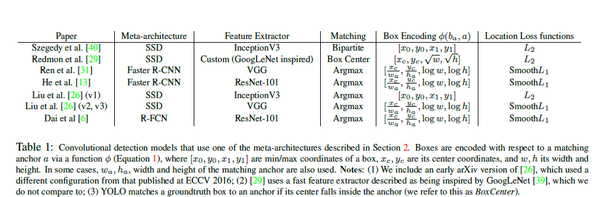

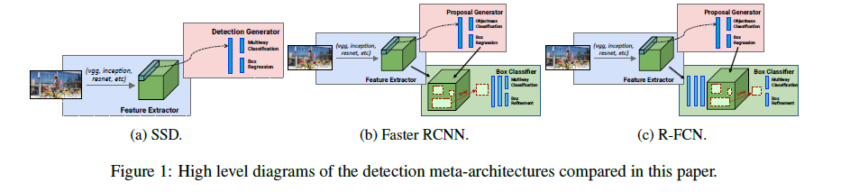

**三、元架构**

近年来，神经网络成为高质量物体检测的主要手段。 在本节中，我们调查了这些文献的一些突出亮点。 Girshick等人的R-CNN论文 \[11\]是卷积网络检测之一。 受最近成像图像分类\[20\]的启发，R-CNN方法采用直接的方式，裁剪在输入图像之外候选框，并在这些作物上运行神经网络分类器。 然而，这种方法可能代价昂贵，因为许多剪裁是必需的，避免导致重叠候选框的重复计算。 快速R-CNN \[10\]通过推送整个图像一次通过特征提取器，然后从中间层裁剪，从而减轻了这个问题，使作物共享特征提取的计算负载。

虽然R-CNN和Fast R-CNN依赖于候选框生成器，但最近的文章表明，也可以使用神经网络生成候选框\[41,40,8,31\]。 在这些文章中，典型的“锚点”（有时称为“先验”或“默认框”）是在不同的空间位置，尺度和宽高比上叠加在图像上的集合。 然后训练模型对每个“锚点”进行两个预测：（1）每个锚点的离散类预测（2）锚点移位以适应（匹配）真值边界框的偏移的连续预测。

遵循这种方法的论文将我们现描述的组合分类的损失和回归的损失都最小化。 对于每个锚点a，我们首先找到最匹配的真值框b（如果存在）。 如果可以找到这样的匹配，我们称之为“正锚”（positive），并将其分配（1）类标签y\_a ∈ {1,…,K}和（2）相关于锚点a的框b的向量编码（称为 盒编码Φ(b\_a; a)）。 如果没有匹配的真值框，我们称之为“负锚”，我们将类标签设置为y\_a = 0。如果对于锚点，我们预测框编码f\_loc（I; a; Θ）和对应的类fcls（I; a ; Θ），I是原图，Θ是模型参数，则a的损失被测量为一个基于位置的损失和分类的损失的加权和：

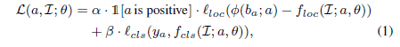

其中α和β是权重以平衡分类和分类损失的。为了训练模型，公式1在锚点上取平均并且相对于参数θ的最小值。

锚点的选择对精度和计算都有重要意义。 在（第一）Multibox论文\[8\]中，这些锚点（由作者称为“盒子”）是通过在数据集中聚类的真值框来生成的。 在近期提出的论文中，通过在图像上以不同的尺度和高宽比平铺一组框来产生锚点。 具有规则网格的锚点的优点在于，这些框的预测可以用共享参数（如：卷积）作为平铺预测器写入图像上，并且使人想起了类似于传统的滑动窗方法，例如，\[44\]。 关于最快的R-CNN \[31\]的论文和关于（第二个）Multibox\[40\]的论文（称这些平铺锚点为“卷积先验”）都是采用这种新方法的首篇论文。

**元架构**

在我们的论文中，我们主要关注三个最新的元架构：SSD（Single Shot Multibox Detector \[26\]），FR-CNN \[31\]和R-FCN（基于区域的完全卷积网络\[6\]）。 虽然这些论文最初是以特定的特征提取器（例如，VGG，Resnet等）呈现的，但我们现在将回顾这三种方法，将元架构与特征提取器的选择分离，从概念上讲，任何特征提取器都可以用到SSD ，FR-CNN或R-FCN。

**SSD(Single Shot Detector)**

SSD论文最近才发表（Liu等人\[26\]），我们使用术语SSD来广泛地表示使用单个前馈卷积网络，来直接预测类和锚点偏移，而不需要第二阶段的架构预选候选框的操作（图1a）。 在这个定义下，SSD元架构已经在\[26\]的一些前身中被探索过了。FR-CNN的Multibox和提取候选框网络（RPN）阶段\[40,31\]都使用这种方法来预测类别不可知的候选框。 \[33，29，30，9\]使用SSD类架构来预测最终（1个K）类标签。 Poirson等人\[28\]将这个想法扩展到预测框，类和姿态。

**Faster R-CNN**

在FR-CNN的设置中，检测分为两个阶段（图1b）。在第一阶段，称为提取候选框网络（RPN），图像由特征提取器（例如，VGG-16）处理，并且某些选定的中间层（例如，“conv5”）的特征被用于预测诊断候选框。该第一阶段的损失函数采用函数1.的形式，使用平铺在空间、尺度和纵横比的锚点网格。

在第二阶段，这些（通常为300个）候选框用于从相同的中间特征图中裁剪特征，随后将其提供给特征提取器的其余部分（例如，“fc6”，后跟“fc7”），以便预测每个候选框的类和类专用框细化。该第二阶段分类器的损失函数也采用从RPN生成的候选框作为锚点的等式1.的形式。值得注意的是，并不直接从图像中提取候选框，而是通过特征提取器重新运行提取过程，这将是重复的计算。但是，每个区域必须运行一次计算，因此运行时间取决于RPN提出的区域数量。

自2015年发表以来，FR-CNN一直具有特别的影响力，并引起了一些后续工作\[2,35,34,46,13,5,19,45,24,47\]（包括SSD和R-FCN）。值得注意的是，截至2016年11月，在COCO上物体检测所提交的一半报告是以某种基于FR-CNN系统的方法。

虽然更快的R-CNN比快速R-CNN快一个数量级，但是指定区域组成这一步必须在每个图像上运行几百次，这导致了Dai文中指出的问题。 \[6\]提出了像Faster R-CNN一样的R-FCN（基于区域的全卷积网络）方法，而不是在同一层中裁剪特征来预测提取候选框，从最后一层特征预测之前的（图1c）。将裁剪推送到最后一层的这种方法使必须进行的每个区域的计算量最小化。Dai等人认为物体检测任务需要考虑到位置表示来代表平移变量，因此提出了一种位置敏感的裁剪机制，而不是像在\[10,31\]中使用的更标准化的ROI池化操作和\[5\]的可区分的裁剪机制。他们表明，R-FCN模型（使用Resnet 101）可以在更短的运行时间内实现比FR-CNN更高的准确性。最近，R-FCN模型也适用于在最近的TAFCN模型\[22\]中进行实例分割，在2016 COCO实例（物体）分割的挑战中获得成功。

**四、实验设置**

引入诸如Imagenet \[32\]和COCO \[25\]的基准使近年来更容易比较检测的方法与精度。但是，谈到速度和内存问题，要进行一一比对会更难。先前的系统依赖于不同的深度学习框架（例如DistBelief \[7\]，Caffe \[18\]，Torch \[4\]）和不同的硬件条件。一些论文针对精度进行了优化，而另一些为速度进行了优化。最后，在某些情况下，使用稍微不同的训练集（例如，COCO训练集与组合训练+验证集）进行报告度量。

为了更好地进行逐项比对，我们在Tensorflow \[1\]中创建了一个检测平台，并在此平台上重新实现了SSD，更快的R-CNN和R-FCN元架构的训练流水线。拥有统一的框架使我们能够轻松地交换特征提取器的结构和损失函数，并在Tensorflow中实现可便于轻松移植到各种平台进行部署应用。在下文中，我们将讨论如何配置我们平台上的模型架构，损失功能和输入——可用于交换调整速度和精度。

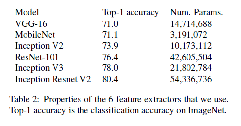

**架构配置**

**特征提取**

在所有元架构中，我们首先将卷积特征提取器应用于输入图像以获得高级（高层次）特征。 特征提取器的选择是至关重要的，因为层的参数和类型的数量直接影响检测器的存储，速度和性能。我们选择了六个代表性的特征提取器进行比较，除了MobileNet \[14\]，所有这些都有开源的Tensorflow实现，并且它们对视觉界具有相当大的影响。

更详细地说，我们考虑以下六个特征提取器。我们使用VGG-16 \[37\]和Resnet-101 \[13\]，两者都赢得了许多比赛，如ILSVRC和COCO 2015（分类，检测和分割）。我们还使用Inception v2 \[16\]，它成了ILSVRC 2014分类和检测挑战中的最新技术，以及其继承者初始v3 \[42\]。 Inception网络都采用“初始单元”，这样可以在不增加计算预算的情况下增加网络的深度和宽度。最近，Szegedy等\[38\]提出了Inception Resnet（v2），它将剩余连接赋予的优化优势与初始单位的计算效率相结合。最后，我们与新的MobileNet网络进行比较\[14\]，已经显示在Imagenet上实现VGG-16级别的精度，而计算成本和模型大小只有1/30。 MobileNet设计用于各种移动视觉应用中的高效推理。其构建块是深度可分离的卷积，将标准卷积分解为深度卷积和1 \* 1卷积，有效降低了计算成本和参数数量。

对于每个特征提取器，可以选择在元架构中使用它。 对于更快的R-CNN和R-FCN，必须选择哪个层用于预测区域候选框。 在我们的实验中，我们可以使用原始论文中的选择。 例如，我们在Resnet-101 \[13\]中使用了VGG-16 \[31\]中的conv5层和conv 4层的最后一层。 对于其他功能提取器，我们做出了类似的选择。 有关详细信息，请参阅补充资料。

Liu\[26\]论文表明，在SSD设置中，使用多个特征图在多个尺度上进行位置和置信度预测对于良好的系统性能至关重要。 对于VGG特征提取器，它们使用conv4\_3，fc7（转换为卷积层）以及添加层序列。 在我们的实验中，我们密切关注他们的方法，总是选择最下面的卷积特征图和较低分辨率的特征图，然后添加一系列卷积层，空间分辨率衰减2倍，每个附加层用于预测。 然而与\[26\]不同的是，我们在所有附加层中使用批量归一化。

为了比较，以前论文中使用的特征提取器如表1所示。在这项工作中，我们评估元架构和特征提取器的所有组合，其中大部分是较新的。 值得注意的是，Inception网络从未在FR-CNN框架中使用，直到最近还没有开源\[36\]。 Inception Resnet（v2）和MobileNet迄今尚未出现在检测文献中。

**候选框数量**

对于FR-CNN和R-FCN，我们还可以选择候选框分类器的区域候选框的数量。 通常，这两个参数在设置中是300，但是一个简单的方法来节省计算就是产生较少的候选框，当然这可能会降低召回率。 在我们的实验中，我们从10到300之间改变候选框数量，以便探索这个权衡关系。

**针对Resnet和Inception的输出步长设置**

我们对Resnet-101的实现从原来步幅为32修改为更有效的输出步幅为16，我们通过修改conv5\_1层步长为1而不是2来实现这一点（并且通过使用多孔卷积来补偿在之后的层减少的步幅），如\[6\]所示。对于FR-CNN和R-FCN，除了16的默认步幅之外，我们还尝试了一个（代价更大的）步骤8中 Resnet-101，其中conv4\_1块被额外修改成步幅是1。同样，我们 实验了步幅为16和步幅为8版本的Inception Resnet网络。 我们发现，使用步幅8而不是16可将mAP提高5％，但是运行时间增加了63％。

**损失函数的配置**

除了选择特征提取器之外，还可以配置可能影响训练稳定性和最终性能的损失函数（等式1）。 这里我们描述我们在实验中做出的选择，表1再次比较了在其他实验中配置的相似损失函数。

**匹配**

确定每个锚点的分类和回归目标需要匹配锚点到真值。 常见的方法包括贪婪的二分匹配（例如，基于Jaccard重叠）或多对一的匹配策略，其中不需要二部分性质，但是如果锚点和真值之间的Jaccard重叠太低则放弃匹配。 我们将这些策略分别称为Bipartite或Argmax。 在我们的实验中，我们使用Argmax匹配，整个阈值设置为每个元架构在原始文献中提出的阈值。在匹配之后，通常有一个采样程序，设计用于将正锚点和负锚点的数量提高到一定所需的比例。 在我们的实验中，我们还将这些比率修正为针对每个不同元架构推荐的比率。

**候选框编码**

相对于其匹配方法编码一个真值框，我们使用框编码函数Φ（ba; a）= \[10\* x\_c/w\_a;10 \* y\_c/ha; 5\*log w; 5\*log h\]（也用于\[11,10,31,26\]）。 注意，即使没有明确提及，在所有这些现有的工作中通常使用标量乘法器10和5。

**位置损失函数**

在\[10,31,26\]之后，我们在所有实验中使用平滑L1（或Huber \[15\]）损失函数。

**输入尺寸的配置**

在FR-CNN和R-FCN中，对在较短边缘上缩放到M个像素的图像进行训练，而在SSD中，图像总是调整为固定形状M \* M。我们探索对缩小图像的每个模型进行评估，去权衡速度和准确率。 特别是，我们已经训练了每个模型的高分辨率和低分辨率版本。 在“高分辨率”设置中，我们设置M = 600，在“低分辨率”设置中，我们设置M = 300.在这两种情况下，这意味着SSD方法相较于FR-CNN和R-FCN模型平均了处理较少的像素，而所有其他变量保持（常数）不变。

**训练和超参的调整**

我们在分布式集群上共同使用异步梯度更新端到端地对所有模型进行训练\[7\]。对于FRCNN和R-FCN，我们使用批量大小（Batch size）为1的SGD（由于这些型号使用不同的图像大小进行训练），而对于SSD，我们使用RMSProp \[43\]，批量大小为32（在少数例外情况下由于内存原因，我们可以减少了批量大小）。最后，我们为每个特征提取器单独调整学习速率。对于与文献中匹配的模型配置（\[31,6,13,12\]），我们重现或甚至超过了报告中的mAP结果。

请注意，对于FR-CNN和R-FCN，该端对端方法与通常使用的4级训练程序略有不同。此外，不使用\[31,6\]中用到的ROI池化层和位置敏感型ROI池化层，而是使用Tensorflow的“裁剪和调整大小”操作，该操作使用双线性插值来将图像的一部分重新取样到固定大小的网格上。这与\[5\]的差异化裁剪机制，\[12\]的注意力模型以及空间转换网络\[17\]相似。然而，我们禁止对边界框坐标的反向传播，因为我们发现这在训练期间是不稳定的。

我们的网络在COCO数据集上训练，使用所有训练图像以及验证图像的一个子集，并提供8000个验证示例。最后在测试时，我们使用非最大抑制进行后处理检测，使用IOU阈值0.6并将所有框剪切到图像窗口。为了评估我们的最终检测，我们使用官方COCO API \[23\]，其测量mAP平均值在\[0.5：0.05：0.95\]中的IOU阈值以及其他指标。

**基准程序**

使用我们的模型需知，我们使用的是32GB内存的Intel Xeon E5-1650 v2处理器和Nvidia GeForce GTX Titan X GPU卡的机器。在GPU上计时的都是以（Batch size）批量大小为1的时间。用于计时的图像调整了尺寸大小，最小尺寸至少为k，然后根据模型裁剪到k \* k，其中k为300或600。我们平均计时超过500张图像。

我们计时的过程包括了（包括非最大抑制）后处理，目前仅在CPU上运行。在最快的模型上做后期处理占用了大部分的运行时间 \~ 40ms，目前我们的最大帧速率上限为25帧/秒。除此之外，这意味着，虽然我们的实验时间结果是相互比较的，但它们可能与文献中写到的实验速度无法直接相比。有很多其他潜在差异，其中包括硬件、软件驱动程序、框架（在我们的实验中为Tensorflow）和批量大小Batch size（例如，Liu等人\[26\]使用批量大小为8）。最后，我们使用tfprof \[27\]在推理期间测量模型的总内存需求，这就提供了一个独立于平台的衡量内存需求的平台。我们还平均计算了超过三个图像的内存测量结果。

**五、模型细节**

表2总结了我们使用的特征提取器。所有模型都预先在ImageNet-CLS上进行了训练。我们详细介绍如何使用以下这些特征提取器来训练物体检测系统。

**Faster R-CNN**

我们紧跟着faster RCNN \[31\]的实现，但是使用Tensorflow的“裁剪和调整大小”操作，而不是标准的ROI池。 除了VGG，所有的特征提取器都在卷积层之后使用批量归一化。 我们将批量归一化参数固定为ImageNet预训练中估计的参数。 我们用异步SGD训练FR-CNN，动量为0.9。 初始学习率取决于我们使用的特征提取器，如下所述。 在900K次迭代之后，我们将学习速度降低了10倍，而在1.2M次迭代后，我们将学习率降低了10倍。在异步训练期间使用了9个GPU工作。 每个GPU每次迭代只处理一张图，RPN训练的最小批量尺寸大小为256，而候选框分类器训练的批量尺寸大小为64。

-   VGG: 我们从步幅大小为16像素的“conv5”图层中提取特征。类似于\[5\]，裁剪并将重置尺寸函数重新调整为14x14，然后将max\_pool最大池化层调整为7x7。初始学习率为5e-4。

-   Resnet 101: 我们从“conv4”块的最后一层提取特征。 当在带孔卷积操作下，步幅大小为8像素，否则为16像素。特征图被裁剪并调整为14x14，然后最大化为7x7。初始学习率为3e-4。

-   Inception: 我们从步幅大小为16像素的“Mixed\_4e”图层中提取特征。特征图被裁剪并调整为14x14。初始学习率为2e-4。

-   Inception V3: 我们从步幅大小为16像素的“Mixed\_6e”图层中提取特征。特征图被裁剪并调整为17x17。初始学习率为3e-4。

-   Inception Resnet: 我们从“Mixed\_6a”层提取特征，包括其相关的残差层。当在带孔卷积操作下，步幅大小为8像素，否则为16像素。特征图被裁剪并调整为17x17。初始学习率为1e-3。

-   MobileNet: 我们从步幅大小为16像素的“Conv2d\_11”图层中提取特征。特征图被裁剪并调整为14x14。初始学习率为3e-3。

**R-FCN**

我们密切关注R-FCN \[6\]的实验，其使用的是Tensorflow的“裁剪和调整大小”操作，而不是从位置敏感分数图获取ROI池化来裁剪区域。所有特征提取器在卷积层之后都使用了批量归一化。我们将批量归一化参数固定为ImageNet预训练模型里估计出的参数。我们用异步SGD训练R-FCN，动量为0.9。在异步训练期间使用了9个GPU。每个GPU每次迭代只处理一张图，RPN训练的小批量大小为256。截至提交本文时，我们没有为VGG或Inception V3特征提取器提供在R-FCN模型下的结果。

-   Resnet 101: 我们从“block3”层提取特征。当在带孔卷积操作下，步幅大小为8像素，否则为16像素。位置敏感分数图用大小为7x7的网格区进行裁剪，并调整为21x21。 我们使用在线难例（hard example）采样来抽取尺寸为128的小批量来训练候选框分类器。 初始学习率为3e-4。 在1M步之后减少10倍，在1.2M步之后减少10倍。

-   Inception V2: 我们从步幅大小为16像素的“Mixed\_4e”图层中提取特征。位置敏感分数图用3x3大小的空格区块裁剪，并调整为12x12。 我们使用在线难例采样来抽取尺寸为128的小批量来训练候选框分类器。初始学习率为2e-4。经过1.8M的步长减少了10倍，2M步骤后又减少了10倍。

-   Inception Resnet: 我们从“Mixed\_6a”层提取其相关残留层的特征。当在带孔卷积操作下，步幅大小为8像素，否则为16像素。位置敏感分数图用大小为7x7的空格区进行裁剪，并调整为21x21。我们使用RPN中的所有候选框进行分类训练。初始学习率为7e-4。在1M步迭代之后减少10倍，在1.2M步之后减少10倍。

-   MobileNet: 我们从步幅大小为16像素的“Conv2d\_11”图层中提取特征。位置敏感分数图用3x3大小网格裁剪，并调整为12x12。我们使用在线难例（hard example）采样来抽取大小为128的小批量来训练候选框分类器。 初始学习率为2e-3。学习速度在1.6M步长之后减少了10倍，另外在1.8M步长后降低了10倍。

**SSD**

如文章所述，我们密切关注\[26\]的方法，以相同的方式生成锚点，并选择最顶层的卷积特征图和较低分辨率的特征图，然后在空间上添加卷积层序列，每个附加层用于预测的分辨率衰减2倍。 Resnet101的特征图选择略有不同，如下所述。

与\[26\]不同，我们在所有附加层中使用批量归一化，并以截尾正态分布初始化标准偏差权重=0.3。除了VGG，我们也不执行“层的归一化”（如\[26\]中的建议）），因为我们发现它不是其他特征提取器所必需的。最后，我们使用11台机器使用具有异步SGD的分布式培训。下面我们将讨论我们考虑过的每个特征提取器的参数设置细节。截至本次提交的时间，我们没有为Inception V3特征提取器提供在SSD模型上的结果，我们只使用Resnet 101和Inception V2特征提取器配高分辨率SSD模型的结果。

-   VGG: 在本文中，我们使用conv4\_3和fc7层，分别附加五个额外的卷积层，分别具有深度512,256,256,256,256的衰减空间分辨率。 我们将L2的归一化应用于conv4\_3层，将特征图中每个位置的特征范数缩放到一个可学习的尺度s，初始化为20.0。

> 在训练期间，我们使用基础学习率lr\_base = 0.003，但是使用一个预热学习率办法，我们首先以0.8\^2·lr\_base的学习率训练，每经过10K次迭代后更新为0.8 \* lr\_base的学习率在下一个10K次迭代中使用。

-   Resnet101: 我们使用“conv4”最后一层的特征图。当在带孔卷积操作时，步幅大小为8像素，否则为16像素。 附加五个具有衰减空间分辨率的附加卷积层，其分别具有深度512,512,256,256,128。 我们也实验了使用包括“conv5”最后一层的特征图。 使用“conv5”的特征，mAP数字非常相似，但计算却成本较高。因此，我们选择使用“conv4”的最后一层。在训练期间，使用3e-4的基础学习率。这里我们使用类似于VGG的学习率预热策略。

-   Inception V2: 我们使用Mixed 4c和Mixed 5c，分别附加四个额外的卷积层，分辨率分别为深度512,256,256,128。 我们使用ReLU6作为每个转换层的非线性激活功能。 在训练期间，我们使用0.002的基础学习率，其后每800k次迭代学习率衰减0.95。

-   Inception Resnet: 我们使用Mixed 6a和Conv2d\_7b，分别附加了三个附加卷积层，分辨率分别为深度512,256,128。我们使用ReLU作为每个转换层的非线性激活函数。在训练期间，我们使用0.0005的基础学习率，其后每800k步迭代学习率衰减0.95。

-   MobileNet: 我们使用conv 11和conv 13，分别附加四个附加卷积层，分别具有深度512,256,256,128的衰减分辨率。 我们使用的非线性激活函数是ReLU6，批量归一化参数β和γ在网络中被训练。在训练期间，我们使用0.004的基础学习率，其后每800k次迭代学习率衰减0.95。

**六、实验结果**

在本节中，我们分析了我们通过训练和基准检测器收集的数据，扩展了各模型中的参数配置如第3节所述。每个这样的模型配置包括：元架构，特征提取器，stride步幅（用于Resnet和Inception Resnet） 以及输入数据要求和候选框数量（更快的R-CNN和R-FCN）。

对于每个这样的模型配置，我们测量GPU上的计时，内存需求，参数数量和浮点运算，如下所述。我们将整个结果表放在附录中，注意到截至本次提交的时间，我们的实验包括了147个模型配置，实验配置的一小部分（即一些高分辨率SSD模型）的模型尚未收敛，因此我们暂忽略分析这部分。

**分析**

**精度 vs 时间**

图2是一个散点图，可以显示每个我们的模型配置的mAP，颜色代表特征提取器，标记的不同形状代表不同元架构。 每个图像的运行时间范围从几十毫秒到将近1秒。 我们观察到R-FCN和SSD模型的平均速度更快，而FR-CNN往往会导致较慢但更准确的模型，每个图像至少需要100 ms。然而，正如我们在下面讨论的，如果我们限制提取的候选框数量，FR-CNN模型可以一样快。我们还附加了一个虚构的“最优边界”，表示能通过牺牲速度在检测中获得更好的精度的权衡关系。在下文中，我们在所谓的“最优边界”上标记了一些关键点，表示是最好的检测器，以便讨论各种模型及其配置选择的效果。

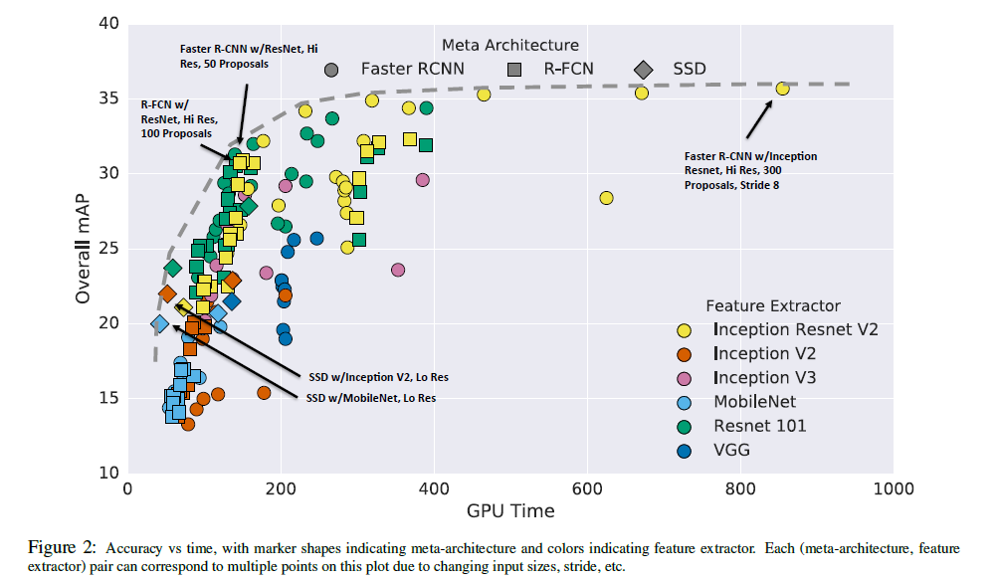

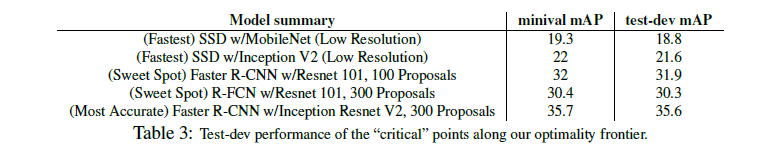

**最优边界的关键点**

（最快速度：SSD与MobileNet）：在这个最优边界的最快端，我们看到具有Inception v2和Mobilenet特征提取器的SSD模型是最快的模型中最准确的。请注意，如果我们忽视后处理的时间成本，Mobilenet似乎大约是Inception v2速度的两倍，而精度略差。（有效点：R-FCN与Resnet或FR-CNN，只有50个候选框）R-FCN模型中使用残差网络特征提取器（Resnet）处于最优边界的“拐点”，这是我们的模型配置中达到速度和精度之间的最佳平衡。正如我们在下面讨论的那样，如果我们将候选框数量限制为50，则FR-CNN / Resnet模型可以达到类似的速度。（最准确的是：FR-CNN/Inception Resnet步长设置为8）：最后更快的R-CNN与密集输出Inception Resnet模型在我们的“最优边界”上取得了最佳的准确性，实现了在我们所知道的范围内性能最好的的单一模型。然而，这些模型很慢，需要几乎一秒的处理时间。这5种模型的整体mAP如表3所示。

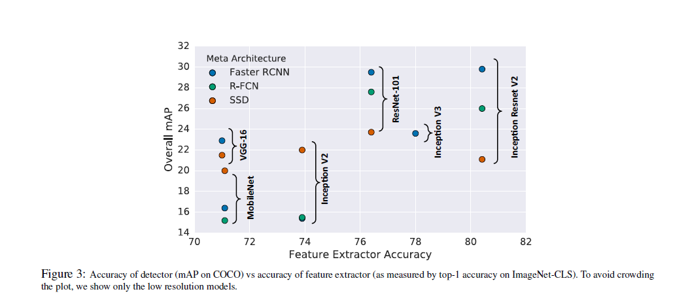

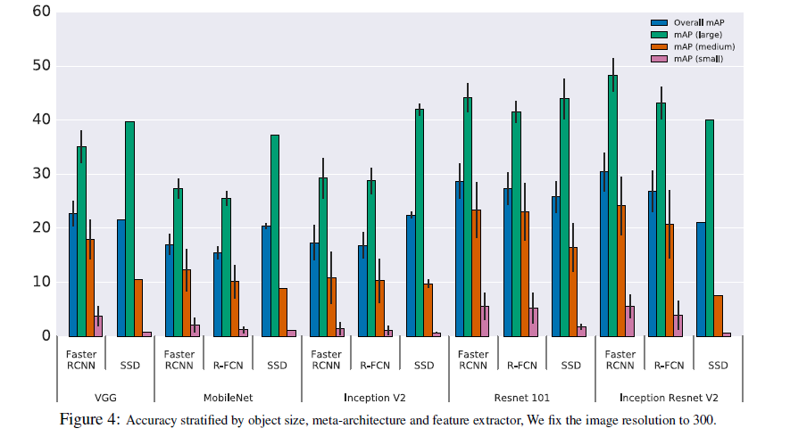

**特征提取器的效果影响**

直观上看，在分类任务上的更强表现应与在COCO上检测的更强性能正相关。为了验证这一点，我们调查了不同模型的整体mAP与用于初始化每个模型的预训练特征提取器获得的Top-1 Imagenet分类精度之间的关系。 图3表明分类任务和检测任务性能之间确实存在着整体相关性。然而，这种相关性似乎对于FR-CNN和R-FCN而言是显著的，而SSD的性能似乎不太依赖于其特征提取器的分类精度。

**图片大小的效果影响**

其他文章作者观察到，输入分辨率可以显著影响检测的精度。从我们的实验中，我们观察到，在两个维度上降低二分之一的分辨率，导致降低了精度（平均为15.88％），平均减少预测时间平均为27.4％。

这种效果的一个原因是高分辨率输入允许小物体被检测。图5比较了大物体上的检测器性能与小物体上检测的性能，证实高分辨率模型导致小物体上的mAP结果明显更好（在许多情况下为2倍），并且在大物体上也有更好的mAP结果。我们还看到，在小物体上的强势表现意味着我们的模型在大物体的强大表现力（但是反之亦然，因为SSD模型在大物体上做得很好，但在小物体上并不好）。

**候选框数量的效果影响**

对于FR-CNN和R-FCN，我们可以调整候选框网络计算的候选框数量。两篇论文中的作者使用了300个框，然而，我们的实验表明，这个数字可以大大降低，而不会损害mAP（太多）。在某些特征提取器中，FR-CNN的“候选框分类器”是代价昂贵的，所以减低候选框数量可以大大节省计算量。图6a显示了用于不同特征提取器在具有高分辨率输入时的FR-CNN模型的权衡曲线。我们看到，Inception Resnet在有300个候选框时有35.4％的mAP，而仅有10个候选框的时候，仍然具有惊人的高精度（29％mAP）。最好的选择（有效权衡点）是50个候选框，我们能够获得与使用300个候选框相同的准确率96％，同时又减少了运行时间。计算节省对于Inception Resnet来说最为明显，所以我们可以在所有特征提取器上看到类似的权衡点。

图6b显示了与R-FCN模型相似的权衡曲线，并显示在R-FCN实验设置中使用较少候选框的计算节省是最小的，这并不足为奇，因为候选框分类器在每张图上只运行一次。使用100个候选框的用ResNet的FR-CNN模型，其速度和准确性与使用300个候选框的R-FCN模型的精度和GPU计算速度大致相当。

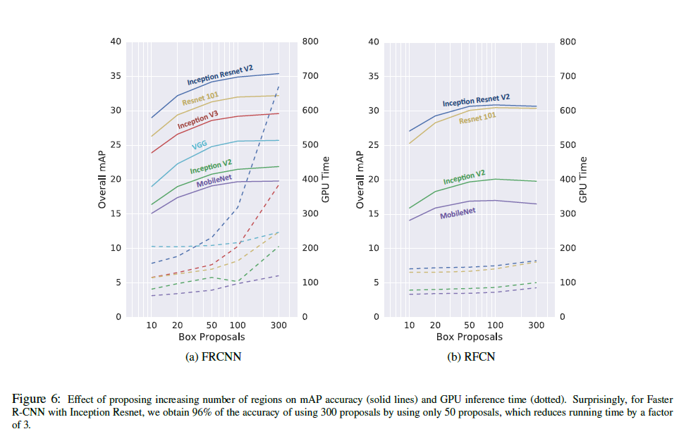

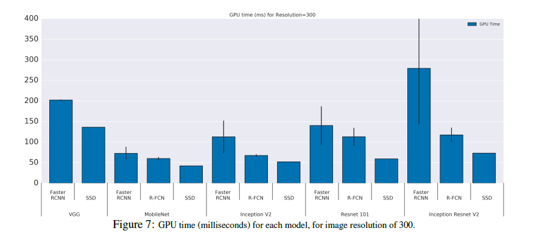

**FLOPs 分析**

图7绘制了每个模型组合的GPU计算时间。这些实验是非常依赖平台。计数FLOP（乘法加法）为我们提供了平台独立的计算度量，由于诸如缓存、I / O、硬件优化等问题，实际运行时间可能是也可能不是线性的。

图8a和8b分别绘制了在GPU和CPU上的观察时钟频率的FLOP计数。有趣的是，我们在GPU图（图8a）中观察到，每个模型具有不同的平均触发比与观察到的运行时间（毫秒）。 对于诸如Resnet 101等更密集的模块，FLOPs / GPU时间通常大于1，这可能是由于缓存的效率。 对于Inception和Mobilenet模型，该比例通常小于1，我们推测这可能是因子分解降低了FLOP，但是在内存I / O中增加了更多的开销，或者潜在的目前的GPU指令（cuDNN）更加优化了密集卷积。

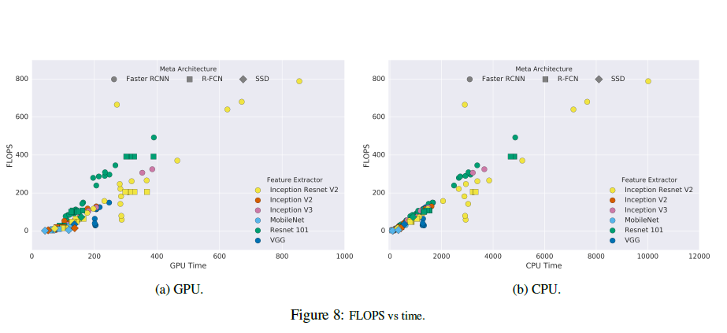

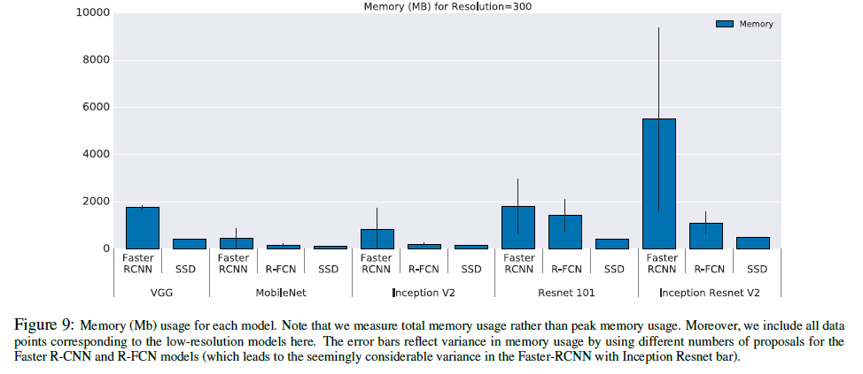

**内存分析**

对于内存基准测试，我们测量总的使用量而不是峰值使用量。图10a，10b绘制了与GPU和CPU wallclock（挂钟）时间的内存使用情况。总体而言，我们观察到内存与更大型更强的特征提取器的运行时间高度相关，更大型更强的特征提取器需要更多的内存。图9更详细地绘制了更多细节信息，通过元架构和特征提取器的选择进行深度探究。当速度一样，Mobilenet是内存代价最低的，几乎在所有设置中都需要少于1Gb（总计）的内存。

**在.75 IOU时的良好检测定位意味着所有IOU阈值的良好定位**

当按照物体大小分割数据时，会导致有趣的事，值得注意的是通过IOU阈值对数据进行分割没有提供更多附加信息。图11实际上显示了mAP @ .5和mAP @ .75的性能与mAP @ \[.5：.95\]几乎完全线性相关。因此，在较高的IOU阈值下表现性能差的检测器在较低的IOU阈值下也总是同样表现不佳。另外，我们还观察到mAP @ .75与mAP @ \[.5：.95\]（R2&gt; 99）稍更紧密地相关，所以如果我们用单个IOU阈值度量替换标准COCO的mAP度量，我们可能会选择IOU = .75。

**在COCO集上表现最好的检测器**

最后，我们简要介绍一下我们如何在2016 COCO集上组合我们的一些模型来实现物体检测。我们的模型在COCO测试集上达到41.3％的mAP @ \[.5，.95\]，是基于Resnet和Inception Resnet特征提取器的五个FR-CNN模型的集合。这超过了以前用MSRA和三个Resnet-101模型\[13\]的最好结果（37.1％mAP @ \[.5，.95\]）。表4总结了我们的模型的性能，并凸显了我们的模型如何改进了所有COCO指标的最新状态。最值得注意的是，我们的模型相对于以前的小物体检测的最佳结果相对改善了近60％。即使这个具有最佳数据的集合可以被看作是速度/精确度权衡曲线上的一个极限点（每个图像需要50个端到端网络评估），我们选择将这个模型摒弃，因为它与下文中我们将关注的“单一模式”结果无法比拟。

为了构建我们的实验，我们从收集的Faster R-CNN模型中选出一组五个。每个模型基于具有不同输出步幅配置的Resnet与Inspection Resnet 特征提取器，通过不同的损失函数及不同随机排序的训练集进行再训练。模型是依据它们在验证集上的表现被筛选出来的。但是, 为了利用具有互补优势的模型，我们鼓励通过修改以前的模型来扩大模型的多样性。为此，我们计算每个模型在COCO上类别的平均精度结果的向量，并且当两个模型的AP向量的余弦距离大于某个阈值，则将这两个模型视为相似模型。

表5总结了最终选定的模型规格以及它们每一个在COCO上表现出的独立性。通过附录A中描述的程序整合这5个模型，并通过多重预测来形成最终的模型。注意，我们不使用文献中涉及到的多尺度训练，水平翻转，候选框细化，候选框投票或全局语境（上下午相关）。

表6比较了单个模型的性能与两种组合方式，（1）指出手动选择模型组合确实有助于提升多样性（2）同时，在单个模型上整合与修改可以对结果最多提升7个点。

**示例检验**

图12到图17可以看到关于图像在COCO数据集上检测的可视化结果，结果显示5个检测器的并行比较落在速度准确权衡图的最右边界上。

为了可视化，我们选择大于阈值的检测值，并绘制每个图像中前20个检测值。我们是用的阈值分别是Faster R-CNN为.5，R-FCN为.5，SSD为.3。为了吸引注意力，这些阈值被手动调整（主观）过，并且并不使用严格的标准调整，因此，我们提醒读者以免从可视化中读取太多的细节。也就是说，通过示例，所有的检测器在大型物体上都表现的比较合理，SSD只显示出在小物体检测上的劣势，第一张图中丢失一些小的风筝或人物，最后一张图中丢失了小杯子和瓶子。

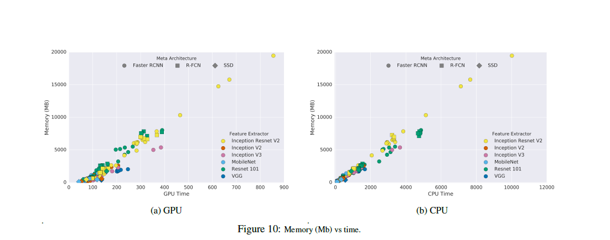

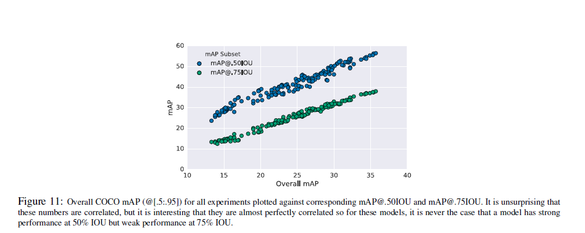

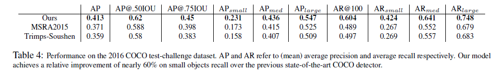

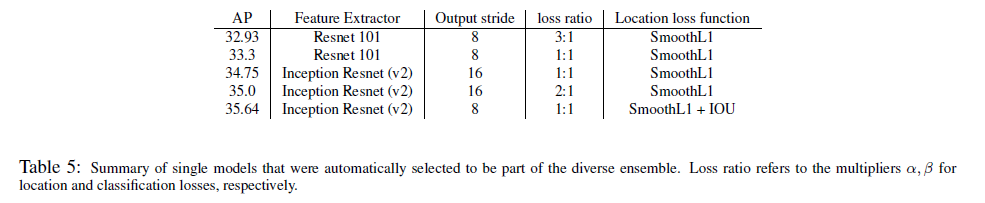

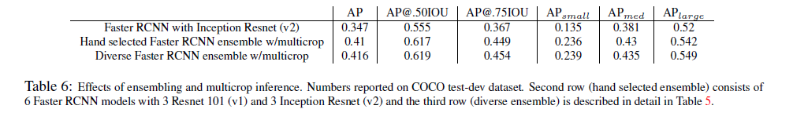

**总结**

我们对影响现代现存的物体检测器速度和精度的一些主要因素（参数和条件）进行了实验比较。希望这将有助于实践者，在现实中应用物体检测系统时，能选择适当的方法。我们还确定了一些提高速度的新方法，而同时又不会牺牲更多的准确性，例如使用FR-CNN时使用更少数量的候选框。

**Acknowledgements**

We would like to thank the following people for their advice and support throughout this project: Tom Duerig, Dumitru Erhan, Jitendra Malik, George Papandreou, Dominik Roblek, Chuck Rosenberg, Nathan Silberman, Abhinav Srivastava, Rahul Sukthankar, Christian Szegedy, Jasper Uijlings, Jay Yagnik, Xiangxin Zhu.

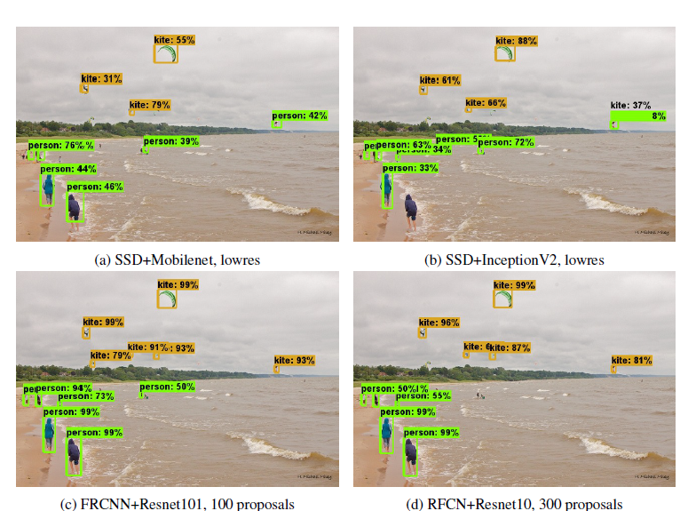

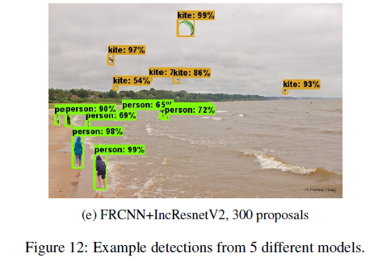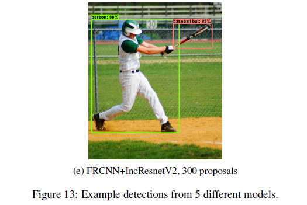

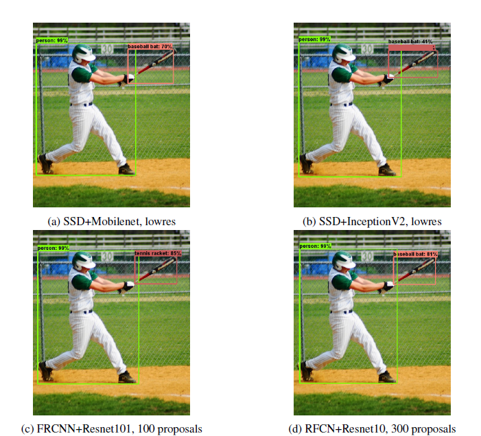
