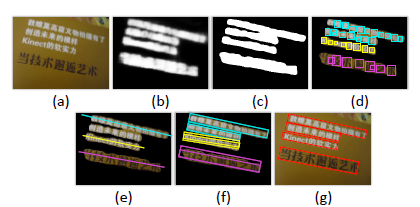
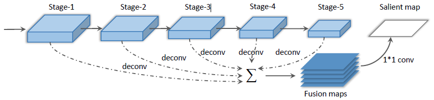
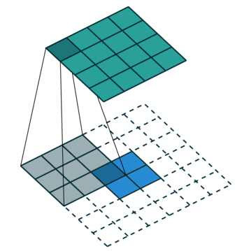
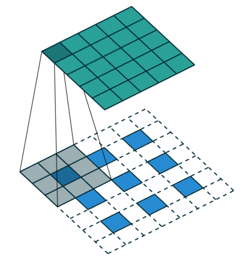
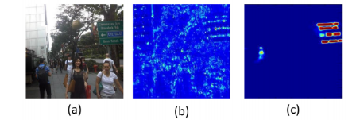
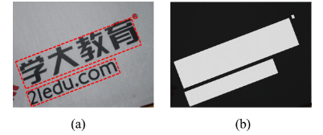
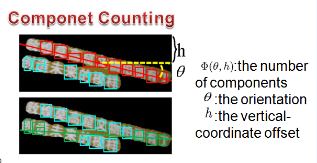

Multi-Oriented Text Detection with Fully Convolutional Networks

**FCN(全卷积网络)在多向文本检测中的应用**

原文：[*http://mc.eistar.net/UpLoadFiles/Papers/TextDectionFCN\_CVPR16.pdf*](http://mc.eistar.net/UpLoadFiles/Papers/TextDectionFCN_CVPR16.pdf)

**模型流程**：

1.  先用FCN进行文本行Salient map（显著图）预测；如图b.

2.  对Salient Map进行连通分量分析，得到Text Block（文本块）；如图c.

3.  利用MSER（最大稳定极值区域算法）提取候选字区域；如图d.

4.  按照提取的候选字区域（组件）估计整个文本行的方向；如图e.

5.  结合候选字符的bounding box生成每一条的文本行；如图f.

6.  用**centroid FCN**得到每条文本行中的字符的质心，利用质心过滤掉非文本行。如图g.

**实现过程：**

·  应用VGG-16网络中前五个卷积层，上图所示，在每个卷积层后都接上一个deconv（反卷积）操作（由1\*1的卷积+上采样构成）。再把5个deconv层得到的5个maps用1\*1的卷积核卷积进行fusion（融合），并经过一个sigmoid层得到salient map。

> **\*\*\*\*\* 注 解 \*\*\*\*\*\*
>
> **Salient map显著图** —— 图像显著性是图像中重要的视觉特征，体现了人眼对图像的某些区域的重视程度。显著性图的目的是通过显著性的空间分布来表示醒目度（conspicuity-saliency）或显著度，在视野中每个位置用一个定量向量表示，引导注意位置的选择。用**Sigmoid**层得到显著图，这一步的实现是加在loss层中，把cross-entropy-loss变为Sigmoid-cross-entropy-loss。
>
> **Fusion融合特征图 ——** 在代码中用Caffe中的Concat层实现，是对多个层进行拼接，是Slice切断层的逆操作，要求每个特征图维度相同（在n\*h\*w中h和w须一致）。
>
> **Deconv层的作用** —— 简单的反卷积操作只是对标签图进行双线性插值，恢复到原始图片大小。反卷积可以让上采样得到的特征图还原到与原图一样的尺度，这样很好的对应了特征的真实位置。
>
>  

·  普通FCN 和 本文Text-block FCN生成的Salient Map效果不同，主要区别在于Text-block FCN模型在训练的时候使用的GroundTruth是一副与原图尺寸一致的二值图像，高亮部分（白色）是显著图的标记（文本行）。

 

·  文本线的生成分为两个部分：首先用MSER（最大稳定极值区域算法）框出文本组件，在文本中用过滤条件去除非文本组件（候选框的面积和长宽比）。取一条近似直线，这条直线通过尽可能多的文本组件，h和θ是预测最优的一条直线。（θ是与水平线的逆时针夹角，h是倾斜文本框质心到最小外接矩形框上边缘的距离。）

> **\*\*\*\*\* 注 解 \*\*\*\*\*\*
>
> 建立一个直方图来确定在h和θ分别取值的情况下的文本组件（组件框）的数目，取能够穿过最多组件的一条可能的预测直线，作为最优文本线。
>
> 

·  代码实现：[*https://github.com/stupidZZ/FCN\_Text*](https://github.com/stupidZZ/FCN_Text)

> 其中提供了TextRegion\_FCN的网络模型，提供预训练的模型（经两万次迭代），这一部分代码实现有Caffe和Torch两个版本（其中Torch版本比较全），五层卷积网络，仅用于Text-block的预测任务，之后用MSER算法进行生成文本行的是Matlab代码，最后需要用Centriol\_FCN的网络，可以用第一步TextRegion\_FCN的模型，只需要用其中三个卷积层就搭建好了质心检测的全卷积网络。
>
> （文本线噪声过滤：质心概率过滤，集合角度）
>
> **\*\*\*\*\* 注 解 \*\*\*\*\*\*
>
> 代码需要的Caffe版本(Hed)中加入了几个新的layer的，其中数据层用到*Image\_Labelmap\_data*层，这个层的特点是需要两个数据输入，一个是原图输入，另一个是真值图（GT图片格式）输入，两张图必须统一尺寸（这是为了学习生成对应的Salient map显著图，特征和原图要位置对应）。用到的损失函数层是*Sigmoid\_CrossEntropy\_Loss*层，在这个层中，将网络预测的Salient map进行Sigmoid函数处理，再计算交叉熵。整个网络每次只能输入一张图，所以batch size设置为1。
>
> 另，在提取五层特征图后，分别进行反卷积，因为后面需要融合五个特征图，需经过Crop层裁剪到原图尺寸。五个尺寸裁剪后的特征图再经Concat层在channel通道拼接。

·  FCN 做文本检测的优劣：

> 优 —— 有角度信息，可以给成片的文本分行检测
>
> 缺 —— 过程复杂，需要三部才能输出结果：
>
> 五层网络（文本区域预测） + MSER（文本分块到文本线） + 三层网络（文本行预测）
