Accurate Single Stage Detector Using Recurrent Rolling Convolution

《基于循环卷积的精确单级检测器》译文

原文: <https://arxiv.org/abs/1704.05776>

代码：<https://github.com/xiaohaoChen/rrc_detection>

最近成功的准确对象检测和定位方法大多采用了RCNN风格的两阶段卷积神经网络（CNN）的一些变体，其中在第一阶段提出了合理的区域，然后是第二阶段的决策细化。尽管培训的简单性和部署的效率，单阶段检测方法在基准测试中考虑到高IoO阈值的mAP时并不具有竞争力。在本文中，我们提出了一种新颖的单级端到端可训练对象检测网络来克服这个限制。我们通过在多尺度特征图上引入循环滚动卷积（RRC）结构来构建“深入上下文”的对象分类器和边界盒回归。我们在具有挑战性的KITTI数据集中评估了我们的方法，该数据集测量了IoU阈值为0.7的方法。我们认为，通过RRC，单个减少的基于VGG-16的模型已经显着超过了以前发布的所有结果。在本文写作时，我们的模型排名第一，在KITTI汽车检测中，第一个骑自行车者检测，第二个行人检测。以前的单阶方法没有达到这些结果，另外，代码已公开。

**介 绍**

在许多现实应用中，具有高精度的鲁棒性物体检测，即预测了bbox位置与真值之间的高重叠率（IoU），这对于应用质量至关重要。例如，在基于视觉的机器手臂应用中，在拾取物体过程中生成鲁棒且准确的操作的过程高度依赖于对物体的定位精度。在先进的驾驶辅助系统（ADAS）中，准确定位汽车和行人也与自主行动的安全性密切相关。

前瞻性深卷积神经网络（CNN）的成功应用极大地推动了对象检测的最新进展。在许多变形的基于CNN的方法，它们可以粗略地分为两个流。第一个是R-CNN风格\[9\]两个阶段的方法。在这些方法中，在第一阶段提出了合理的区域，然后是第二阶段的决策细化。另一种方法旨在消除区域候选框阶段，并直接训练单级端对端检测器。单级探测器通常比较容易训练，计算效率更高\[12\]。然而，由于两级方法在性能上通常比较有利，因此在基准时评估模型时考虑到高IoU阈值的mAP（例如KITTI car \[6\]），这种优势被大大的覆盖。我们稍后将会证明，单阶段方法的这个弱点不属于在复杂场景中识别对象的无力，而是产生高质量边界框的失败。在图1的左栏中示出了两个例子。

可以通过实验证明，大多数低质量的候选框来自于小对象或重叠对象的错误定位。在任一情况下，常规的候选框回归变得非常不可靠，因为必须用上下文（内容）来确定正确候选框的确切位置（例如围绕闭塞区域的多尺度信息或特征）。 这就是为什么使用某种形式的上下文感知改进程序来消除这些错误是有效的。 Faster R-CNN的RoI池化和分类阶段可以被认为是通过重新采样特征图来利用这种上下文的一种简单的方法。

在本文中，我们展示了可以在单级网络中无缝集成上下文感知细化过程。洞察力是这样的程序可以通过使用一种新颖的循环卷积卷积（RRC）架构“深入上下文”。换句话说，上下文信息可以在需要时逐渐有选择地引入到候选框回归器中。整个过程完全是数据驱动的，可以端到端进行训练。我们在挑战性的KITTI数据集中评估了我们的方法，该数据集考虑了mAP的高IoU阈值。在我们的实验中，我们使用缩减的VGG-16网络而不是完整的VGG网络，或者将更新的ResNet作为我们预先训练的基础网络，以便我们能够充分说明新增的RRC的有效性。这确保了这种改进不是由更强大的骨干网络简单引入的。结果表明，我们的方法显着优于单一模型的所有以前发布的结果。我们的模型的集合在提交给基准的所有方法中排名第一。

我们工作的贡献可以总结如下：

1.  首先，我们展示了可以以端对端方式训练单级检测器，为需要高定位质量的任务产生非常准确的检测结果。

2.  其次，我们发现改进单级检测器的关键在于反复引入候选框回归的上下文。可以使用所提出的循环卷积卷积架构来有效地实现该过程。

**近 期 研 究**

近来，卷积神经网络方法与候选框提取阶段在物体检测领域取得了非常成功的成果。 在R-CNN论文\[9\]中，选择性搜索\[20\]被用于生成对象提案，CNN用于提取和馈送特征到分类器。 后来提出了R-CNN的两种加速方法。 在\[8\]中，RoI池被用于有效地用于预测物体的特征生成。 在\[16\]中，作者使用CNN而不是选择性搜索来执行区域提案。 许多作者在\[16\]中采用了这个框架，并提出了许多在基准测试中表现良好的变体，考虑到高IoU阈值的mAP。 例如，在\[23\]中，作者提出使用规模依赖池和层级级联拒绝分类器来提高准确性并获得良好的结果。 \[21\]中使用子类别信息来增强区域建议阶段，并在KITTI中取得有希望的成果。

R-CNN方法的一个问题是，为了处理大量候选框，第二阶段的计算量通常很大。提出不依赖候选框预测的各种单级方法来加速检测流程。 SSD \[12\]是一种单级模型，其中在前馈过程中具有不同分辨率的特征图直接用于检测大小为指定范围的对象。这个巧妙的设计节省了大量的计算量，并且比\[16\]快得多。它在IoU阈值为0.5的数据集中取得了良好的效果。然而，我们将在实验中显示，当我们增加候选框质量的条件时，性能会显着下降。 YOLO \[14\]是另一种快速单阶段方法，它能生成期望的结果，然而，它不如SSD那么准确，尽管定制的版本更快。我们注意到完全卷积的两阶段方法\[5\]都提出来减少第二阶段的计算复杂度。然而，它很大程度上依赖于更大更深的骨干网络。 \[7\]的动机类似于我们的动机，但它不会通过使用循环结构来考虑上下文信息。

虽然反复神经网络（RNN）已经在诸如图像字幕\[11,22\]，机器翻译\[19,1\]和多媒体\[15\]等许多领域得到广泛应用，但是使用序列模型来提高物体检测精度的想法仅被少数作者探讨。一个启发性的工作是\[18\]，其中作者将检测问题定义为候选框生成过程，并使用长期记忆（LSTM）\[10\]通过使用匈牙利损失来了解深层CNN特征的此过程。已经表明，该方法能够更鲁棒地检测重叠对象。然而，在该公式中，序列中的第一候选框实质上由“上下文浅”网络确定，因为第一输出仅仅由基本网络的最后一层提取的特征进行调节。如果流水线中的第一个对象已经具有挑战性（例如，小对象，遮挡，失焦，运动模糊等）以检测在许多现实生活中的应用中并不罕见的话，这可能是有问题的。此外，该方法仅使用0.5的IoU阈值进行评估。与\[18\]不同，我们提出的RRC架构通过“深度上下文”的网络有效地检测每个对象，并在较高的IoU阈值下实现了最先进的性能。

**分析以及我们的研究**

**当前方法的缺失**

鲁棒性的物体检测系统必须能够同时检测具有不同尺度和纵横比的物体。在Faster R-CNN \[16\]中，它依赖于最后一个卷积层的每个重叠的3x3区域的大感受野来检测小对象和大对象。 因为使用多个池层，所以最后一层特征图的分辨率比输入图像小得多。这检测小物体的时候可能会有问题，因为在低分辨率特征图中，表示小物体的细节的特征可能很弱。 如\[17\]所示，在多尺度输入图像上运行网络是减轻此问题的一种方法，但计算效率较低。

在SSD论文\[12\]中提出了一个有见地的替代方案。这个模型利用了大多数CNN模型进行检测，因为不同层次的内部特征图由于集中而已经有不同的尺度。因此，利用较高分辨率的特征图来检测相对较小的物体，和较低的分辨率特征图以检测相对较大的物体是合理的。这种方法的优点是，它不仅提供了通过将这些对象的分类和候选框回归重新定位到更高分辨率层来更准确地定位小对象的机会，作为单阶段方法，它也比以前两级方法快很多，因为这种多尺度处理不会对原始骨干网增加额外的计算。

然而，SSD不能超过最先进的两阶方法。实际上，当使用高IoU阈值进行评估时，差距变得更加显着。我们现在分析和讨论为什么这是SSD的局限性，这里还将展示我们在我们提出的单一阶段模型中如何解决这些局限性，并在以后的章节提到我们获得了最优的结果。 SSD中多尺度特征图的使用可以在数学上定义如下，

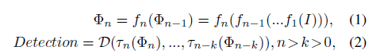

其中Φn是层n中的特征图，fn（·）是将第（n .. 1）层中的特征图转换到第n层的非线性块。 fn（·）可以是卷积层，池层，ReLU层等的组合，f1（I）是将输入图像I传送到第一层特征图的第一个非线性块。τn（·）是将第n层特征图转换为特定尺度范围的检测结果的函数。 D是聚合所有中间结果并生成最终检测的最终操作。

根据等式（2）我们可以发现，它很大程度上依赖于一个强有力的假设来表现良好。因为每一层的特征映射都是对其尺度的输出负责，因此假设每个Φ本身必须足够复杂，以支持检测和感兴趣对象的准确定位。通过复杂化，这意味着：1）特征图应该具有足够的分辨率来表示对象的细节; 2）将输入图像转换为特征图的功能应足够深，以便对特征图进行适当的高级抽象; 3）特征图包含适当的上下文信息，基于此，可以强烈地推断重叠对象，遮挡对象，小对象，模糊或饱和对象的确切位置\[16,12,18\]。从等式（1）和（2），我们观察到，当k大时，Φn比Φn-k深得多，所以上述的第二个条件对于Φn-k是不成立的。结果是，将（n-k）层中的特征图转换为其检测输出的函数τn-k（·）可能比τn（·）弱得多，难以训练。更快的R-CNN没有这个深度问题，因为它的区域提议是从最后一层特征图生成的，即：

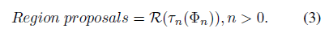

但是， （3）也有自己的问题，因为它打破了第一个条件。因此，我们认为在单级检测器中学习更为合理的功能可以定义如下：

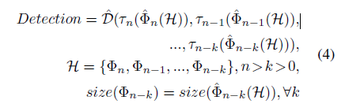

其中H是包含所有特征图的集合，其贡献于等式2中的检测函数D（·）。不等于（2），\^Φn（·）现在是一个函数，其中考虑所有贡献特征图，并向Φn输出相同维数的新特征表示。

式中定义的函数\^ D（·）如等式4确实满足特征图复杂度的前两个条件，因为由\^Φn-k（H）输出的特征图不仅具有与Φn-k相同的分辨率，而且还包含在较深层中提取的特征。值得注意的是，\^ D（·）仍然是单阶段过程，虽然修改为等式2。换句话说，如果我们也可以使等式4满足上述第三条件，设计有效的架构进行训练，我们将能够全面克服以前的单级方法的局限性，即使对于高IoU阈值也有机会超越两阶段方法。

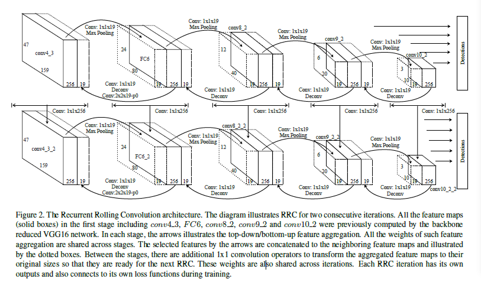

**反复滚动卷积**

条件特征聚合的RNN我们现在定义细节\^Φ（H），使得由该函数生成的特征映射包含有用的检测上下文信息。 \^Φ（·）中的上下文信息对于不同的感兴趣对象有不同意味。例如，当检测到小对象时，意味着\^Φ（·）应该返回特征图包含该对象的更高分辨率的特征，以表示缺少的细节。当检测到封闭对象时，\^Φ（？）应该返回特征图，其中包含这种对象的鲁棒抽象，使得特征对于遮挡是相对不变的。当检测到重叠对象时，\^Φ（·）应该返回特征图，其中包含边界细节和高级别抽象以区分不同的对象。然而，对于诸如Φp的中间级特征图，其中p是正整数，所有上述上下文信息可以从其较低级对应物Φp-q或其较高级对应物Φp+ r获取，其中q和r是也是正整数。困难在于，手动定义函数\^Φp（H）的固定规则从H中的Φp-q和Φp+ r中检索适当的特征，手工选择q和r也很难。因此，我们必须从数据中系统地学习这个特征检索和聚合过程。

然而，\^Φ（H）的学习可能是比较麻烦的，因为H是包含不同层次和不同尺度的多个特征图的集合，并且我们不知道应该涉及哪一个特征图，并且应该对特征施加什么样的操作映射当前感兴趣的物体。因此，从H到有用的\^Φ（H）的直接映射必须诉诸具有多层非线性的相当大的深度网络。这不会使计算高效，易于训练单级网络。另一种方法是设计一个迭代过程，其中每个步骤都是一个小而有意义和一致的进度。该过程可以在数学上描述如下，

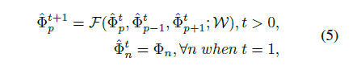

其中F是在步骤t处的\^Φt\_p及其直接的较高和较低级对应物的函数，在步骤t + 1处将新的Φp映射到函数F.功能F由一些可训练权重W参数化。

从图中我们可以看到，I是输入到网络的输入图像，并输出特征图\^Φ\^ 1。当功能τ应用于分类和边界框回归，输出仅适用于\^Φ\^ 1。然后函数F将执行特征聚合以获得必要的上下文信息，并在步骤2给出新的\^Φ\^ 2。然后函数τ能够输出基于更新的特征图\^Φ\^ 2的精细结果。请注意，我们可以在训练过程中对每个步骤施加监督信号，以便系统在特征聚合中找到有用的上下文信息，以便在检测中取得实际进展。一个重要的见解是，如果F和τ分别分担了这些步骤，这是一个重复性的网络。这里不能忽视重复性，因为它可以确保整个步骤中的一致功能聚合。这使得每个步骤中的功能聚合顺利并且很好地泛化。否则会更容易过拟合，造成意想不到的偏差。

**RRC模型细节**

如果我们同时应用等式5到每个\^Φ，这是我们提出的循环卷积卷积模型。值得注意的是，即使\^Φt + 1\_p是\^Φt\_p及其直接对应物\^Φt\_p..1和\^Φt\_p + 1的函数，如果对于Φt\_p..1和\^ Φt\_p + 1分别为自己的直接对应物，\^Φt + 1\_p中的值最终将受到足够迭代后H中所有特征图的影响。

所提出的RRC模型在图2中详细说明。该图显示了如何使用减少的VGG-16骨干模型将RRC应用于KITTI数据集\[12,13\]。输入图像的大小为1272x375，具有3个通道，因此原始conv4\_3层和FC7层的大小分别为159x47x512和80x24x1024，其中512和1024为通道号。 在特征聚合之前，我们使用额外的3x3卷积层来进一步将它们的频道减少到256个。 在SSD之后，我们还使用了conv3\_2，conv9\_2和conv10\_2图层进行多尺度检测，区别在于我们的conv8\_2层有256个，而不是512个通道。 我们发现多尺度特征图之间的统一通道号促进了更一致的特征聚合。

我们使用一个卷积层和一个去卷积层向下聚集特征。例如，对于图层conv8\_2，使用具有1x1内核的卷积层来生成大小为40x12x19的特征图。在通过ReLU和反卷积层之后，它们被连接到FC7。同样，图中的所有左指向箭头指示这样的向下操作。我们使用一个卷积层和一个最大池层来执行向上的特征聚合。同样采用图层conv8\_2作为示例，1x1卷积后跟ReLU和最大池，所得到的20x6x19功能图连接到conv9\_2。类似地，图中的所有正确的箭头指示这样的向上操作。我们称这个功能聚合过程为“滚动”，因为左指向和右箭头类似于它。

一旦滚动第一次完成，分别对每个层执行1x1卷积，以将通道数减少到原始设置。在这个信道减少之后，对于第一次迭代，完成整个特征聚合。这个通道减少很重要，因为它确保了两个连续特征聚合之间的每个特征图的统一形状。它也使经常性滚动可能。在训练期间，对应于每个箭头的卷积内核以及通道减少都是跨越迭代共享的。我们称之为迭代过程反复滚动卷积。

**RRC讨论**

RRC是一种循环过程，其中每次迭代收集并聚合相关特征进行检测。 正如我们之前讨论过的，这些重要的功能包含对检测具有挑战性的物体至关重要的上下文信息。 对于每个RRC，有一个单独的损失函数来指导它的学习。 这确保相关功能将逐渐导入，并使我们在每次迭代中取得实际进展。 因为RRC可以执行多次，所以所得到的特征图因此是“深入上下文”。 与\[18\]不同，因为RRC不是针对任何特定的边界盒而定制的，因此可以利用上下文信息中的深度来检测场景中的每个对象。

**损失函数**

每次迭代在训练过程中都有自己的损失函数。在SSD之后，对象类别分类的损失函数是交叉熵损失。平滑L1损失用于边界回归。

**边界盒回归空间离散化**

在我们的设置中，层中的一组特征图（例如conv4\_3）负责一定尺寸范围的边界框的回归。因为边界回归本质上是线性过程，因此如果该范围太大或者特征太复杂，则边界框回归的鲁棒性将受到显着影响。因为RRC过程将更多的情境信息带到特征图上，所以不可避免地会使得特征映射更加丰富，基于边界框回归对于原始对象范围可能更难做到。为了克服这个问题并使边界框的回归更加鲁棒，我们通过为其分配多个回归来进一步离散特定特征图中的边界框回归空间，使得每个回归函数负责更简单的任务。

**实 验**

我们的模型的评估是在KITTI基准测试\[6\]上进行的，其不仅包含许多具有挑战性的物体，如小型和严重闭塞的汽车和行人，它还采用0.7的IoU阈值进行评估。 KITTI数据集包含7481张图像进行训练和验证，另有7518张图像用于测试。我们在实验中没有使用任何其他数据集来增强结果。测试集的基准是不公开的。需要将结果提交到专用服务器进行测试集的性能评估。

我们在本文中进行了三个实验。第一个实验检验了每个反复滚动卷积之后的预测质量。第二个在较小的验证集中评估了我们的方法的性能。最后一个在官方测试集中评估了我们的方法，并与其他最先进的方法进行了比较。

**实施细节**

在整个实验中使用了以下设置。对于网络架构，我们做了5次RRC的培训。我们为每个相应的特征图分配了5个单独的回归。由于RRC由1x1卷积执行，因此得到的模型是有效的。对于数据增加，除了SSD纸张中采用的数据增加方法外，我们还在HSV色彩空间中随机调整了图像的曝光和饱和度为1.3倍。另外，由于KITTI数据集中对象的最小比例远小于原始配置，因此我们将conv4\_3的相应比例从0.1调整为0.066。我们还删除了原始SSD模型的最后一个全局池层，并将conv10\_2的规模设置为0.85。为了学习，动量为0.9的随机梯度下降（SGD）用于优化。重量衰减设定为0.0005。我们将初始学习率设置为0.0005。每40,000次迭代，学习率将除以10。我们还采用了训练集和验证集分离的简单图像相似性度量。目标是使训练集与验证集不同，我们生成的验证集有2741个图像。

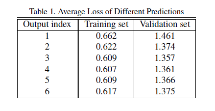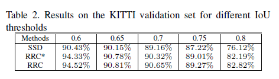

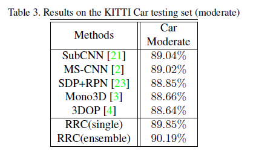 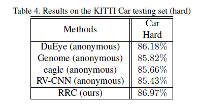

**检查每个RRC后的输出**

由于RRC在训练中使用了5次，原则上我们的模型有6个输出，即模型连续6次预测。根据RRC的设计，我们应该能够在每个RRC之后观察到改进。这个实验的目的是检查是否确实如此。

为了看结果，我们在训练集和验证集上运行了一个RRC模型，以计算两组的平均损失。结果总结在表1中。第一个输出是任何RRC发生之前的输出。第二次预测发生在第一次RRC迭代之后，等等。我们可以看到验证损失一般大于训练损失。这表示一定程度的过度配合。这是正常的，因为我们保留了验证集的大部分图像。我们观察到一致的趋势。第二产量的损失明显低于第一产量。最低损失来自第三或第四产出。然而，随后的损失值将不再下降。

一般来说，结果表明，RRC能够显着和持续地改进连续反复迭代的预测，但改进最终会发生偏差。这种现象的见解是双重的。首先，可以确认RRC的有效性。在后面的实验中，我们将展示这种改进是我们提出的方法来实现最佳性能的关键。另一方面，RRC最终退化预测的原因主要是因为缺乏有效的记忆机制\[10\]，这是长期序列模式建模的一种方式。虽然记忆机制是有帮助的，但它也将为模型引入相当多的计算和内存成本。本实验为我们提供了最终结果预测选择的指导。对于其余的实验，通过在第三，第四和第五预测中运行非最大抑制（NMS）来产生最终检测结果。

**验证集的绩效评估**

在本节中，我们量化了我们的方法对检测任务带来的改进。 该实验是用汽车数据集进行的，因为由于缺乏数据，训练集和步行验证的分离是困难的。 采用不同IoU阈值的mAP进行评估。 我们仔细培训了一个SSD汽车检测器作为基准。 在实验中测试了RRC的两个设置。 第一个通过输出2到通过输出6执行NMS，并表示为RRC \*。 第二种采用标准方法，其仅通过输出3到输出5执行NMS。如表2所示，两个RRC检测器执行得比原始的SSD实现好得多。 由于SSD和我们的方法共享与骨干网相同的减少的VGG-16网络，所以改进是新增的RRC架构的直接后果。

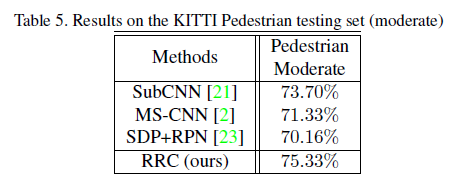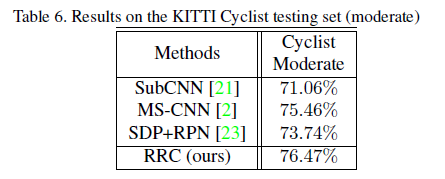

我们还可以观察到RRC执行得比RRC \*更好。这一点证实了我们从第一个实验中获得的结论的鲁棒性。值得注意的是，如果我们将IoU阈值的值提高到0.8，则该方案的性能优于原来的SSD超过6％。这大大证实了RRC在预测高质量候选框中的有效性。图4示出了三个模型之间的差异的一些示例。实际上，SSD的问题并不罕见，BBox的质量是阻止以前单级方法取得良好效果的瓶颈。RRC可以很好地解决这个问题。

**测试集的性能评估**

在这个实验中，我们评估了我们在KITTI汽车数据库上，行人和骑自行车者官方测试中的模型。对于汽车基准，我们将我们的方法与最近发布的五种最先进的方法进行了比较。结果如表3所示。与以前实验的唯一区别是我们采用与\[2\]相同的输入分辨率来确保公平比较。我们可以看到，单个RRC模型能够显着地胜过以前发布的所有结果。 RRC模型的集合比以前的方法执行得更好。我们还将RRC与其他匿名未发布的草案进行了比较，在表4中提到了KITTI。到本文撰写之时，我们最难的类别的结果在所有提交的基准方法中排名第一，包括所有未发布的匿名提交。据我们所知，RRC是实现这种结果的第一个单级检测器。该结果不仅证实了RRC的有效性，而且为单级检测器的精度提高铺平了道路。

RRC还获得了行动和骑自行车者基准测量的最先进的结果，测量IoU为0.5。见表5和表6。与以前公布的方法相比，我们观察到明显的改善。当包括所有匿名未发布的提交时，RRC排名第一，用于骑车人检测，第二个用于行人检测。这完全证明了所提出的RRC模型的有效性和鲁棒性。更多的定性结果如图5所示。

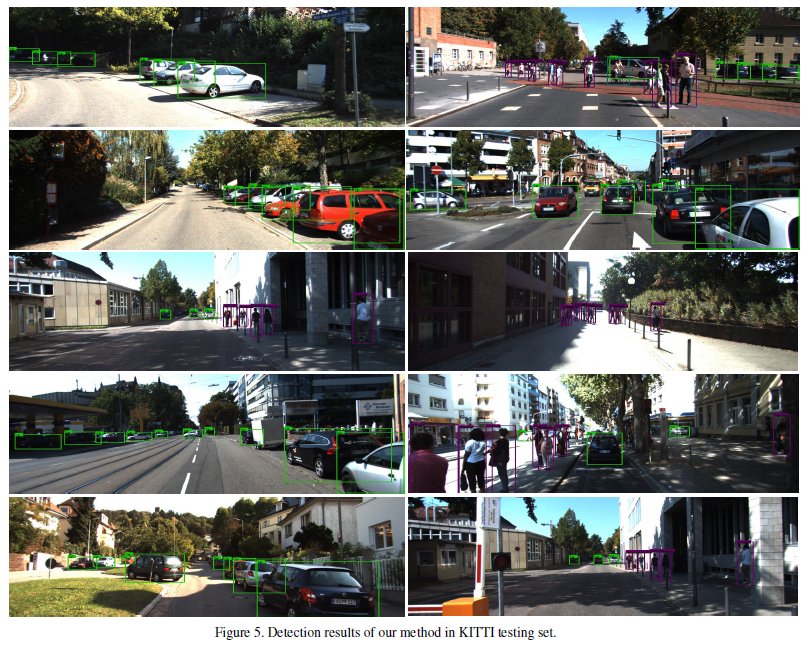

**结 语**

在本文中，我们提出了一种新型的循环滚动卷积架构来改进单级探测器。我们发现RRC能够在特征图之间逐渐和一致地聚合相关的上下文信息，并生成非常准确的检测结果。 RRC在KITTI检测的所有三个基准中获得了最先进的结果。 据我们所知，这是获得这样令人信服的结果最好的单级检测器。

在未来的工作中，我们计划在对象检测的上下文中调查内存启用的循环体系结构，并量化其对检测性能的影响。 我们也有兴趣将RRC广泛应用于3D对象检测和相关应用的任务。
