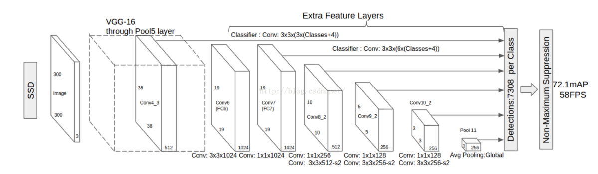
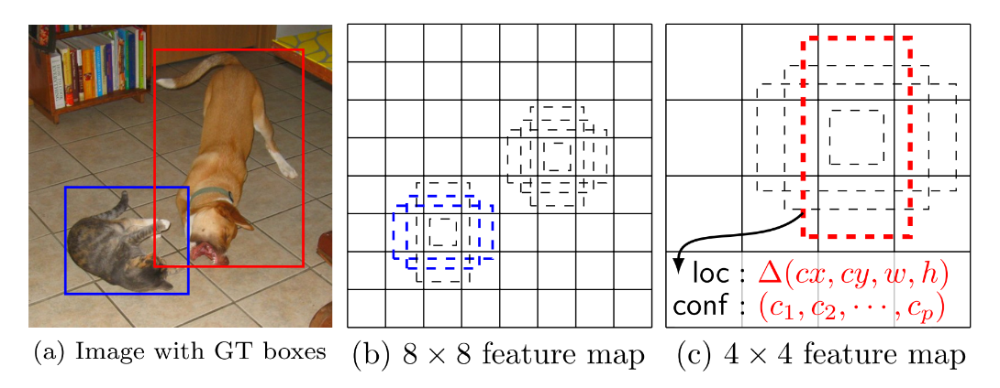
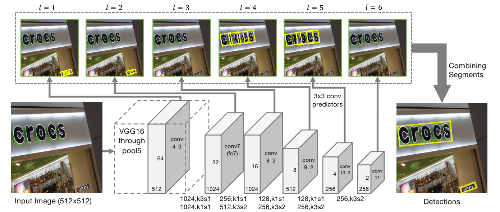
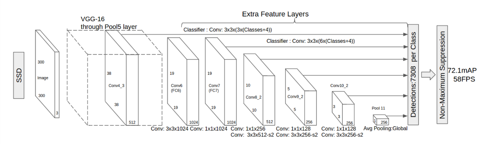
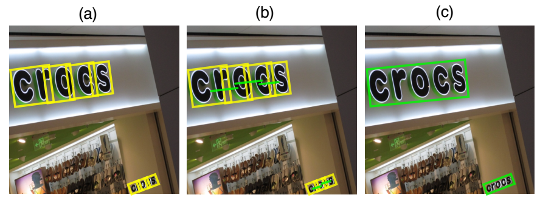
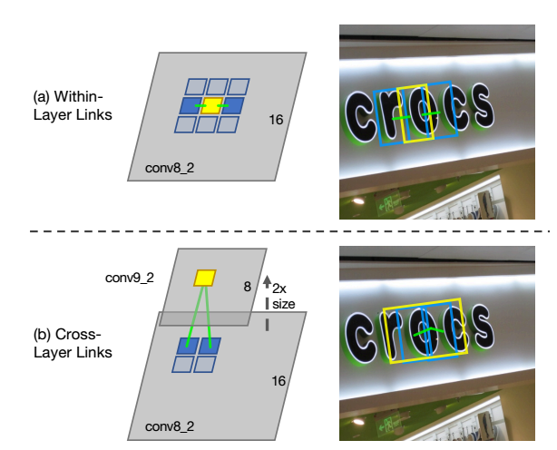
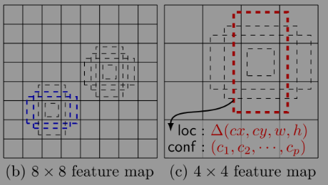
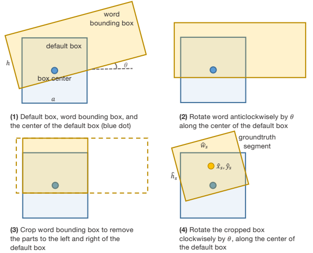

**SegLink自然场景中的字符检测:**

**主要贡献：**

*Segment(分割) & Link(连接)*

**网络输入图像大小：**

*512\*512*

**概述算法流程：**

*通过一个CNN网络产生密集预测，然后将相关（同词中的分割块）连接起来*。

**算法优势：**

*变形文字，非水平方向文字，任意长宽比文字，多语言种类文字都适用。*

**算法短板：**

*对于间隙较大的文本（字符串）容易在分割后无法连接成词被检测。*

原文：《Detecting Oriented Text in Natural Images by Linking Segments》

*http://xueshu.baidu.com/s?wd=paperuri%3A%28c3182ef8b3fb8ffdbd0232c78b438453%29&filter=sc\_long\_sign&tn=SE\_xueshusource\_2kduw22v&sc\_vurl=http%3A%2F%2Farxiv.org%2Fpdf%2F1703.06520&ie=utf-8&sc\_us=16077648517782010526*

1.  **基础模型**：

> 首先，应用**旧版SSD**的理论，建立在SSD的基础上，早期的SSD检测模型如下图，

{width="5.41044728783902in" height="1.5778937007874017in"}

SSD模型是建立在预训练的VGG-16基础上，替换了原VGG-16中的全连接层，替换为Conv4\_3，SSD模型的pool11层，之后输出每一类的检测预测。

原理是在base network的基础上，加了不同尺度的卷积层，卷积层尺寸大小逐层递减，为了在多尺度下预测。

1.  **原理：**

> SSD是针对（物体）检测的算法，后也被应用于字符检测，但是用于整体文字（词级，句级）检测，，这容易造成后期不利于识别的问题。对于**后期的文字识别工作，检测最好的效果是按词（英文），按字词（中文）独立成框**。所以分割是该文章检测方法中的重要步骤。

1.  **步骤：**

> **SegLink**分为**Segment**和**Link**，分割和连接，网络结构在预案SSD上有所改进如下图：
>
> 
>
> VGG-16网络的全连接层被替换成Conv4\_3后续如同SSD模型的不同尺度卷积层，最后的Pool\_11层被Conv\_11替代，多一层卷积，可以多个尺度预测的结果。改进SSD的地方除了个别网络层替换，在输出参数方面，将输出Bounding Box的四系数输出变为五系数输出（x, y, w, h, $\theta$）。$\theta$代表的是预测的字符与水平位置的逆时针旋转角度。
>
> ***在这个模型训练中，Ground Truth需要包含：***
>
> 字符标签（Labels：0/1，是否是字符），坐标框（Default Box）,偏移量（Offset：x, y, w, h, $\theta$）,和两种连接标签（Labels:0/1，同层和相邻层是否可连）。
>
> 

1.  **分割过程**：

> 改进的SSD网络的输出含有五维信息（x, y, w, h, $\theta$），实际上这篇paper中提及的分割算法，并不是真正从图像特征出发，从词句中分割出单个字母（字符）。而是通过更改数据库本身给的GT，将原始GT改为分割GT，实际上是按字符学习，但是整个网络是按词汇检测输出，分割后在第二部分连接合并。

1.  **连接（合并）过程**：

> 是词汇检测的重要步骤，按照分割块之间的关系（同层中如3\*3的关系窗，中心块和八个关系块相邻，属于同词的连接，标签为1，否则为0），合并分割块。
>
> 

1.  **训练真值（GT）生成：**

> 所有feature map上的Default Boxes是用于分割原始GT的基础点，首先在每个网格（每层feature map上）上按比例取Default boxes（在这篇文中只取一个尺度为1:1的）,然后判定每个DB是否是有字符（正样本），继而和GT框比对位置，旋转切割GT框，得到的就是单个字符的GT，是属于数据的预处理。生成的新的训练真值（GT）包含了角度信息还有Link信息（与某word有连接还是没有连接）。是否有连接的Label是按照，先判断该连接两边的DB是否都是字符，再判断是否都匹配同一个词的GT（这里是上一步分割GT前的原始GT）。
>
>  

1.  **训练**：

> 训练过程是学习每一个DB框和真值之间的（$\nabla$x, $\nabla$y, $\nabla$w, $\nabla$h, $\nabla\theta$）。
>
> 损失函数由两部分构成 —— *分割损失* 和 *合并损失*。
>
> 
