**译文：通过“分割再链接”检测自然图像中的多方向文本**

*原文：*

*Detecting Oriented Text in Natural Images by Linking Segments*

*链接:* *https://arxiv.org/pdf/1703.06520.pdf*

**概 述：**

大多数最先进的文本检测方法是特定于拉丁文脚本中的水平文本，对于实时应用程序来说还不够快。我们引入了一种多向文本检测方法的分割链接法（SegLink）。主要思想是将文本分解成两种可检测的元素，即分段（分割）和链接。片段是覆盖单词或文本行的一部分的定向边界框，链接连接两个相邻的段，表示它们属于同一个字或行。通过端到端训练的完全卷积神经网络，两个元素在多个尺度上密集地检测。最终检测是通过链接连接的段的组合。与以前的方法相比，我们的方法在精度，速度和训练容易度方面都有所改进。在标准的ICDAR 2015集（挑战4）基准测试中，它达到了75.0％的f值，优于前一大优势。它在512 \* 512输入图像上运行超过20 FPS。另外，我们的方法能够检测长的非拉丁文本（汉字等）。

**简 介：**

在自然图像中读取文本是许多现实应用的一个具有挑战性的任务，如照片OCR \[2\]，地理位置和图像检索\[9\]。在文本阅读系统中，文本检测，即在文字/文本行的边界区域定位文本区域通常是具有重要意义的第一步。在某种意义上，文本检测是物体检测的特定实例，以字/字符/文本行作为检测对象。最近，一种新的趋势已经产生，基于一般物体的高级检测/分割技术，设计了最先进的文本检测方法\[9,6,22,30\] \[4,5,15\]。

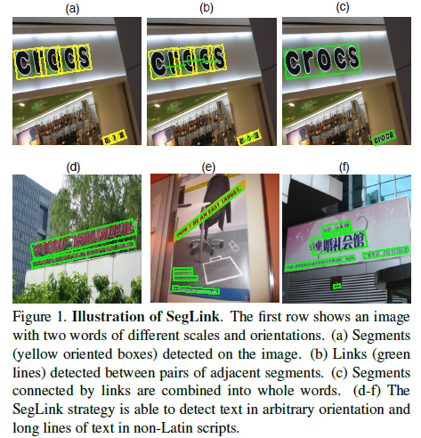

尽管以前的工作取得了巨大的成功，但我们认为一般物体的检测方法在几个方面并不适合本地化文本区域。首先，一个单词/文本行的边框比普通对象具有更大的纵横比。 （fast/faster）R-CNN \[5,4,19\] 或YOLO \[18\]型检测器可能受这种有检测框的限制。第二，一些非拉丁文脚本在相邻单词之间没有空格，例如中国汉字。直接命中单词的方法（例如\[9,6\]）可能不适用于检测这些脚本中的文本，因为没有确定每个单词边界的视觉提示。最后，文本可以在自然场景中任意定向\[25\]，而大多数方法\[9,22\]是专门为水平文本设计的。

为了克服上述困境，我们以新的视角处理自然场景文本检测。在本文中，我们提出用分段（分割）和链接两个基本元素来表示场景文本。如图1所示。 一个分割段是覆盖单词的一部分的边界框（为了清楚起见，我们在这里和稍后使用“单词”，但分段也可以应用于包含多个单词的“文本行”）。链接连接一对相邻的段，表示它们属于同一个字。在分段和链接的定义下，每个单词由具有所有相邻对之间的链接的多个段组成。在我们的方法中，分段和链接首先在经过卷积神经网络的特征图上被密集地预测，然后根据链路连接将来自相同字或文本行的段分组在一起。

具有个段和链接的这种表示的关键优点是，即使对于变形或非水平取向的情况，也可以用边界框局部地描述文本区域。此外，它允许我们检测任意长度的文本，因为段组合过程仅依赖于预测的链接。受益于拟议表示的简单性和灵活性，我们的方法适用于检测长行文本，特别是非拉丁语脚本中的文本。请注意，段可以设置为任意方向以覆盖定向或曲线形文本。

具体来说，我们提出了一种卷积神经网络（CNN）模型，以完全卷积的方式同时预测段和链路。网络架构基于SSD \[14\]，这是近来一般对象检测的发展。卷积预测器被添加到多个要素图层以检测不同尺度的段和链接。特别地，检测到两种类型的链路，即层内链路和跨层链路。层内链路将段与其一层上的邻近段相连。另一方面，跨层链接连接两个不同层上的分段。以这种方式，可以连接相邻位置的段。最后，我们将通过链接连接的细分作为最终输出，结合在一起。

本文的主要贡献是提出了具有分割和链接的新型检测框架，具有与现有技术相似的独特优势

方法在三个方面：1）鲁棒性：它很好地捕捉到面向复杂背景的定向文本的特征，在标准基准上获得更好的结果。特别是，在2010年ICDAR 2015（挑战4）基准\[12\]方面，它在Fscore上大幅优于先前的最佳成绩（75.0％vs 63.5％）。 2）效率：我们的方法是高效的，能够处理大于每秒512x512尺寸的20个以上的图像，因为在全卷积CNN模型中通过单次向前传递获得的分段和链接，而不调整大小或旋转输入图像; 3）通用性：除了拉丁语脚本之外，我们的方法还能够检测长的非拉丁语脚本文本，通过对多语言数据集的评估来证明。

**近 期 研 究：**

文本检测在过去几年中，吸引了大量关于自然图像文本检测的研究工作\[24,23,17,17,25,7,8,30,29,2,9,6,22,26\]。根据基本检测元素，这些方法可以大致分为三类：基于字符的，基于字的和基于行的。基于字符的方法\[17,23,24,10,7,8\]假设字符由一个或几个连接的组件组成，并利用此属性来寻找字符或笔画的所有可能候选。这样的方法通常需要后处理滤波或分量分组。基于词的方法\[9,6\]直接敲击单词的边界框，类似于最近流行的具有卷积神经网络的一般对象检测的流程。尽管实现了出色的检测精度，但这些方法可能不适用于非拉丁语脚本。基于行的方法\[29,30,26\]以整体划分文本行的区域方式，这还需要额外的后处理操作字分割和/或去除。

与以前的方法相比，我们的方法的大多数检测程序着重于用单个卷积神经网络预测段和链接，导致更简洁检测流程。所提出的SegLink策略类似于最近通过卷积神经网络和循环神经层的组合分析和分一系列不同精细尺度文本来检测文本行的工作\[22\]。然而，在我们的方法中，分段可以任意定向，这比以前仅适用于水平方向文本框的办法，更适合于覆盖多向文本\[22\]。

**物体检测**

文本检测可以看作是一般物体检测的一个特定实例，这是计算机视觉中的一个根本问题。最先进的检测系统可以使用CNN模型\[5,4,19\]未知类别的分类问题，或直接估计对象位置和边界框\[18,14\]。

我们网络的架构是基于最近的一个物体检测模型SSD \[14\]。 SSD提出了使用卷积预测器检测多个要素层上的对象的想法。我们的模型也以非常相似的方式检测分割和链接。尽管模型相似，但是我们的检测策略是完全不同的：SSD直接输出对象边界框，而我们检测到的段只是一个单词或文本行。

**分 割 & 连 接：**

我们的方法使用前馈CNN模型检测文本。 给定特定大小wI \* hI的输入图像I，模型输出固定数量的分段和链接，然后通过它们的置信度分数进行滤波并组合成整个单词。 对于水平和定向文本，边界框由5个参数b =（x\_b, y\_b, w\_b, h\_b, theta\_b）表示。 x\_b，y\_b是边界框中心的坐标，wb，hb是宽度和高度，theta\_b是以水平为单位的弧度角。

**CNN模 型：**

图2说明了CNN模型的架构。特征层（conv \*）的配置与SSD相似\[14\]。早期的层（conv\_1到pool\_5）来自预先训练的VGG-16网络\[21\]，其完全连接的层被分别转换成卷积的层（分别为fc6-7到conv6-7）。这些层之后是一些额外的卷积层（conv8-10），提取更深的特征用于检测。 SSD（pool11）的最后一个池层由我们网络中的卷积层（conv11）替代。

在六个特征层上检测到分段和链接，即conv4\_3，conv7，conv8\_2，conv9\_2，conv10\_2和conv11。特征层产生不同尺寸的特征图，提取不同尺度的高质量特征。将具有3\*3个滤波器的卷积预测器添加到六层中的每一层，以共同检测段和链接。我们通过l = 1，...，6对特征层和预测变量进行索引。

**分割检测**

分段（分割）也是定向的边界框，由s =（x\_s, y\_s, w\_s, h\_s, theta\_s）表示。它们通过估计与特征图位置相关联的一组默认框\[14\]的置信度分数和几何偏移来检测。为了简单起见，我们只将一个默认框与地图位置相关联。

考虑其特征图大小为wl \* hl的第l个要素图层。该地图上的位置（x,y）对应于图像上以（x\_a,y\_a）为中心的默认框，其中:

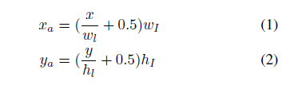

默认框的宽度和高度均设置为常量a\_l。

在（x, y）的位置，预测器将2个数字预测为正和负分段得分，5个数字作为几何偏移（Δx\_s, Δ y\_s, Δw\_s, Δh\_s, Δtheta s）。 通过将估计的偏移应用于默认框来计算段的几何参数：

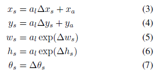

常数a\_l控制输出段的比例，关于第l层的感受野大小来选择。我们使用以下经验公式来选择这个大小：

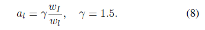

**层内链接检测**

检测到的分段是整个单词的一部分。 然后我们通过检测链接来明确地估计它们之间的连接。 链接连接一对相邻的段，表示它们属于同一个字。这里，相邻段是在相邻地图位置处检测到的分段。链接不仅需要将分段组合成整个单词，而且还有助于分离两个相邻的单词，分离单词之间的链接应该被预测为负值。

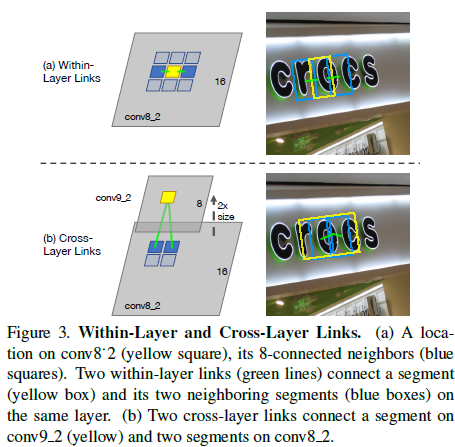

由于我们在图上检测到一个分段的位置，所以分段可以通过位置(x,y)进行索引，和层索引l，即s（x, y, l）。 如图所示3.a，我们将分段的内层邻居定义为同一特征图上的8连接邻居：

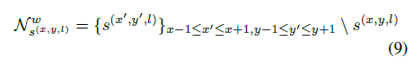

当局部检测到分段时，一对相邻的分段在输入图像上也相邻。

链接也由预测器卷积检测。在某个位置，预测器估计s（x; y; l）与其所有8个邻居Nw s（x， y， l）之间的链接的正和负分数，产生16个数字。

跨层链路检测由于在不同尺度的多个特征层上检测到段，所以可以在多个层上检测到一个单词的段，从而产生冗余。受链接策略的启发，我们进一步提出了另一种称为跨层链路的链路来解决冗余问题。跨层链路连接两个连续层上的段，例如conv4\_3和conv5，conv7和conv8 2，这些层有一个重要属性是第一个层次的总体尺寸是第二个层次的两倍，因为它们之间存在最大池化层或卷积层步长为2的层。请注意，只有当所有特征图都具有偶数大小时，该属性才能保持，通过使输入图像的宽度和高度均可分成128。

如图所示3.b，我们将段的跨层邻居定义为：

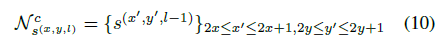

跨层邻居位于当前层之上，它们对应于在更细微尺度上检测到的分段。再次，预测器卷积地检测跨层链路，连同段和层内链路。在每个地图上的位置上，预测器产生8个数字，这是4个跨层链接的正和负分数。除了最下面的特征层conv4\_3之外，所有特征层都检测到跨层链接。它们连接每对连续的层。因此，可以连接和组合两个不同尺度的段。

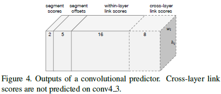

卷积预测器的输出将东西放在一起，图4示出了卷积预测器的输出通道。预测器被实现为输出这些通道的卷积层，具有额外的softmax层以分别标准化段和链接得分。因此，我们的模型以完全卷积的方式检测分段和链路，提高速度。

**将分割与链接结合：**

最后一步是将检测到的分段与检测到的链路相结合。 在进一步转换之后，CNN模型产生固定数量的分段和链接（数量取决于图像大小），然后通过其置信分数进行过滤。 我们为片段和链接设置不同的过滤阈值，分别为α和β。

将过滤的分段作为节点，将过滤的链接作为边，构建一个图。 然后，在图上执行深度优先搜索（DFS）以找到其连接的组件。 每个组件包含一组由B表示的由链接连接的分段。 一组中的分段通过Alg.1中描述的过程组合成一整个单词。

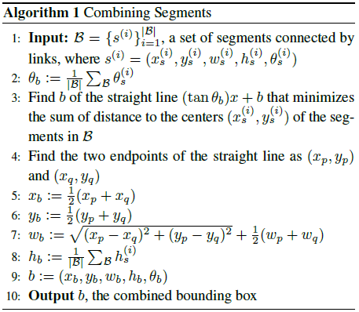

**训 练：**

**分割和链接的真值（GT）**

训练检测网络需要分割和链接的GT。 groundtruths包括所有默认框的标签，偏移量和所有内层和跨层链接的标签。 它们是从训练数据集的自带边界框计算的。 我们设计以下规则来计算基准值。 假设图像上只有一个单词，默认框被标记为正，并与该单词匹配，如果1）框的中心在单词内; 2）盒子大小a\_l和单词高度之间的比例h满足：

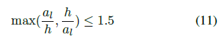

否则，它被标记为负样例。

当图像包含多个单词时，如果该单词不符合上述条件，则默认框将标记为否定。否则，它被标记为正，并且与具有最接近的大小的单词匹配，即具有等式11.的左侧具有最小值的单词。

偏移量仅在正值默认框上计算。 按照图1所示的步骤。 我们首先计算groundtruth段的几何参数。 然后，我们解等式 3到等式 7获取该默认框的groundtruth偏移量。

最后，如果连接到它的两个默认框都标记为正，则将链接（层内或跨层）标记为正， 2）两个默认框与同一个字匹配。

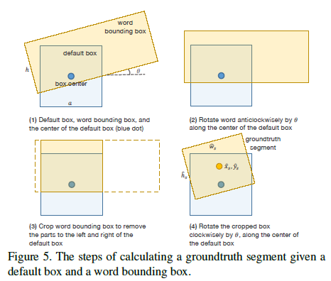

**优 化：**

**目标**

训练CNN模型同时最小化分段损失，偏移回归和链路分类。总的来说，损失函数是三个损失的加权和：

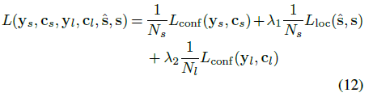

这里，y\_s是所有段的标签。 如果第i个默认框被标记为正，y\_s（i）= 1，否则为0。 同样，y\_l是链接的标签。 L\_conf是预测段和链路得分的softmax损失，分别为c\_s和c\_l。 Lloc是预测的段几何和真值（GT）的平滑L1回归损失\[4\]。 通过N\_s归一化段分类和回归的损失，N\_s是正的默认框的数量。 链路分类的损失通过正链路N\_l的数量来归一化。 实际上，重量常数λ1和λ2均设定为1。

**在线强采样**

对于分段和链接，负样本占用大多数训练样本。因此，需要采取严格的负面采样策略来平衡正和负样本。我们遵循\[20\]中提出的在线强采样策略，最大限度地保持负样本和正样本之间的比例为3：1，为分段和链接单独执行采样。

**数据扩增**

我们采用类似于SSD \[14\]和YOLO \[18\]的在线扩增渠道。将训练图像随机裁剪成一个图块，该图块与groundtruth边界框具有最小的jaccard重叠o，然后将其重新调整为相同的大小并加载到批（batch）中。对于定向文本，扩展是在定向词边界框的最小边界矩形上执行的。从0（无约束），0.1，0.3，0.5，0.7和0.9中随机选择重叠o。图块儿的大小是\[0.1, 1\]的原始图像大小，训练图像不会水平翻转。

**实 验：**

在本节中，我们按照本研究领域的标准评估协议，对三个基准数据集（即ICDAR 2015文本（挑战4）），MSRA-TD500和ICDAR 2013进行评估。

**数据集**

*合成词（SynthText）\[6\]*包含80万个合成训练图像。它们通过将自然图像与随机渲染的人造文本混合而合成字体，大小，方向和颜色。此外，为了使图像更加现实，作者提出寻求以均匀颜色和质感为特征的图像区域。单词与这些估计区域对齐。数据集为字符，单词和文本行提供非常详细的注释。在我们的实验中，数据集仅用于产生的CNN模型的预训练。

*ICDAR 2015文本集（IC15）\[12\]*是ICDAR 2015年鲁棒读取文本竞赛的挑战。这个挑战提供了Google眼镜捕获的偶然场景文字图像，而不考虑定位，图像质量和观点。因此，该数据集中的文本可能呈现出任何方向和任何具有小尺寸或低分辨率的位置，使得挑战比以前的ICDAR挑战困难得多。数据集包含1000个训练图像和500个测试图像。注释被提供为字边界框。

*MSRA-TD500（TD500）\[25\]*是第一个专注于定向文本的流行数据集。此外，数据集是多语言的，包括中文和英文文本。数据集由300个训练图像和200个测试图像组成。与IC15不同，TD500的注释作为文本行的边界框提供。该数据集的评估方案与ICDAR挑战的评估方案略有不同，可参考\[25\]。

*ICDAR 2013（IC13）\[13\]*仅包含水平文本（有些单词略有导向）。该数据集已被广泛用于评估以前工作中的文本检测性能。数据集由229个训练图像和233个测试图像组成。

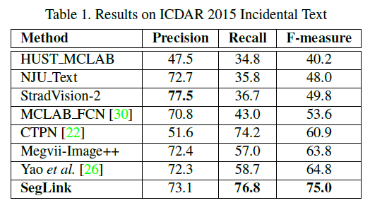 !
[C:\\Users\\zhanni\\AppData\\Local\\Temp\\1496645372(1).png](seglink_t/media/image14.png)

**实 施 细 节：**

我们的检测网络对SynthText数据集进行了预先训练，并对实际数据进行了计算。 检测网络采用标准SGD算法优化，动量为0.9。 对于预训练和训练，训练图像大小调整为384\*384次随机播种。 由于我们的模型是完全卷积的，我们可以按照一定的尺寸进行训练，并将其应用于其他尺寸的测试中。 批量大小设置为32.在预训练中，对于前60k次迭代，学习率设置为10\^-3，然后在30k次迭代中衰减到10??4。 对于精确计算，5-10k次迭代的学习率固定为10\^-4。微调训练迭代的数量取决于数据集的大小。

我们的方法是在TensorFlow \[1\]（版本r0.11）下实现的，这是一个基于数据流的GPU加速深度学习框架。 该实现主要基于Python，一些使用C ++编写的自定义操作符。 所有实验都在具有Intel Xeon 8核CPU（2.8 GHz），4 Titan X显卡和64GB RAM的工作站上进行。 训练过程并行运行在4个GPU上，每个GPU一次处理一个批次中的32个图像中的8个。 训练一批约需0.5s。 整个训练过程不到一天。 测试在一个GPU上执行。 测试图像大小因数据集而异。

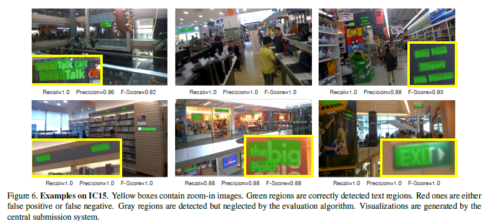

**检测多向英文文本**

首先，我们评估IC15上的SegLink，这是目前最具挑战性的数据集之一。 预训练的模型在IC15的训练数据集上进行10k次迭代。 所有测试图像的原始尺寸为1280 \* 800。 这些图像大小调整为1280 \* 768，因此它们的高度和宽度可分为128。我们将分段和链接的阈值分别设置为0.9和0.7。 绩效分数由官方中央提交服务器（http://rrc.cvc.uab.es/?ch=4）计算。 为了适应所需的提交格式，词边界框从定向矩形转换为多边形。

表1列出并比较了提出的方法和其他最先进的方法的结果，在精度，召回值和f度量方面。 一些结果是从在线竞争的领导者获得的。 从表中可以看出，我们的方法大大优于其他方法。 在f度量方面，SegLink的表现优于10.2％。考虑到与SegLink相比，几种方法具有接近甚至更高的精度值，其改进主要来自召回值。 如图6所示，我们的方法能够区分文本区域和非常混乱的背景。 另外，由于明确的链接预测，我们的方法正确分离了彼此非常接近的单词。

**检测长行多行文本**

为了显示SegLink的泛化性（普适性），我们进一步展示了其检测非拉丁文本的能力。我们在这里采用TD500，因为它具有任意导向和多语言文本。 TD500的训练集仅包含300张图像，即使使用数据增加，也不足以对我们的模型进行精细化。为了克服训练数据的不足，我们把TD500的训练集与IC15的训练集进行了混合，每批都有一半的图像来自每个数据集。我们预先训练的模型为8k次迭代。测试图像大小调整为768 \* 768。阈值α和β分别设置为0.9和0.5。绩效分数由官方开发工具包计算。

根据表2总结的结果，SegLink在精度，召回率和f-measure方面达到最高分。此外，SegLink的简洁性和精心设计的架构受益匪浅，每秒处理大约9张图像，比竞争对手快得多。 SegLink也很简单。 SegLink的推理过程是检测网络中的单一向前传递，而以前的方法\[25,28,30\]涉及复杂的基于规则的分组或过滤步骤。

TD500包含许多长的英文和中文文本。图7显示SegLink如何处理这样的文本。可以看出，长的文本行很好地被本地化，被密集检测的片段覆盖，并且遍及整个图像。特别地，我们的模型抑制两个相邻文本行之间的链接，使得文本行被分离而不是组合成一个。

**检测水平文本**

我们还测试了IC13上的SegLink，以评估其在检测水平文本时的性能。对于训练，我们的模型与IC13和IC15的训练集的组合进行了5k次迭代。由于IC13中的大部分文字尺寸相对较大，因此在我们的实现中，测试图像大小调整为512 \* 512。阈值α和β分别设定为0.6和0.3。由于IC13的提交格式是矩形边框，我们通过找到每个框架的最小边界矩形将检测到的定向框转换为矩形边框。

表3比较了SegLink与其他最先进的方法。分数由中央提交系统根据“Deteval”评估方案计算。 SegLink在fmeasure方面取得了非常有竞争力的成果，是处理每秒超过20张图像的最快方法。在f-measure方面，只有一种方法\[22\]胜过SegLink。然而，\[22\]主要用于检测水平文本。它也比SegLink慢得多。在这个意义上，SegLink仍然是水平文本本地化的顶级文本检测器。

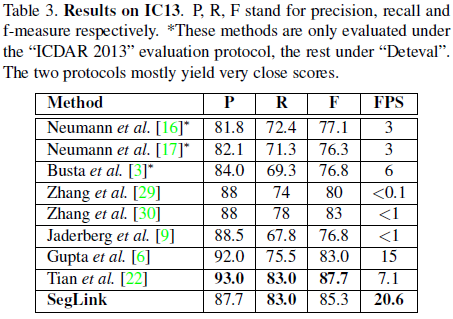

**局 限：**

SegLink的主要限制是需要手动设置两个阈值α和β。作为召回值，精度和f度是两个参数的非线性函数。实际上，通过网格搜索找到阈值的最优值。我们的方法的另一个缺点是它无法检测到具有非常大的字符间距的文本。图8.a，b显示了这种情况的两个例子。 检测到的链路连接相邻的段，但在远程段上失败。

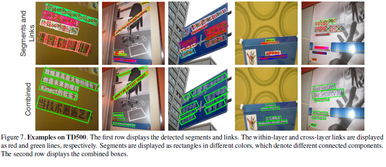

SegLink可能无法检测弯曲形状的文本，例如图中的示例8.c. 然而，我们认为，这个问题可以通过对段组合算法的修改来解决，该算法应该能够输出除定向边界框之外的变形边界框。

**总 结：**

我们提出了SegLink，一种新颖的文本检测算法以及CNN模型，用于有效预测分割和链接。 在文献中优于其他竞争方法的水平和多面向文本检测基准的优越性表明，我们的方法有效地捕捉了场景文本的子结构，灵活和一般地克服了它们的巨大变化（方向等）。 如所讨论的，SegLink在拉丁语和非拉丁语的脚本上都有很好的工作，具有任意的长度和方向，并且可以检测变形的文本，例如曲线形文本。 我们的方法的另一个优点是其高效率，满足实际应用的要求。 将来，我们有兴趣将SegLink扩展到端到端的文本识别系统。
