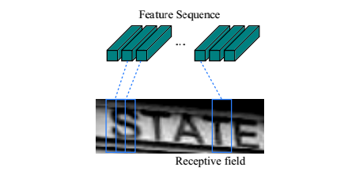
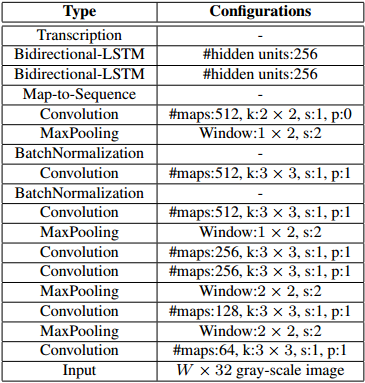
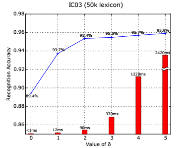
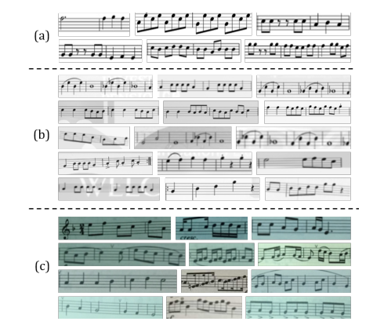
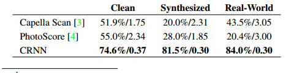

An End-to-End Trainable Neural Network for Image-based Sequence
Recognition and Its Application to Scene Text Recognition

Baoguang Shi, Xiang Bai and Cong Yao\
School of Electronic Information and Communications\
Huazhong University of Science and Technology, Wuhan, China\
*{*shibaoguang,xbai*}*@hust.edu.cn,
[*yaocong2010@gmail.com*](mailto:yaocong2010@gmail.com)

摘要

基于图像的序列识别一直是计算机视觉中长期存在的研究课题。在本文中，我们研究场景文本识别的问题，这是基于图像的序列识别中最重要和最具挑战性的任务之一。本文提出了一种将特征提取，序列建模和转录集成到一个统一的框架中的新型神经网络工作架构。与以前的系统文字识别相比，所提出的架构具有独特的特性：（1）与大多数现有算法相比，它们是端到端可训练的，其组合是经过独立训练和调整的。（2）自然地处理任意长度的序列，不涉及字符分割或水平尺度归一化。（3）对于任何预先设定的词汇表，并不会在词汇和词法的基础上进行语言识别任务，而且具有显着的性能。（4）它产生一个有效而又模糊的模型，对现实应用场景更为实用。包括IIIT-5K，街景视图文本和ICDAR数据库在内的标准基准测试的实验证明了所提出的算法与现有技术的优越性。此外，所提出的算法在基于图像的音乐符号识别任务中表现良好，这显然证明了它的通用性。

1.  说明

最近，社会上可以看到神经网络的巨大复兴，主要是深层神经网络模型，特别是深层神经网络（DCNN）在各种视觉刺激中取得的巨大成就。然而，最近与深层网络有关的大多数工作都致力于检测或分类对象类别\[12,25\]。在本文中，我们关注计算机视觉中的一个经典问题：基于图像的序列识别。在现实世界中，稳定的视觉对象，如场景文字，手写和音乐，通常以序列的形式出现，而不是间隔。与一般对象识别不同，识别这种类似序列的对象通常需要系统来预测一系列对象标签，而不是单个标签。因此，这样的对象的识别当然可以被给出序列识别的问题。类似的对象序列的另一个独特的特征是它们的长度可以变化很大。例如，英文单词可以由两个字符组成，如“OK”或15个字符，如“congratulations”。因此，最流行的深度模型如DCNN
\[25,26\]不能直接应用于序列预测，因为DCNN模型通常对具有固定维度的输入和输出进行操作，因此不能产生可变长度的标签序列。

一些具体的对象序列（如场景文本）试图解决这个问题。例如，\[35,8\]中的算法首先检测单个字符，然后使用用标记图像训练的DCNN模型来识别检测到的字符。该方法通常需要对强大的字符检测器进行训练，以便从原始单词图像准确地检测和切割每个字符。一些其他方法（例如\[22\]）将场景文本识别视为图像分类问题，并为每个英文单词（总共90K个字）分配一个类标签。结果是大量训练有素的模型，大量的课程难以扩展到其他类型的类似对象序列，如中文文本，音乐分数等，因为类型的基本顺序的组合可以超过100万。总之，基于DCNN的目标系统不能直接用于基于图像的序列识别。

神经网络（RNN）模型是深层神经网络系列的另一个重要分支，主要用于处理序列。
RNN的一个优点是在训练和测试期间不需要序列对象图像中每个元素的位置。然而，将输入对象图像转换为一系列图像特征的预处理步骤通常是至关重要的。例如，Graves
et al.\[16\]从手写文本中提取几何或图像特征，而Su和Lu
\[33\]将字图像转换为顺序HOG特征。预处理步骤独立于管道中的后续组件，因此基于RNN的在线系统不能以端到端的方式进行训练和优化。

几个不依赖于神经网络的，传统的，独立于场景的文本识别方法也提供了新颖的方法，AlMazan等人
\[5\]和Rodriguez-Serrano等人\[30\]提出将单词和文本字符串嵌入到通用子空间中，并将单词识别转换为检索问题。姚等人\[36\]和戈多等人\[14\]使用中间函数进行场景文本识别。虽然有前途的表征是在标准的基础上进行的，但这些方法一般都是基于以前的神经网络算法\[8,22\]以及本文提出的方法。

本文的主要贡献是一种新颖的神经网络模型，其网络架构用于识别图像中的序列对象。所提出的神经网络模型称为卷积循环神经网络（CRNN），因为它是DCNN和RNN的组合。对于串行对象，CRNN具有优于传统神经网络模型的以下显着优点：1）可以直接从序列标签（例如单词）获得，而不需要详细的注释（例如字符）；2）DCNN直接学习图像数据；3）与RNN相同的属性可以生成一系列标签；4）不需要预处理步骤的对象序列的长度，不需要预处理步骤，包括二进制；5）它比现有的技术在场景文本（字符识别）上获得更好或更具竞争力的表现\[23,8\]；6）它比标准DCNN型号的参数少，占用较少的存储空间。

1.  网络结构

CRNN的网络架构如图1所示，由三个组成部分组成，从底部到顶部为卷积分层，循环层和转录层。

在CRNN的底部，卷积层自动地从每个输入图像中提取特征序列。在卷积网络的顶部，构建了一个循环网络，用于对由卷积层输出的特征序列的每个帧进行预测。采用CRNN顶部的转录层将循环层的帧预测转化为标签序列。虽然CRNN由不同种类的网络架构（例如CNN和RNN）组成，但可以通过一个损失函数进行联合训练。

{width="4.952830271216098in"
height="5.623525809273841in"}

图1. 网络架构。该架构由三部分组成：1）卷积层，从输入图像中提取特征序列;
2）循环层，其预测每个帧的标签分布;
3）转录层，其将每帧预测转换成最终标签序列。

2.1特征序列提取

在CRNN模型中，通过从标准CNN模型（去除全连接层）中的卷积和max-pooling层构造卷积层的分量。这样的组件用于从输入图像中提取序列特征表示。在进入网络之前，所有图像都需要缩放到相同的高度。然后，由卷积层的组合产生的特征向量提取特征向量序列，卷积层是用于循环层的输入。特别地，*特征序列的每个特征向量在特征映射列上从左到右生成*。这意味着第i个特征向量是所有图的第i列的连接。我们设置中每列的宽度固定为单个像素。

由于卷积层，max-pooling和激活函数在局部区域上运行，它们是不变的。因此，特征图的每一列对应于原始图像的矩形区域（称为接受域），并且这些矩形区域与从左到右的特征图上的相应列相同。如图2所示，特征序列中的每个向量与接受域相关联，并且可以被认为是该区域的图像描述符。

{width="4.78125in" height="2.25in"}

图2.接受领域，提取的特征序列中的每个向量与输入图像上的接受域相关联，并且可以被认为是该字段的特征向量。

强大的，丰富的和可训练的，深度卷积特征已经被广泛应用于不同类型的视觉识别任务\[25,12\]。一些以前的方法已经使用CNN来学习诸如场景文本之类的类似物体的鲁棒表示\[22\]。然而，这些方法通常通过CNN提取整个图像的整体表示，然后收集局部深度特征来识别序列样对象的每个分量。
由于CNN要求输入图像以固定尺寸的形式进行布局，以满足固定输入尺寸的要求，因此它不适用于其长度变化大的序列样物体。
在CRNN中，我们将对流特征转换为顺序表示，以便对序列样对象的长度变化是不变的。

2.2 序列标注

卷积层的顶部是一个深度的双向循环神经网络，作为循环层。循环层预测标签分布$y_{t}$每帧$x_{t}$的特征序列$X = x_{1},\ldots,x_{T}$。循环层的优点是三个。首先，RNN具有在序列内捕获上下文信息的强大能力。使用基于图像的序列识别的上下文提示比独立地处理每个符号更稳定和有帮助。以场景文字识别为例，宽字符可能需要连续几个帧来完全描述（参见图2）。此外，当观察其上下文时，一些模糊的字符更容易区分，例如。通过将字符高度相比，可以更容易地识别“i”“l”，而不是分别识别每个。其次，RNN将误差传播到其输入，即卷积层，允许我们在统一的网络中共同训练循环层和卷积层。第三，RNN能够按照从开始到结束的任意长度序列进行操作。

2.3 转录

转录是将RNN制作的每帧预测转换成标签序列的过程。从数学上讲，转录是以每帧为前提条件，以最高概率找出标签序列。在实践中，存在两种转录模式，即基于词汇和词典的转录。词典是一组标签序列，预测约束为（例如，拼写检查字典）。在没有词汇的模式中，没有任何词汇表进行预测。基于非线性模式，通过选择具有最高概率的标记序列进行预测。

2.3.1 标签序列的概率

我们采用Graves等人提出的连续时间分类（CTC）层定义的条件概率\[15\]。对于按照每帧预测$y = y_{1},\ldots,y_{T}$标签序列l定义概率，它忽略了l中每个标签的位置。因此，当我们使用这种概率的负数似然度作为网络训练的目标时，我们只需要图像数据和它们对应的标签序列，避免了个人字符位置标记的工作。

条件概率的公式如下：输入是序列$y = y_{1},\ldots,y_{T}$，T是序列长度。
这里，每个$y_{t} \in \mathcal{R}^{\left| \mathcal{L}^{'} \right|}$是集合$\mathcal{L}^{'}\mathcal{= L}\bigcup_{}^{}\ $上的概率分布，其中$\mathcal{L}$包含任务中的所有标签（例如，所有内容字符）以及由.表示的“空白”标签。
序列映射函数B在序列$\pi \in \mathcal{R}^{'T}$上定义，其中T是长度。
B将π映射到l，最后删除重复的标签，然后删除'blank'。
例如，将“--hh-e-l-ll-oo”（' - '表示'blank'）映射到“hello”。
然后，条件概率被定义为由B映射到l的所有π的概率之和:

$$p\left( 1 \middle| y \right) = \sum_{\pi:\beta\left( \pi \right) = 1}^{}{p\left( \pi \middle| y \right)}$$

其中π的概率定义为$p\left( \pi \middle| y \right) = \prod_{t = 1}^{T}y_{\pi_{t}}^{t}$,$\ y_{\pi_{t}}^{t}$是具有标签$\pi_{t}$时间戳t的概率。直接计算方程由于总和项目的数量很大，所以1将是计算不可行的。但是，1可以使用\[15\]中描述的前向后向算法进行有效计算。

2.3.2 无词典转录

在这种模式下，具有等式（1）中定义的最高概率的序列l \*
作为预测。我们使用\[15\]中采用的策略，不存在可疑算法来精确地发现这个问题。大约由$1^{*} \approx \beta(\arg\max_{\pi})\text{\ p}\left( \pi \middle| y \right)$找到序列l
\*，即在每个时间戳t处拍摄最可能的标签$\pi_{t}$，并将得到的序列映射到1
\*。

2.3.3 基于字典的转录

在基于词典的模式中，每个测试样本与词典$D$相关联。基本上，通过选择具有等式中定义的最高条件概率的词典中的序列来识别标签序列1，即$1^{*} = \arg\max_{x_{1} \in D}p\left( 1 \middle| y \right),$
然而，对于大型词典，例如50k字的汉普斯拼写检查词典\[1\]，对词法进行详尽的搜索，即为词法中的所有序列计算公式1，并选择具有最高概率的那一个将是非常耗时的。为了解决这个问题，我们观察到，2.3.2中描述的通过无词汇转录预测的标记序列通常接近于编辑距离度量的基础实际。这表明我们可以将我们的搜索限制为最近邻候选$N_{\delta}(1^{'})$，其中δ是最大编辑距离，$1^{'}$是在词典自由模式下从y转录的序列：

$$1^{*} = \arg\text{\ max}_{\ }p\left( 1 \middle| y \right)$$

$${1 \in N}_{\delta}(1^{'})$$

可以用BK树数据结构\[9\]有效地找到候选$N_{\delta}(1^{'})$，这是一种特别适用于离散度量空间的度量树。BK树的搜索时间复杂度为$O(log\ |\ D\ |)$，其中|D|
是词库的大小。
因此，这种方案很容易扩展到非常大的词典。在我们的方法中，构建了一个BK树，用于词典。然后，我们使用树进行快速在线搜索，通过确定与查询序列具有小于或等于δ编辑距离的序列。

2.4 网络训练

通过$X\  = \ \{ I_{i},1_{i}\}\ i$表示训练数据集，其中训练图像和$I_{i}$表示地面真实标签序列。目的是最小化基本真实条件概率的负对数似然：

$$= - \sum_{I_{i},l_{i} \in x}^{}{\log{p\left( 1_{i} \middle| y_{i} \right)}}$$

其中$y_{i}$是由$1_{i}$的反复和连续层产生的序列。该目标函数直接从图像计算成本值及其地面实际标签序列。因此，网络可以在成对的图像和序列上进行端对端的训练，从而消除了在训练图像中手动标记所有单个组件的过程。

网络训练有随机梯度下降（SGD）。梯度通过反向传播算法计算。
特别地，在转录层中，误差差异用前向后向算法反向传播，如\[15\]所述。
在循环层中，应用“时间传播时间（BPTT）”来计算差错误差。

为了优化，我们使用ADADELTA
\[37\]自动计算每维学习率。与传统的动量\[31\]方法相比，ADADELTA不需要手动设置学习率。更重要的是，我们发现，使用ADADELTA的优化收敛速度比动量法更快。

1.  实验

为了评估所提出的CRNN模型的有效性，我们对场景文本识别和乐谱识别的标准基准进行了实验，这些都是具有挑战性的视觉任务。3.1提供数据集训练和测试的设置，3.2提供场景文本图像的CRNN设置。3.3综合比较结果报告。3.4为了进一步证明CRNN的通用性，我们验证了提出的音乐分数识别任务的算法。

3.1 数据集

对于场景文本识别的所有实验，使用Jaderberg等人发布的合成数据集（Synth）\[20\]作为训练数据。数据集包含8百万条规则图像及其对应的合成图片。这些图像由合成文本引擎生成，非常现实。我们的网络对合成数据进行了一次训练，并对所有其他自然场景的测试数据进行了测试，无需对其训练数据进行任何调整。甚至认为CRNN模型是纯合成文本数据的训练，它可以在标准文本识别基准的自然场景图像上运行。

用于场景文本识别的四个流行基准用于性能评估，即ICDAR 2003（IC03），ICDAR
2013（IC13），IIIT 5k字（IIIT 5k）和街景视图文本（SVT）。

IC03 \[27\]测试数据集包含251个场景图像与标签文本边界框王等人
\[34\]，识别包含非字母数字字符或少于三个字符的图像，并获得具有860个裁剪的文本图像的测试集。
每个测试图像都与Wang等人定义的50个词汇相关联\[34\]。丰富的词汇是通过组合所有的每个图像的词典构建的。另外，我们使用一个包含Hunspell拼写检查字典中的单词的50k字词典\[1\]。

表1.网络配置总结。第一行是toplayer。'k'，'s'和'p'代表内核大小，步幅和填充尺寸。

{width="3.8020833333333335in"
height="3.9895833333333335in"}

IC13
\[24\]测试数据集继承了IC03的大部分数据。它包含1,015个自然场景裁剪的单词图像。

IIIT5k \[28\]包含从互联网收集的3,000个裁剪词测试图像。
每个图像已经被关联到一个50字词典和一个1k词汇词典。

SVT
\[34\]测试数据集包含从Google街景视图收集的249个街景图像。从他们647字图被裁剪。每个单词图像都有Wang等人定义的50个词\[34\]。

3.2 实现细节

我们在我们的实验中使用的网络配置总结在表1中。连续层的架构基于VGG-VeryDeep架构\[32\]。进行了调整，以使其适合于识别英文文本。在第3和第4最大池层中，我们采用1×2尺寸的矩形池窗而不是常规的平方。这种调整产生宽度较大的特征图，因此具有更长的特征序列。例如，包含10个字符的图像通常为大小为100×32，可以从其生成25帧的特征序列。这个长度超过了大多数英文单词的长度。最重要的是，直角收敛窗口产生矩形接收场（如图2所示），对于具有窄形状的识别字符，如“i”和“l”。

网络不仅具有深卷积层，而且还具有循环层。两者都知道难以训练。我们发现批量归一化技术对于这样深度的训练网络非常有用。在第5和第6卷积层之后分别插入两批归一化层。随着批量正常化，训练过程大大加快。

我们在Torch7 \[10\]框架内实现网络，并为LSTM单元（in Torch7 /
CUDA），转录层（C ++）和BK树数据结构（在C
++中）的自定义实现。实验在具有2.50 GHz Intel（R）Xeon E5-2609 CPU，64GB
RAM和NVIDIA（T）Tesla TM K40GPU）的工作站上进行。
网络通过ADADELTA训练，将参数ρ设置为0.9。
在训练期间，所有图像都被缩放至100×32，以加快训练过程。
训练过程大约需要50个小时才能达到收敛。测试图像被缩放为具有高度32.宽度按照高度进行比例缩放，但至少为100个像素。平均测试时间为0.16秒/样本，如在没有词典的IC03上测得的。
近似词典搜索应用于IC03的50k词典，参数δ设置为3.测试每个样本平均为0.53s。

3.3 比较评估

所提出的CRNN模型获得的上述四个公共数据的所有识别精度，以及包括基于深度模型的方法的最新技术技术\[23,22,21\]见表2。

在约束的词典案例中，我们的方法始终超过了大多数最先进的方法，并且平均得分是\[22\]中提出的最佳文本阅读器。具体来说，我们在IIIT5k上获得了优异的性能，SVT与\[22\]相比，仅在IC03上实现了“Full”词典的较低性能。请注意，\[22\]中的模型被训练在特定字典上，即每个单词都与类标签相关。与\[22\]不同，CRNN不限于识别已知字典中的单词，并且能够处理随机字符串（例如电话号码），句子或其他诸如中文字的脚本。因此，CRNN的结果在所有测试数据集上都具有竞争力。

在无约束的词典案例中，我们在SVT上实现最佳性能的方法仍然落后于IC03和IC13上的一些方法\[8,22\]。
请注意，表2的“none”列的blanksin表示这种方法不能应用于无眼图识别，或者没有报告受约束的情况下的识别精度。我们的方法仅使用具有词级标签的合成文本作为训练数据，与使用7.9百万个具有用于训练的字符级注释的实际字图像的PhotoOCR
\[8\]非常不同。\[22\]在无约束的词典中报告了最好的性能，从其大字典中获益，然而，它不是严格不受约束的字典，如前所述。在这个意义上，我们的结果在无约束的词汇。

表3.各种方法的比较。科学性质包括：1）端对端可训练（E2E训练）2）使用从图像直接获取的卷积特征，而不是使用手工制作的卷积特征（Conv
Ftrs）; 3）在训练期间不要求角色的自然场景界限框（CharGT-Free）;
4）没有被定义到一个预先定义的字典（未约束）;
5）模型大小（如果使用端对端可训练模型），由模型参数（ModelSize，M代表数百万）来衡量。

{width="4.927083333333333in"
height="4.895833333333333in"}

为了进一步了解提出的算法优于其他文本识别方法的优点，对表3中总结的几个属性名称为E2E
Train，Conv Ftrs，CharGT-Free，Unconstrained和Model Size进行了综合比较。

E2E
Train：这一栏是为了显示一种特定的阅读模式是否是端对端可训练的，没有任何预处理或通过几个分离的步骤，这表明这种方法是优雅和干净的训练。从表3可以看出，只有基于深层网络的模型，包括\[22,21\]以及CRNN才是属性。

Conv
Ftrs：这一列是指示一个方法是使用直接从训练图像学习的卷积特征或手工特征作为基本代表。

CharGT-Free：此列用于指示特征级别注释是否对训练模型至关重要。由于CRNN的输入和输出标签可以是一致的，因此不需要字符级注释。

Unconstrained：此列用于指示训练模型是否受限于特定字典，无法处理字典外字或随机序列,请注意，虽然最近通过标签电子邮件学习的模型\[5,14\]和增量学习\[22\]实现了高度的竞争性，但它们被限制在特定的字典。

表2.四个数据集的识别精度（％）。
在第二行中，“50”，“1k”，“50k”和“Full”表示所使用的词典，“None”表示没有词典的识别。
（\* \[22\]在严格意义上不是词典，因为它的输出被限制在一个90k字典。

{width="5.768055555555556in"
height="2.7485050306211725in"}

模型大小：此列用于报告学习模型的存储空间。在CRNN中，所有层都具有共享连接，并且不需要完全连接的层。因此，CRNN的参数数量远低于CNN变体获得的模型\[22,21\]，导致与\[22,21\]相比，模型数量更小。我们的型号有830万个参数，只有33MB
RAM（每个参数使用4字节单精度流量），因此可以轻松地移植到移动设备。

表3详细列出了不同方法之间的差异，充分展示了CRNN与其他竞争方法的优势。

此外，为了测试参数δ的影响，我们在等式（1）中实验了δ的不同值。 在图2中。
我们将识别精度绘制为δ的函数。
较大的δ导致更多的候选人，因此更准确的基于词典的转录。
另一方面，由于BK树搜索时间较长，测试候选序列的数量越多，计算量越大，δ越大。
在实践中，我们选择δ= 3作为精度和速度之间的折衷

3.4 乐谱识别

乐谱通常包括安排在乐谱上的多种音符。识别图像中的音乐会被称为光学音乐识别（OMR）问题。
以前的方法通常需要图像预处理（主要是二进制化），人员线检测和个人笔记识别\[29\]。我们将OMR转化为序列识别问题，并直接用CRNN从图像中预测音符的序列。
为了简单起见，我们仅认可音高，忽略所有乐谱的所有和弦，并获得所有乐谱相同的主要音阶（C大调）。

{width="3.9895833333333335in"
height="3.1041666666666665in"}

图4.蓝线图：识别精度作为函数参数δ。 红色栏：每个样本的词典搜索时间。
使用50k词典在IC03数据集上进行测试。

据我们所知，在音高识别算法上没有公开的数据。
重新编制CRNN所需的训练数据，我们从\[2\]收集2650幅图像。
每张图片包含3到20个音符的分数片段。我们手动标记所有图像的ground-truth标签序列（不是ezpitches的序列）。
收集到的图像通过旋转，缩放和破坏而被增加到265k的训练样本，并通过用自然图像代替他们的背景。
对于测试，我们创建三个数据集：1）“清理”，其中包含从\[2\]收集的260个图像。
实例如图5.A所示; 2）使用上述增强策略从“清洁”创建的“合成”。
它包含200个样品，其中一些示于图5.B;
3）“真实世界”，其中包含200张图像，从带有音像书的音乐书籍中获取，实例如图5.C。

图5.（a）清洁从\[2\]（b）收集的乐谱图像合成的乐谱图像。（c）使用手机相机拍摄的真实拍摄图像

{width="5.104166666666667in" height="4.3125in"}

由于我们有有限的训练数据，我们使用简化的CRNN配置来降低模型容量。
与表Tab。 1，去除第4和第6卷积层，2层双向LSTM由2层单向定向LSTM代替。
网络对图像和相应的标签序列进行训练。
两种测量用于评估识别性能：1）片段准确度，即正确识别的分数片段的百分比;
2）平均编辑距离，即预测间距序列与地面真值之间的平均编辑距离。
为了比较，我们评估两个商业OMR引擎，即Capella Scan \[3\]和PhotoScore
\[4\]。

表4.已经收集了三个数据集中的CRNN和两个商业OMR系统之间的音调识别精度的比较。
表演由片段种族和平均编辑距离（“片段精度/平均编辑距离”）进行评估。

{width="5.135416666666667in" height="1.25in"}

表4总结结果。CRNN大大超越了两个商业系统。
Ceraa扫描和PhotoScore系统在Clean数据集上执行得很好，但是它们的性能在合成和现实世界的数据上却大有下降。主要原因是它们依赖于强大的二值化来检测员工队伍和笔记，但是由于光线不良，噪音破坏和杂乱的背景，二次化步骤往往在合成和实际数据上失败。
另一方面，CRNN使用非常鲁棒的卷积特征来产生噪音和扭曲。此外，CRNN中的循环层可以利用分数中的上下文信息。
每个人都不仅是自己，而且还被附近的注释所认可。
因此，一些音符可以通过将它们与附近的音符相组合来识别，对比他们的位置。

结果显示了CRNN的一般性，因为它可以很容易地应用于其他基于图像的序列识别问题，需要最小的域知识。与Capella
Scan和PhotoScore相比，我们基于CRNN的系统仍然是初步的，并且缺少许多功能。
但它为OMR提供了一个新的方案，并且在音高识别方面表现出了有希望的能力。

1.  总结

在本文中，我们提出了一种新颖的神经网络工作架构，称为卷积循环神经网络（CRNN），其集成了卷积神经网络（CNN）和循环神经网络（RNN）的优点。CRNN能够采用变化尺寸的输入图像，并产生具有不同长度的预测。它直接在粗级标签（例如单词）上运行，在训练阶段不需要每个单独元素（例如字符）的详细注释。此外，由于CRNN放弃了在传统神经网络中使用的完全连接的层，所以它产生了更加紧凑和有效的模型。所有这些属性使CRNN成为基于图像序列识别的优秀方法。

场景文本识别基准测试的实验表明，与常规方法以及其他基于CNN和RNN的算法相比，CRNN具有优异或高竞争力的性能。这证明了所提出的算法的优点。此外，CRNN显着优于其他竞争对手的光学音乐识别（OMR）基准测试，这证明了CRNN的一般性。

实际上，CRNN是一个通用框架，因此可以应用于其他领域和问题（如中文字符识别），涉及序列预测图像。
为了进一步加快CRNN，使其在现实世界中的应用变得更为实际，这是今后值得探索的另一个方向。
