**Robust Scene Text Recognition with Automatic Rectification**

----------

**【摘要】**

&ensp;&ensp;&ensp;&ensp;识别自然图像中的文本是一项具有挑战性的任务。这里面有许多未解决的问题。自然场景的文本不同于文件中的文本，自然图像中的文本常常存在着文字的形变，以及字符的弯曲。这些都是透视变换引起的，都无法避免。我们提出RARE（具有自动校正功能的鲁棒性文本识别器）模型，这是一种可以识别不规则文本的强大模型。 RARE是一个特别设计的深层神经网络，由空间变换网络（STN）和序列识别网络（SRN）。在测试时，图像首先经过TPS校正，在进入SRN网络。TPS能将预测的图片转换成一个更“可读”的图片，从而可以通过SRN识别出来对应的文本。我们已经验证了该模型能够识别几种类型的不规则文字，其中包括透视文字和曲线文字。RARE是可以端到端训练的，只需要图像和相关的文字标签。因此RARE不仅很方便训练，还方便在实际系统中部署模型。我们在几个benchmark上进行了验证，都达到了state-of-art 的效果。

**1.引言**

&ensp;&ensp;&ensp;&ensp;在自然场景中，文字会出现在各种物体上，例如道路标志，广告牌和产品包装。它们提供了丰富和高级的语义信息，这些对图像理解是很重要的。如果我们能识别图像中的文本，将有助于许多现实世界的应用，例如地理位置，无人驾驶汽车和基于图像的机器翻译。因此，有很多机构一直在研究自然场景中的文字识别。虽然扫描文件中的光学字符识别的研究比较成熟，但是识别自然图像中的文本仍然具有挑战性。因为自然场景中的文字图像在照明，移动模糊，文本字体，颜色等方面都表现出很大的变化。除此之外，野外的文字还可能有不规则的形状。例如，侧视摄像头会造成一些透视文字，另外，有些字符并不是沿着直线放置，而是沿着曲线放置。我们称这些文字为不规律的文字，用于区别水平和正面的普通文本。

&ensp;&ensp;&ensp;&ensp;通常，当文本识别器的输入图像包含有限个的正常文本时，文本识别器效果最好。这促使我们在识别之前使用应用空间变换，以便将输入图像纠正为识别器更“可读”的输入图像。在本文中，我们提出了一种能识别不规则文本的鲁棒的方法。具体来说，我们构建了一个深层神经网络，它结合了空间变换网络（STN）和序列识别网络（SRN）。模型的概述如图1。

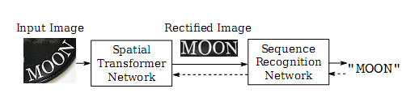

> 图1. RARE的示意图，其中包含一个空间变换网络（STN）和序列识别网络（SRN）。 STN将输入图像转换成校正图像，再给SRN进行识别。这两个网络在训练时，是同时训练的，共同由反向传播算法进行优化。图中的虚线代表反向传播时梯度的流向。

&ensp;&ensp;&ensp;&ensp;在STN中，输入图像在空间上变换成校正后的图像。在理想情况下，STN产生的图像是一类常规的文本图像，这比原来的不规则的文本图像更合适输入到SRN中。STN的空间变换是一个薄板样条（TPS）变换，这种变换的非线可以纠正各种类型的不规则文本，包括透视和弯曲文本。TPS变换是由一组基准点决定，这些基准点的坐标就是由STN这个卷积神经网络回归出来的。

&ensp;&ensp;&ensp;&ensp;常规文字的图像中，字符沿水平线排列。它有点类似于顺序信号。受此启发，我们构建了SRN，这是一种在序列识别中采用了注意力的模型。SRN由编码器和解码器构成。编码器将输入的图像表示成序列的特征，即一系列的特征向量。解码器会根据注意力机制进行解码，循序地生成识别出的字符序列。

&ensp;&ensp;&ensp;&ensp;如果模型能够正确的初始化，那么整个模型是可以端到端训练的。因此，对于STN，我们不需要标注任何几何位置，比如，TPS基准点的位置。 STN的训练可以由SRN反向传播的误差进行迭代。在实践中，训练最终会使STN倾向于产生包含常规文本的图像，这些图像正是SRN的理想输入。

&ensp;&ensp;&ensp;&ensp;本文的贡献有三重：首先，我们提出了一种新颖的自然场景的文本识别方法，该方法对不规则文字十分鲁棒。第二，我们的模型扩展了以注意为基础的STN框架的模型。原本的STN仅在普通卷积神经网络上进行测试。第三，在SRN的编码器中，我们采用卷积循环结构，这是注意力模型的一种新颖的变体。

**2.相关工作**

&ensp;&ensp;&ensp;&ensp;近年来，有许许多多的场景文字识别的方法。传统方法中，许多采用自下而上的方法，首先使用滑动窗口，或者连通域等方法来检测出单个独立的字符。然后，将检测到的字符通过动态规划，词典搜索等方法进行整合。另外的一些方法，则采用自上而下的方式，文本是从整个输入图像中直接一次性识别出来的，而不是检测和识别单个字符的。

&ensp;&ensp;&ensp;&ensp;一些最近的工作将文字识别问题模拟为序列识别问题，其中文本由字符序列表示。 Su和Lu从图像文本中提取了一个序列特征，它是一个HOG 描述符的序列，然后再用RNN预测输出的文字序列。Shi 等人提出了一种结合了CNN和RNN的端到端的序列识别网络。我们的方法也采用了序列预测的方案，但我们还进一步考虑到了不规则文本基准点的问题。

&ensp;&ensp;&ensp;&ensp;虽然在自然场景的文本检测和识别的任务是常见的，但是很少有明确的方法去解决 不规则文本的检测和识别问题。 姚等人第一次提出了多方向文本检测的问题，并通过仔细设计具有旋转不变性的区域描述符来处理它。张等人提出了一种利用文本低阶结构进行字符校正的方法。藩等人明确提出了通过SIFT描述子匹配来校正透视扭曲文字的方法。上述的工作都给这个问题提供了深刻的想法。然而，大多数方法仅能处理一种专门设计的不规则文本。 我们的方法使用了一种统一的方式，可以校正几种不规则的文本。 此外，由于STN在训练期间由SRN监督，因此在训练时，也不需要额外的标注。

**3. 模型**

&ensp;&ensp;&ensp;在本节中，将详细介绍我们的模型。 总的来说，模型的输入为输入入图像I，输出为序列L =（l1，...，lT），其中l t是第t个字符，T是变化的字符串的长度。

**3.1 空间变换模型**

&ensp;&ensp;&ensp;STN通过预测的TPS变换将输入图像I变换为校正后的图像I’。如图2所示。它首先通过定位网络预测了一组基准点。然后，在网格发生器内部，根据基准点计算TPS变换参数，并在I上生成采样网格。采样器同时接收网格和输入图像，通过网格点采样生成校正后的图像I’。

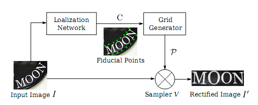

> 图2. STN的结构 定位网络可以定位出一组基准点C。网格生成器会根据C生成采样网格P。采样器根据P和输入图像I，生成校正后的图像I’。

&ensp;&ensp;&ensp;STN的独特之处在于其采样器是可微分的。 因此，一旦我们有一个可微的定位网络和一个可微的网格发生器，STN在训练时就可以通过误差进行反向传播。

**3.1.1 定位网络**

&ensp;&ensp;&ensp;定位网络可以直接回归出K个基准点的x，y坐标。这里，常数K是基准点的个数，一般是偶数。K个基准点的坐标用C表示，C =\[$c_{1}$，。 。 。 ，$c_{K}$\]∈$R^{2xK}$，其中第k列$c_{k}$表示第k个基准点的坐标，$c_{k}$ = \[$x_{k}$ ，$y_{k}$\]，即，每个基准点由x和y坐标两维数据组成。这里使用归一化的坐标系，坐标系的原点是原始图像的中心。这样以来，x，y都在\[-1,1\]的范围内。

我们使用卷积神经网络（CNN）进行回归。 和常规的CNN一样，这里的CNN包含卷积层，池化层和全连接层。 但是，我们的CNN 是用来回归而不是分类的。因此，最后的一个全连接层的输出节点的数量需要设置为2K，将激活函数设置为tanh（.），使得输出向量值的范围为（-1，1）。 最后，将输出向量reshape为C。

我们的定位网络会基于全局图像的上下文来定位基准点。 网络会捕获输入图像的整体文本形状，然后相应地定位出基准点。这里，应该强调的是，我们不用为任何样本标注基准坐标点。因为定位网络的训练是由STN的其他部分完全监督的，其他部分会遵循反向传播算法将梯度传播到定位网络中。

**3.1.2 网格生成器**

网格生成器会根据基准点计算TPS变换的参数并生成采样网格。我们先定义另一组基准点，称为基本基准点，表示为C’ =\[$c_{1}'$，。 。 。 ，$c_{K}'$\]∈$R^{2xK}$。如图 3所示。基本基准点均匀分布在校正后的图像I’的顶部和底部边缘。 因为K是一个常数，坐标系也被归一化了，因此C’也总是一个常数。

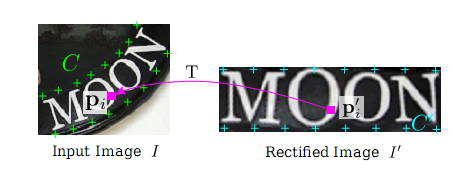

> 图3.基准点和TPS变换。 左图的绿色标记是基准点C，右图的青色标记是基本基准点C’。粉色箭头表示了变换T。变换T可以找到校正后图像I’的任意点（x i’，y i’）对应在原图像I中的坐标（x i，y i）。

TPS变换的参数用矩阵T表示，T∈$R^{2x(K + 3)}$，T的计算方式如下：

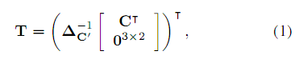

这里$_{c'} \in R^{(K + 3)x(K + 3)}$，它是一个常量，唯一只取决于C’矩阵。C’矩阵也是常量。

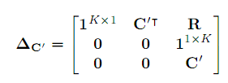

这里R是K行，K列的。第i 行，第j列的元素用$r_{i,j}$表示。$r_{i,j} = \ d_{i,j}^{2}\ln d_{i,j}^{2}$，这里$d_{i,j}$是$c_{i}^{'}$和$c_{j}^{'}$的欧氏距离。

另外，这里C的维度是2xK，R的维度是KxK, 因此，$_{c'}$的维度为(K+3)x(K+3)，T维度为2x(K+3)。

这里，我们用P’表示校正后图像I’的像素的网格。

P’={$p_{i}^{'}$}，其中i=1,2,3，。。。N。这里$p_{i}^{'} = {\lbrack x_{i}^{'},y_{i}^{'}\rbrack}^{T}$ ，x,y为第i个像素的坐标，N为校正后图像的像素的总个数。如图3所示。对于图像I’上的每个像素$p_{i}^{'}$，我们都能通过下面的变换，在原图像I中找到对应的像素$p_{i}$，其中$p_{i}$=${\lbrack x_{i},y_{i}\rbrack}^{T}$。

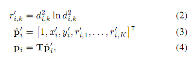
这里，这里$d_{i,k}$是$p_{i}^{'}$和第k个基本基准点$c_{k}^{'}$的欧氏距离。

通过对P’所有的像素点进行迭代，我们就能在输入图像I上生成一个网格P={$p_{i}$},其中i=1,2,3，。。。N。因为上面的公式1和公式4都是可微分的，是两个矩阵相乘，因此这个网格生成器可以反向传播梯度。

**3.1.3 采样器**

采样器会将输入图像在$p_{i}$附近的像素进行双线性插值，插值后的结果就是校正后图像$p_{i}^{'}$的像素值。采样器对所有的像素进行上述操作，就可以得到校正后图像I’。

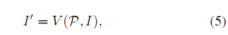

这里V表示双线性采样器，它同样是一个可以微分的模块。

TPS转换的灵活性使我们能够将不规则文本图像转换为包含常规文本的图像。图4展示了一些不规则文本常见的类型，包括a）松散有限的文本，由不完美的文字检测引起; b）多方向文本，由非水平摄像机的视图引起; c）透视文本，由侧视摄像机角度引起; d）弯曲的文字，一种常见的艺术风格。 STN能够纠正包含这些类型的不规则文本的图像，让它们变得更可读后，再进去后面的序列识别网络。

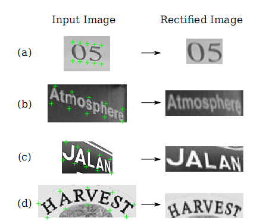

> 图4. STN能校正包含多种不规则文字类型的图像。 绿色标记是输入图像预测的基准点。

STN可以处理几种类型的不规则文字，包括（a）松散有限的文字; （b）多方向文本;

（c）透视文本; （d）曲线文字。

**3.2 序列识别网络**

由于目标词是固有的字符序列，因此我们可以把识别问题当做序列识别问题进行建模。这里，我们就采用了序列识别网络进行处理。SRN网络的输入就是前面校正过的图像I’。理想状态下，I’是一幅只包含一个单词的的图像，并且单词是从左向右水平书写的。我们会从图像I’中提取相应的序列特征，然后再基于这些序列特征去识别文字。

我们的识别模型是一个基于注意力的模型，可以直接从输入图像中识别出一个序列的文字。SRN包含了编码模块和解码模块。编码模块从校正过的图像I’ 中提取一个序列特征。解码模块会根据前面的序列特征，循序地生成输出序列。

**3.2.1 编码：卷积循环网络**

一张原始的提取序列特征的方法是从左到右的提取图像I ‘中每一个字符的特征。 但是，这种方法不会在重叠特征中共享计算，因此效率比较低下。 这里，我们构建的网络，组合了卷积网络和循环网络。给定一个任意大小的输入图像，网络就可以提取出一个序列的特征向量。

如图5所示，编码模块的底部是一些卷积层。通过这个卷积网络可以得到输入图像中比较鲁棒的，比较高级的特征图。这里会将这些特征图转化成一个序列，序列的长度就是特征图的宽度。这样以来，我们就得到了按照从左到右的顺序排列的特征向量。

我们进一步设计了一个双层的双向LSTM网络。该网络能够在两个方向上分析一个序列的独立性，并输出另一个同样长度的序列，h={h1,h2,…hl}。l为编码模块底部的卷积网络输出的特征图的宽度。

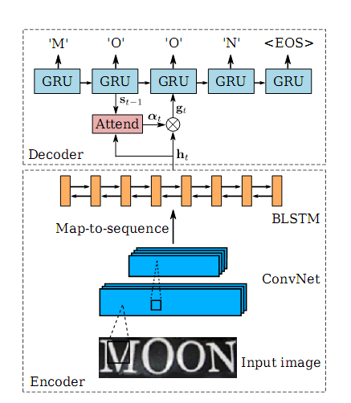

> 图5 SRN的结构图。包括一个编码模块和一个解码模块。编码模块使用了卷积网络和一个双层双向的LSTM网络。编码模块能从输入图像中提取出一个序列h。解码模块则根据这个序列h生成预测的字符序列（包括EOS标识）

**3.2.2 解码：循环字符生成器**

解码模块是一个基于注意力的循环神经网络。这里，我们使用GRU作为循环网络的基本单元。

由于这里的基于注意力的解码模块和之前介绍的一样，因此，就不在累述。注意力的计算方式也是之前介绍过的公式。

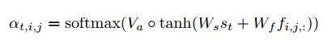

SRN直接将输入序列映射到另一个序列。 输入和输出序列都可以具有任意长度。 它只能用单词图像和相关文本进行训练。

**3.3：模型训练**

这里用X表示训练数据，$X = \{(I^{\left( i \right)},l^{\left( i \right)}\}$, i=1，2 。。。N。

为了训练上述的模型，需要在X上最小化对数似然函数L。

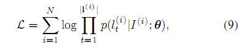

上式中p(.) 是解码模块的输出最后通过softmax计算的概率。$\Theta$是STN和SRN的参数。这里选用ADADELTA优化方法优化代价函数。因为这种优化方法的优化速度更快。

上述模型的参数是随机初始化的，但是定位网络中的参数初始化是个例外。

定位网络最后输出层对应的全连接层的初始权重全为0，初始偏置为图6（a）中那些能产生基准点的值。在试验中，我们发现，如果初始偏置为图6（b）或者图6（c）中的基准点，模型最后的性能较差。如果我们将定位网络的全部参数都随机化，最终的训练会失败。

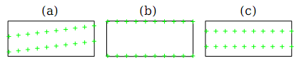

> 图6 定位网络中基准点的一些初始化的方式

**4．实验**

在本节中，我们在多个标准场景文本识别的benchmark上对我们的模型进行了评估。在评估中，特别关注了不规则文字的识别。首先，我们在常规的文本识别的benchmark上进行了评估，这些benchmark主要由正常文本组成，但也存在着不规则的文字。然后，我们还在

专门为不规则文本识别而设计的benchmark上进行了评估。在所有benchmark上的测试，我们的模型都在文本识别中表现了较高的准确性。

**4.1 实现细节**

- STN网络：STN的定位网络有4个卷积层，每个卷积层后面是一个2\*2的max pooling层。所有的卷积层中，卷积核的大小为3\*3，填充的pad为1，stride为1。4个卷积层中卷积核的个数依次为64,128,256,512。在这4个卷积层和4个max pooling层后是两个全连接层，全连接层的隐藏单元个数1024。这里，我们设置基准点的个数K为20。这就意味着定位网络的输出应该是一个40维的向量。这里除了输出层外，所有层的激活函数为RELU函数。输出层的输出函数为tanh(.)。这样以来，保证了输出的基准点都在（-1，1）之间。

- SRN网络：编码部分有7个卷积层，这些卷积层的卷积核大小，卷积核个数，stride，pading size依次为{3,64,1,1}，{3,128,1,1}，{3,256,1,1}，{3,256,1,1}，{3,512,1,1}，{3,512,1,1}和{3,512,1,0}。在第一层，第二层，第四层和第六层的卷积层后面都有一个2\*2的max pooling层。在卷积层的之后，是一个两层的双向LSTM网络。每个LSTM单元中有256个隐藏单元。解码部分，我们用了GRU单元，每个单元中有256个记忆块和37个输出单元（26个字母，10个数字，还有1个EOS标识）。

- 模型训练：我们的模型是在800万的合成数据上训练的。训练时的batch size为64。在训练和测试时，图像首先被resize为100\*32。SNT的输出仍然为100\*32。在训练时，我们的模型每秒能处理160多个样本。在整个训练数据集上训了了3个回合，大致需要2天。

- 实现：我们的模型是在torh7框架下实现的。绝大部分模块都使用了GPU加速。所有的实验都是在如下配置上运行的：CPU为Intel Xeon（R），2.40GHz， GPU为NVIDIA GTX-Titan，RAM为64G。

&ensp;&ensp;&ensp;不使用字典时，识别一张图片的文字需要的时间不到2ms。如果使用字典，识别的速度依赖于字典的大小。如果字典的的单词总数小于1000，我们使用精确搜索。如果字典的单词总数更大一些，我们就使用近似的模糊搜索，其中模糊的宽度为7。我们测试过，如果字典大小为五万个单词，一幅图像的搜索大致需要200ms。

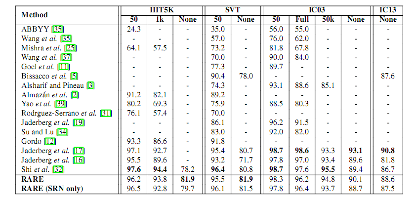

> 表1 在一些通用的识别文字的benchmark上的识别准确率。标题中的50,1K,5K为字典的大小。FULL表示字典包含了每张图片的单词。None表示识别中没有使用字典。

&ensp;&ensp;&ensp;表1展示了我们的方法和别的方法的评估结果。不使用字典时，在III5K上，RARE比CRNN高出了将近4个百分点。因为III5K的数据集中包含了一些不规则的文本，特别是弯曲的文本，所以RARE在处理这些文本时，有明显的优势。

&ensp;&ensp;&ensp;如果使用了字典，RARE也达到了较高的准确率。比CRNN略略低一点点。

&ensp;&ensp;&ensp;我们还训练了一个只有SRN的模型，这个模型在大部分的benchmark上，也达到了较高的准确率，是个相当有竞争力的模型。

&ensp;&ensp;&ensp;CRNN对应的论文是An end-to-end trainable neural network for image-based sequence recognition and its application to scene text recognition。
