**R-FCN: Object Detection via Region-based Fully Convolutional Networks**

**一．背景介绍**

   R-CNN 系列的方法，如 SPPnet、Fast R-CNN、Faster R-CNN 等方法在 Object Detection 上取得了很大的成功。这些方法的网络结构被 RoI pooling 层分成两个子网络：共享的全卷积子网，RoI-wise 的子网络。这样设计的一个主要的原因是，借鉴自那些经典的分类网络结构，如 AlexNet、VGG Nets 等，这些网络结构都是卷积子网络，再接一个 pooling层，之后再接几个全连接层。很容易将分类网络的 spatial pooling 层对应到 RoI pooling，将分类网络转化成一个用于 detection 的网络。

   当前 state-of-art 的分类网络，如 ResNet、GoogleNet，都是全卷积网络。很自然地将这样的分类的全卷积网络的结构应用到 Detection 网络上。[ResNet](http://arxiv.org/pdf/1512.03385.pdf) 的论文中提出了，一种使用 ResNet 作为特征引擎的 Faster R-CNN 方法，将 RoI pooling 层插在两个卷积子网络之间。RoI-wise 子网络越深，那么对于有 N 个 Proposal 的图像，那么子网络就需要重复计算 N 次，虽然子网络越深，准确度可能越高，但是这应一定程度上是以牺牲速度为代价的。

该文的出发点就是为了减少重复计算，尽可能地共享网络，因此对这种结构，提出了更深层次的理解：分类问题，具有平移不变性(translation invariance)；检测 (Detection) 问题，在一定程度上具有平移敏感性 ( translation variance)。前面提到的 将 RoI pooling 层插入到两个卷积子网路之间，就是为了打破 translation invariance，使用这种 region-specific 操作也就是为了尽可能的捕捉检测的 translation variance特性。

   该论文巧妙地同时考虑这两种相互矛盾的特性，设计了一个用于 Detection 的共享的全卷积网络结构。

**二．论文概要**

   为了将 translation variance 引入到全卷积网络中，论文中设计了一种特殊的卷积层作为全卷积网络的输出，该卷积层输出就是 position-sensitive score map。每一个 score map都将这些相对的空间位置编码成位置信息，例如,左侧，右侧等。同时，在FCN的顶部，还有一个对位置敏感的RoI池层。这些ROI会从这些score map中提取信息。所有可学习的层都是卷积的，没有全连接层，并在整个图像上可以共享。，该网络结构把空间位置信息引入特征学习中，使得整个网络可以进行 end-to-end 的学习。

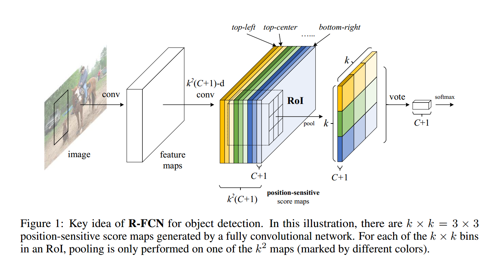

  该论文也采用 R-CNN 方法经典检测步骤：生成 region proposal, region 分类。使用 RPN 来生成 proposal，类似于 Faster R-CNN，R-FCN 和 RPN 是特征共享的。在给定 Proposal Region(RoIs) 之后，R-FCN 将 RoIs 分类成目标物体或者背景。在 R-FCN 的网络中，所有可学习的网络都是卷积层，都是在全图上进行操作的，最后一个卷积层为每个类别（包括背景）生成 k\*k 个 position-sensitive 的 score map，也就是总共 k\*k\*(C+1) 个通道的输出。C为类别数目，1表示背景。这个 k\*k 个 score map 对应地描述了一个 k\*k 的网格的空间信息。例如，k\*k = 3\*3，那么这 9 个 score map，分别对应 {top-left, top-center, top-right, …, bottom-right} 位置的目标分类。R-FCN 的最后一层是一个 position-sensitive 的 RoI pooling 层，对于每个 RoI 从 k\*k 的 bins 生成一个值，用于类别的分类。

**三．网络结构**

**Position-sensitive score maps**：

  该论文的方法采用 ResNet-101 的网络结构，去掉最后的 average pooling 层和全连接层，只使用其中的卷积层。ResNet-101 的最后一个卷积层的 feature map 的维度是 2048，新增加了一个卷积层，将维度降成 1024维，这样共享的卷积层也就是 101层。即在res5c层之后再加入一个维数为1024的卷积层。然后，再这个新的卷积层上再接上生成 k\*k\*(C+1) 个通道 position-sensitive score map 的卷积层。

**Position-sensitive RoI pooling：**

   为了将位置信息明确地反映到ROI中，我们用一个矩形网格将每个 RoI分割成 k\*k 个 bins。对于一个宽高分别为w, h的ROI矩形框，每个 bin 的宽高分别为w/k和h/k。最后的一个卷积层会为每个类别生成 k\*k 个 score map。在第 (i,j) 个 bin上，我们定义了Position-sensitive RoI pooling操作。该操作仅仅在第 (i,j) 个 score map上进行池化。其中0≤i≤k−1, 0≤j≤k−1。

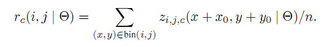

其中 $r_{c}(i,j)$ 是在第 (i, j) 个bin 下第 c 个类的响应值，$z_{i,j,c}$ 是 k\*k\*(C+1) 个通道中的对应的通道，(x0,y0) 是 RoI 对应的起点坐标值， n 是对应的 bin 中像素点的个数，Θ 是网络的参数。第 (i,j) 个 bin 中x和y的范围是 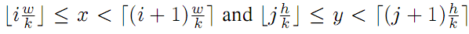。其实这个操作就是一个 average pooling 的过程，当然是用 max pooling 也可以。

  在每个ROI上，这k\*k 个 position-sensitive 的 score将会对该类别进行投票。本文中，我们简单地对这些分数值求平均值，得到最终的 score，因为分母都相同，均为 k\*k，因此这个 score 就可以写成：

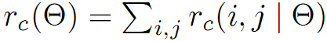
当我们计算出这个 Ro所有类别的响应值后，再使用 Softmax 计算每个类别的概率，如下式：

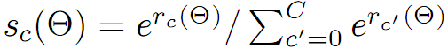

更进一步，我们还用了一种简单的方式进行bounding box回归。这个回归方式类似于 R-CNN、Fast R-CNN 等。R-FCN 在最后的特征层（即是res5c层之后加入一个维数为1024的卷积层），加一层 4\*k\*k 维的卷积层，用于 BBox 的回归。对于每个 RoI，position-sensitive 的 RoI pooling 都将作用于这样的 4\*k\*k 个 map，得到一个 4k\*k 维的向量。类似于上面类别的操作，再在k\*k个bin上，使用平均的方式，为每个 RoI 得到最终的一个 4 维的预测值，分别为 (x,y,w,h) 。

为了简单起见，我们进行的边界框回归是与类别无关的，但是与类别相关的边界框回归仍然是可用的。

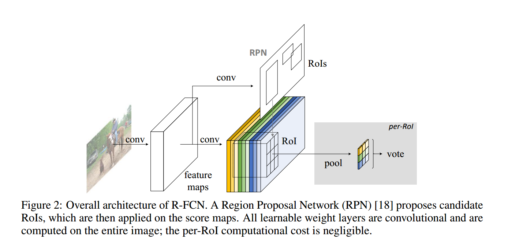

在下面的图 4和图 5中，我们展示了通过R-FCN学习到的position-sensitive score maps。不同的特征map标识了不同的特征相对位置信息。例如：“top-center-sensitive”score map对于那些top-center位置关系的物体显示了较高的分数。如果一个候选框与真实物体精确的重合了（图 4），那么大多数的k\*k个bins会被强烈的激活，然后会得到较高的分数。相反的，如果候选边框与真实物体并没有完全准确的重合（图 5）那么有一些k\*k bins不会被激活，从而导致得分很低。

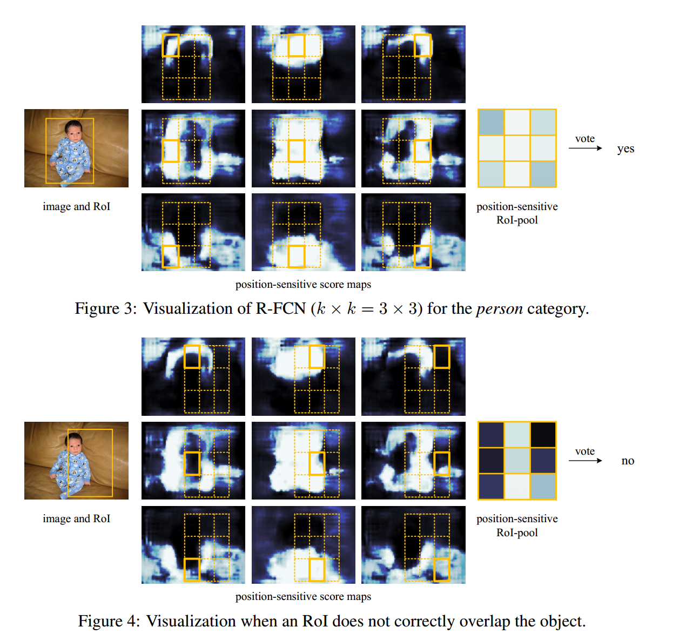

**四．训练策略**

该论文可以说是 Faster R-CNN 的改进版本，其 loss function 定义基本上是一致的：

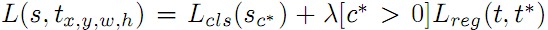
其中c\*表示ROIs是否为GT的标签。如果为背景，c\*为0；否则为1；

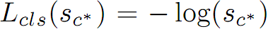
是类别的交叉熵，即我们在训练过程中采用交叉熵的类别损失函数；

λ是个平衡类别损失和bbox损失的平衡权重，设置为1；

我们把ROI的Iou大于0.5的roi做为正样本，其他的为负样本。

   在该网络框架下，所有可学习的层，都是卷积层，使用 Online Hard Example Mining (OHEM) ，几乎不会增加训练时间。

   网络只使用一种 scale 的图像训练，图像最短的边宽度为 600 像素，每张图像使用 128 个 RoI 用于反向传播。冲量设置成 0.9，权值衰减设置成 0.0005。在 VOC 上 Fine-tuning 过程中，初始学习率设置成 0.001，训练 20k 个mini-batches，然后学习率为 0.0001，10k 个 mini-batchs。

   R-FCN 和 RPN 共享网络参数，训练方式和 Faster R-CNN 的训练策略和步骤基本一样。R-FCN 和 RPN交替训练。

  

**五．实验结果**

-   深度影响对比：101深度最好！
    ---------------------------

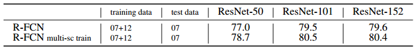

-   候选区域选择算法对比：RPN比SS，EB好！
    -------------------------------------

 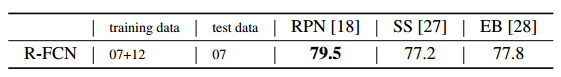

 

-   COCO库上与Faster R-CNN的对比：R-FCN比Faster RCNN好！
    ----------------------------------------------------

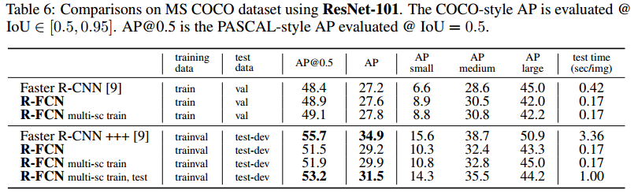
---------------------------------------------------------------------------------------------------------------------------------------------------------------------------------

VOC2007和VOC2010上与Faster R-CNN的对比：R-FCN比Faster RCNN好！

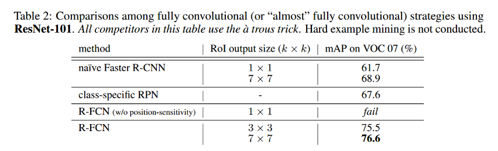
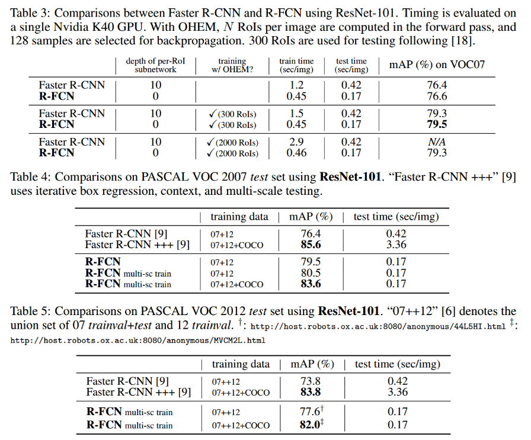

**六．最后总结**

   该论文也可以归为 R-CNN 系列，R-FCN 使用 position-sensitive score map 将 localization 的 translation variant 的从网络结构中抽离出来，能够充分利用 ResNet 的强大分类能力。R-FCN 使用全卷积网络，其共享的卷积直接作用于全图，使用 OHEM 不会给训练带来额外的时间消耗，同时使用 atrous trick 使得性能有一定的提升。在 Pascal VOC 2007 上的效果，已经到到了 83.6%。 

R-FCN是在Faster R-CNN的框架上进行改造，第一，把base的VGG16换成了ResNet，第二，把Fast R-CNN换成了先用卷积做prediction，再进行ROI pooling。由于ROI pooling会丢失位置信息，故在pooling前加入位置信息，即指定不同score map是负责检测目标的不同位置。pooling后把不同位置得到的score map进行组合就能复现原来的位置信息。  

**R-FCN比faster rcnn的baseline提高了3个点，并且是原来faster rcnn更快（因为全部计算都共享了）。但是和改进过的faster rcnn相比（roi pooling提前那种）提高了0.2个点，速度快了2.5倍。所以目前为止这个方法的结果应该是所有方法中速度和performance结合的最好的。**

**七．R-FCN实现细节**

1.  **新增的new conv layer如何实现？**

**该层是R-FCN的核心。主要计算了positive-sensitive score map，以及回归了相应的bbox的坐标。**

**新增的大层都是从res5c开始的，先在res5c上连接一个卷积层，此卷积层的卷积核个数为1280，卷积核尺寸为1\*1。此卷积层将**res5c的维度从2048降低到1024。之后就在于这个降维的卷积层上实现**positive-sensitive feature map，以及bbox坐标的回归。**

**第一幅图是coco数据集上的训练模型，有81类；（80类+1背景）**

**第二幅图是voc数据集上的训练模型，有21类；（20类+1背景）**

**rfcn\_cls层是**p**ositive-sensitive scores map，卷积核个数为cls\_num\*(score\_maps\_size\^2)**

**rfcn\_bbox层是bbox坐标的回归，卷积核个数为8\*(score\_maps\_size\^2)**

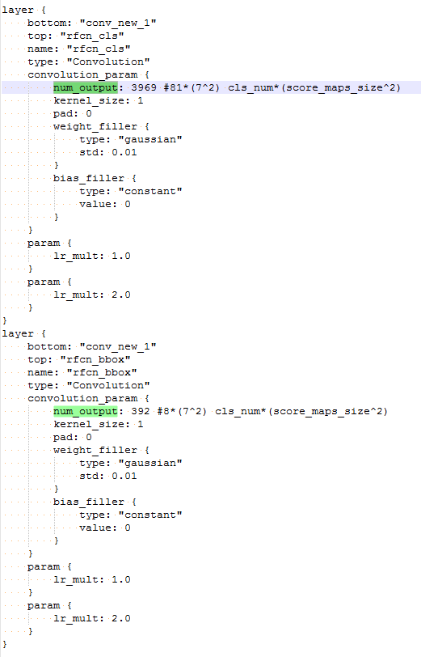

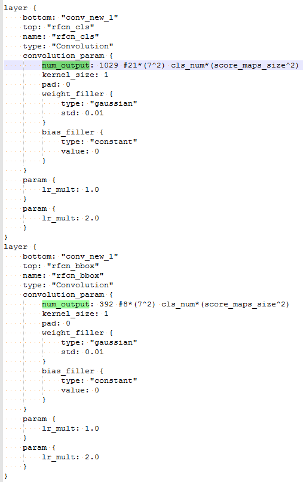

**论文中提到，为了简单起见，我们进行的边界框回归是与类别无关的，但是与类别相关的边界框回归仍然是可用的。**

**如果使用和类别相关的边界框回归，上面rfcn\_bbox层中的卷积核个数就需要设置为cls\_num\*(score\_maps\_size\^2)。**

[https://github.com/Orpine/py-R-FCN.git的工程中，在models文件](https://github.com/Orpine/py-R-FCN.git的工程中，在models文件)**中，很多网络定义的边界框回归的rfcn\_bbox层中，卷积核个数为8\*(score\_maps\_size\^2)，如res101和res50。**

**但是，在论文中为指明边界框回归的个数为4\*(score\_maps\_size\^2)。**

**2、poition sensitive RoI pooling如何实现？**

下图展示了position sensitive RoI pooling的全部结构。

首先通过之前RPN得到的rois和positive-sensitive score map对应的rfcn\_cls，得到(c+1)个类别的分数值，每个类别的分数都是一个k\*k的矩阵。这里k为7。这个操作是PSROIPooling层完成的。该层的output\_dim参数需要设置为总类别数，即C+1。

然后再将每一类的k\*k的矩阵进行average pooling，得到某一类的最后的分数。即cls\_score 就是 (c+1)个类别对应的最终得分。

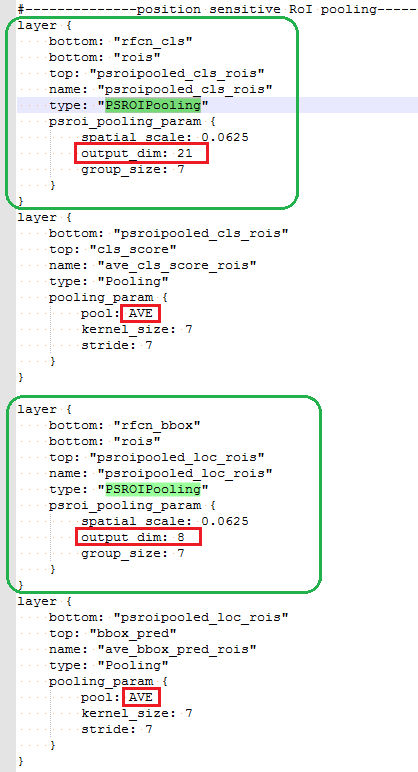

同样的，边界框回归也一样。

首先通过之前RPN得到的rois和bbox坐标的回归对应的rfcn\_bbox，得到8维的坐标值，每个维度都是一个k\*k的矩阵。这里k为7。这个操作也是PSROIPooling层完成的。该层的output\_dim参数需要设置为坐标的维度，即为8。

然后再将每维的k\*k的矩阵进行average pooling，得到某一维的坐标值。即bbox\_pred 就是8维坐标值。

所有PSROIPooling 层中的group\_size和average Pooling层中kernel\_size，stride都应该设置为k（每个 RoI分割成 k\*k 个 bins），这里k为7。

**八．比较总结**

> **和之前的faster rcnn比较：**

1.  **rpn是相同的。**

**虽然例子中的res101对应的R-FCN中调整anchors的个数，不是R-FCN的专利。faster rcnn也是支持的。**

1.  **rpn对应的RoI Proposal是相同的。**

2.  **类别预测和边界框回归是完全不同的。**

<!-- -->

1.  **faster rcnn是在conv5\_3（VGG网络）的卷积层上，将RPN回归出来的rois进行池化，将所有rois对应的特征图池化到一个统一尺寸。然后再连接了两个4096维全连接层。最后，在这个结果上进行类别预测和边界框回归。类别预测和边界框回归都是用全连接层实现的，类别预测的维度为(c+1)个类别，边界框回归的维度为4\*(c+1)，即这里边界框回归和类别是相关的。**

2.  **R-FCN是在res5c（resNet网络）的卷积层上，先用一个1024的卷积层降维，然后在这个基础上分别连接两个卷积层分别positive-sensitive score map和边界框回归。positive-sensitive score map的维度为K\*k\*（C+1）维，和边界框回归为8\*(k\*k)。最后，才使用RPN回归出来的rois分别对positive-sensitive score map和边界框回归的结果进行池化，池化的结果就变成(c+1)个类别的分数，8个的边界框回归的坐标。**

**可见，faster rcnn很早使用了rois，将其中大小统一，然后用全连接实现类别和位置的预测。R-FCN直到最后才使用rois，没有全连接层，对位置的信息保留的更好。**
