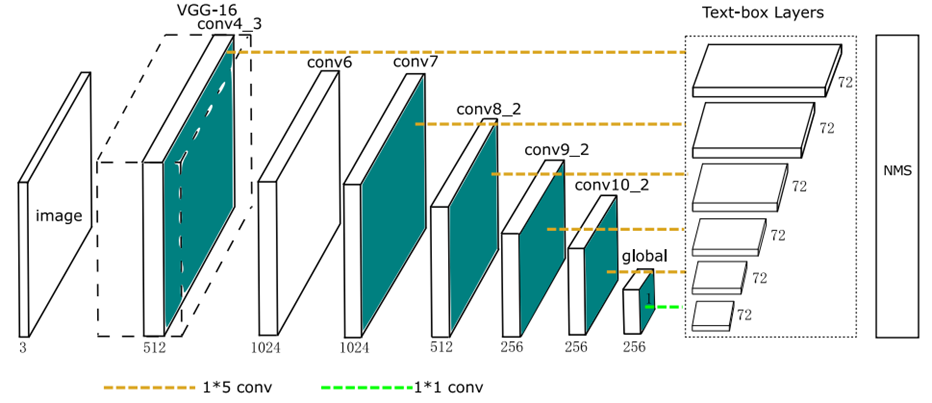
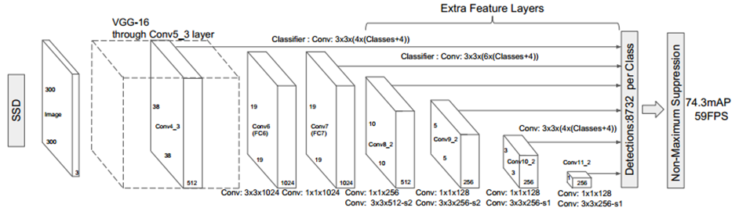
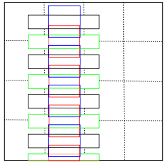
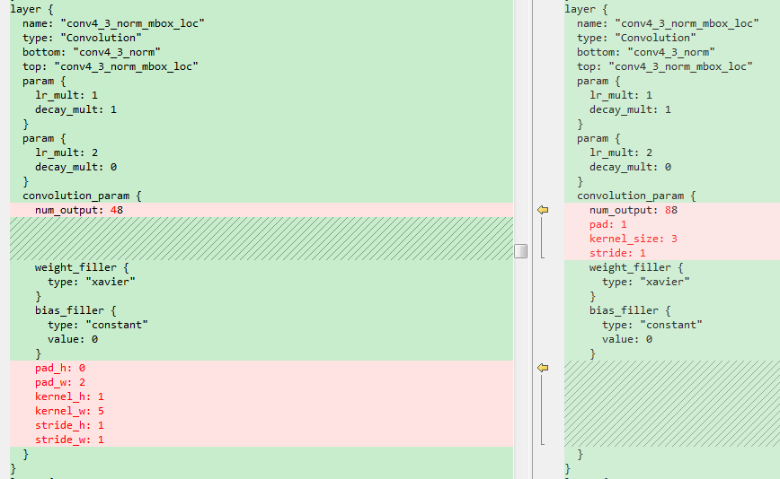
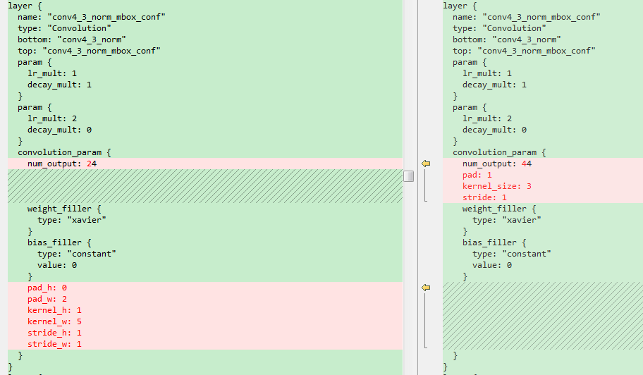
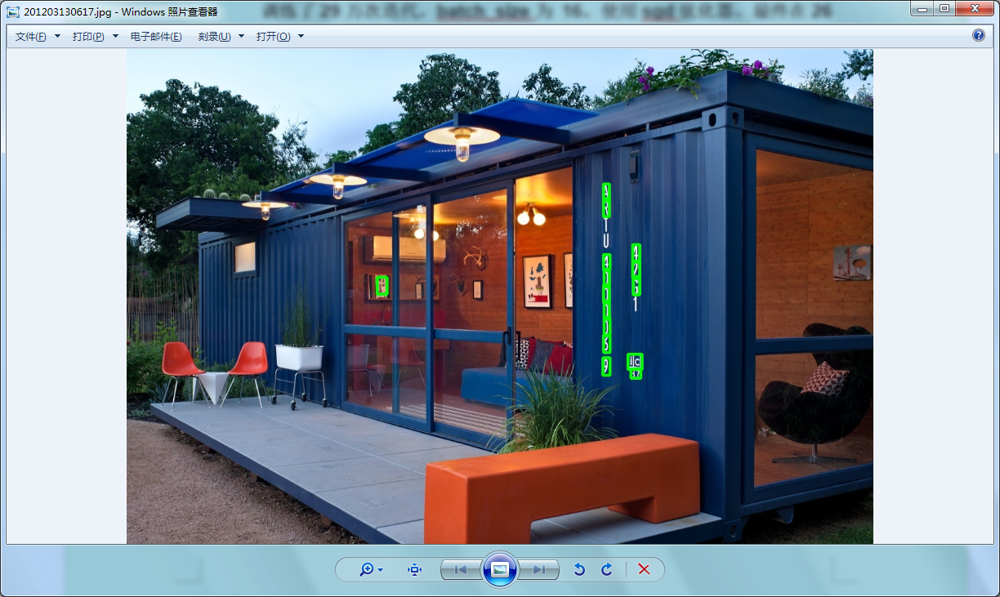
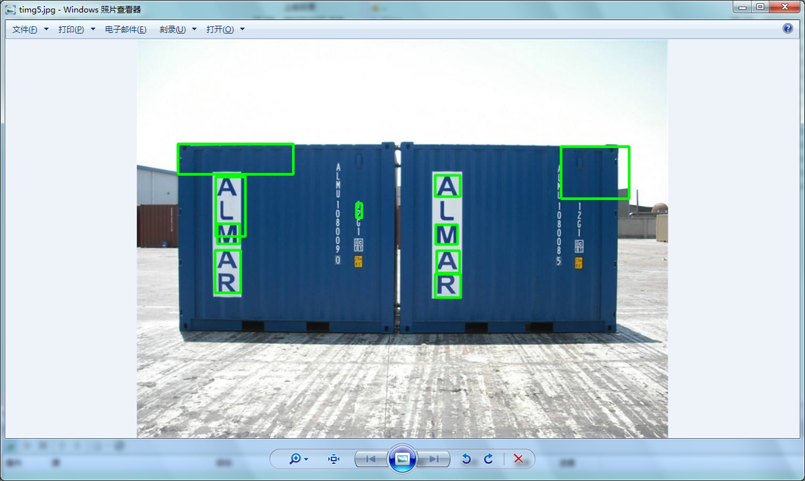
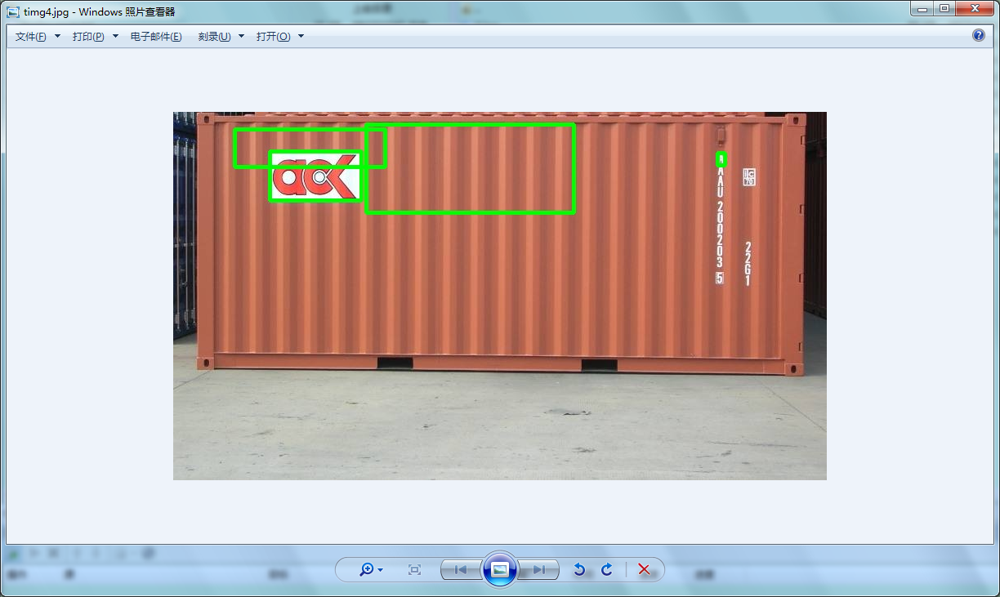

**TextBox实验记录**

**TextBox的代码地址：[*https://github.com/MhLiao/TextBoxes*](https://github.com/MhLiao/TextBoxes)**

**一．TextBox简介**

**TextBoxes是改进版的SSD，用来解决文字检测问题。**把SSD进行修改，使其适用于文字检测**（SSD本身对小目标识别不鲁棒）。它提供了端到端识别的pipeline: **

**TextBoxes**改进的SSD的地方：

> 1.default box的长宽比**进行修改（长条形），使其更适合文字检测（单词）**
>
> **2.作为classifier的**卷积滤波器**大小从3\*3变成**1\*5**，更适合文字检测**
>
> **3.SSD原来为多类检测问题，现在转为**单类检测**问题**
>
> **4.从输入图像为单尺度变为多尺度**

-   TextBoxes网络结构

-   {width="5.2694827209098865in" height="2.2761187664041995in"}

-   SSD 网络结构{width="5.820895669291339in" height="1.700009842519685in"}

**TextBox中第一个回归的卷积层中一共有12个default box。aspect\_ratio为2,3,5,7,10。min\_size: 30.0。没有max\_size。因此，特征图的每个像素对应生成的default box分别为：**

**（1）宽高都为30，box的中心位于网格中心。宽高比为1:1。如下图4\*4的网格中蓝色的default box。**

**（2）宽高都为30，box的中心在位于网格的下边缘的中心。宽高比为1:1。如下图4\*4的网格。红色和蓝色的default box为。如下图4\*4的网格中红色的default box。**

**（3）面积为30\*30，box的中心在位于网格的中心。宽高比为2:1。宽为30\*sqrt(2), 高为30/sqrt(2)。**

**（4）面积为30\*30，box的中心在位于网格的下边缘的中心。宽高比为2:1。宽为30\*sqrt(2), 高为30/sqrt(2)。**

**（5）面积为30\*30，box的中心在位于网格的中心。宽高比为3:1。宽为30\*sqrt(3), 高为30/sqrt(3)。**

**（6）面积为30\*30，box的中心在位于网格的下边缘的中心。宽高比为3:1。宽为30\*sqrt(3), 高为30/sqrt(3)。**

**（7）面积为30\*30，box的中心在位于网格的中心。宽高比为5:1。如下图4\*4的网格中黑色的default box。宽为30\*sqrt(5), 高为30/sqrt(5)。**

**（8）面积为30\*30，box的中心在位于网格的下边缘的中心。宽高比为5:1。如下图4\*4的网格中绿色的default box。宽为30\*sqrt(5), 高为30/sqrt(5)。**

**（9）面积为30\*30，box的中心在位于网格的中心。宽高比为7:1。宽为30\*sqrt(7), 高为30/sqrt(7)。**

**（10）面积为30\*30，box的中心在位于网格的下边缘的中心。宽高比为7:1。宽为30\*sqrt(7), 高为30/sqrt(7)。**

**（11）面积为30\*30，box的中心在位于网格的中心。宽高比为10:1。宽为30\*sqrt(10), 高为30/sqrt(10)。**

**（12）面积为30\*30，box的中心在位于网格的下边缘的中心。宽高比为10:1。宽为30\*sqrt(10), 高为30/sqrt(10)。**

{width="2.850746937882765in" height="2.7774365704286965in"}

**TextBox中其他的回归的卷积层中一共有14个default box。aspect\_ratio为2,3,5,7,10。既有min\_size。还有max\_size。**

**二．TextBox训练过程**

1.  **环境准备**

> **在100的服务器上用nvidia-docker从镜像gds/keras-th-tf-opencv中新建了caffe\_ys容器。按照caffe的依赖文件，并编译GPU版本。**

1.  **数据准备**

> **训练数据为/dataTwo/datasets/data/str/SynthText的85万数据。**
>
> **创建数据生成脚本。该脚本从gt.mat中读出图像的路径和宽高，以及图像的bbox的坐标，分别保存在和图像同名txt文档中。**
>
> **该脚本的存放位置为：**
>
> **/dataTwo/yushan/darknet-master/voc\_label\_text\_xml\_for\_ssd.py**

1.  **标签生成**

> **使用windows下的xml生成工具，将上面的txt文档转化为VOC PASCAL格式的xml文件，以及图像的名称的索引文件train\_total.txt**
>
> **使用文本打乱工具，将train\_total.txt中的各行打乱，分别生成train\_val.txt和test.txt。**

1.  **训练**

> **(1)修改create\_data.sh中的数据路径和labelmap\_voc.prototxt路径，以及lmdb数据的保存路径，并将其脚本重新保存为create\_data\_text.sh使用/dataTwo/yushan/TextBoxes/data/VOC0712/create\_data\_text.sh。将训练数据转化为lmdb的格式。该脚本会自动将lmdb的数据保存到/dataTwo/yushan/TextBoxes/jobs1/textdata中。**
>
> **(2)使用train\_icdar13.py，会生成jobs文件夹，并生成对应的训练脚本文件，以及models生成对应的网络结构，优化器。**
>
> **将train和test的网络结构中的数据源修改为上面生成的lmdb的数据。启动训练。**
>
> **train\_icdar13.py的存放位置如下：**
>
> **dataTwo/yushan/TextBoxes/examples/TextBoxes/train\_icdar13.py**

**训练了16万次迭代，batch\_size为 16，使用sgd优化器，最终在15万次迭代时，测试的性能最好。**

**Test net output \#0: detection\_eval = 0.782504**

**Iteration 150000, loss = 2.42571**

> **训练的日志保存路径如下： \\dataTwo\\yushan\\TextBoxes\\jobs\\VGGNet\\text\\longer\_conv\_300x300\\VGG\_text\_longer\_conv\_300x300\_1.log**

**因此，后面使用的预测模型的路径为**

> **dataTwo/yushan/TextBoxes/models/VGGNet/text/longer\_conv\_300x300/VGG\_text\_longer\_conv\_300x300\_iter\_150000.caffemodel**

**该模型对横着的文本检测效果还可以，尤其是多尺度检测时，虽然速度较慢，但是大部分都能正确的检测出来。但是检测不到竖值的文本。**

**四．修改TextBox的结构重新训练**

**鉴于之前检测不到竖值文本，修改了候选框，增加了竖值的候选框。**

**前面的标签仍然可以使用，这里唯一需要修改的是models文件夹下面的train.prototxt，test.prototxt和deploy.prototxt。修改这三个文件中的回归的卷积层中的卷积核个数以及PriorBox层的参数。这里将修改后的网络结构重新存放在jobs1文件夹下。**

**这里简单截图示意一下。左边是原始的横框，右边是增加了竖框的结构。**

{width="5.126865704286964in" height="3.1568471128608926in"}

{width="5.141531058617673in" height="3.0in"}

> **训练了29万次迭代，batch\_size为 16，使用sgd优化器，最终在26万次迭代时，测试的性能最好。**
>
> **Test net output \#0: detection\_eval = 0.804227**
>
> **Iteration 260000, loss = 1.78662**
>
> **训练的日志保存路径如下： dataTwo\\yushan\\TextBoxes\\jobs1\\VGG\_text\_longer\_conv\_300x300.log**
>
> **因此，后面使用的预测模型的路径为**
>
> **dataTwo/yushan/TextBoxes/jobs1/ /VGG\_text\_longer\_conv\_300x300\_iter\_260000.caffemodel**

**遗憾的是，修改网络结构后训练出来的新模型，对于竖值的文本检测效果依旧不理想，改善效果甚微。怀疑是85万的数据集中竖值文本太少。**

{width="5.310149825021872in" height="3.1716415135608047in"}

{width="5.397611548556431in" height="3.2238801399825023in"}

{width="5.208955599300087in" height="3.111201881014873in"}
