**Attention\_ocr技术总结**

注意力模型
==========

注意力模型的理解参考文献：[*http://blog.csdn.net/malefactor/article/details/50550211*](http://blog.csdn.net/malefactor/article/details/50550211)

**Encoder-Decoder框架**
-----------------------

Encoder-Decoder框架可以看作是**一种文本处理领域的研究模式**，应用场景异常广泛。下图是文本处理领域里常用的Encoder-Decoder框架最抽象的一种表示：

> 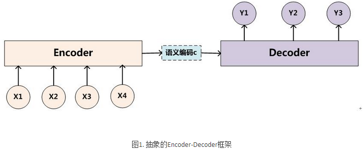{width="6.385416666666667in" height="2.6838560804899387in"}

Encoder-Decoder框架可以这么直观地去理解：可以把它看作适合处理由一个句子（或篇章）生成另外一个句子（或篇章）的通用处理模型。对于句子对&lt;X,Y&gt;，我们的目标是给定输入句子X，期待通过Encoder-Decoder框架来生成目标句子Y。X和Y可以是同一种语言，也可以是两种不同的语言。而X和Y分别由各自的单词序列构成：

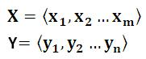{width="1.8854166666666667in" height="0.7604166666666666in"}

Encoder顾名思义就是对输入句子X进行编码，将输入句子通过非线性变换转化为**中间语义表示C**：

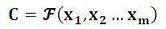{width="2.1458333333333335in" height="0.375in"}

对于解码器Decoder来说，其任务是根据句子X的中间语义表示C和之前已经生成的历史信息y1,y2….yi-1来生成i时刻要生成的单词yi 

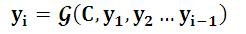{width="2.5625in" height="0.3541666666666667in"}

每个yi都依次这么产生，那么看起来就是整个系统根据输入句子X生成了目标句子Y。

seq2seq模型
-----------

> seq2seq模型理解可参考文献：[*http://blog.csdn.net/jerr\_\_y/article/details/53749693*](http://blog.csdn.net/jerr__y/article/details/53749693)

seq2seq 模型是一种基于Encoder-Decoder框架的，就像一个翻译模型，输入是一个序列（比如一个英文句子），输出也是一个序列（比如该英文句子所对应的法文翻译）。这种结构最重要的地方在于**输入序列和输出序列的长度是可变的**。

例如：

在[***机器翻译***](http://lib.csdn.net/base/machinetranslation)：输入（hello） -&gt; 输出 （你好）。输入是1个英文单词，输出为2个汉字。\
在对话机器中：我们提（输入）一个问题，机器会自动生成（输出）回答。这里的输入和输出显然是长度没有确定的序列（sequences）.

直观上的模型：

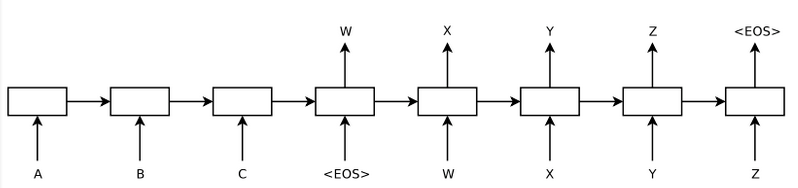{width="6.7649606299212595in" height="1.59375in"}

表示一个序列”ABC”被翻译成”WXYZ”, 其中&lt;EOS&gt;代表一句话的结束。

seq2seq模型**按照时间展开**的结构如下图所示：

{width="2.875in" height="2.818784995625547in"}

**Encoder 部分**，就是一个RNNCell（RNN ，GRU，LSTM 等） 结构。每个 timestep， 我们向 Encoder 中输入一个字/词（一般是表示这个字/词的一个实数向量），直到我们输入这个句子的最后一个字/词 *XT* ，然后输出**整个句子的语义向量 c**（一般情况下， *c*=*hXT* , *XT* 是最后一个输入）。因为 RNN 的特点就是把前面每一步的输入信息都考虑进来了，所以理论上这个 *c* 就能够把整个句子的信息都包含了，我们可以把 *c* 当成这个句子的一个语义表示，也就是一个句向量。

在 **Decoder** 中，我们根据 Encoder 得到的句向量 *c*， 一步一步地把蕴含在其中的信息分析出来。

![C:\\Users\\zhangjing1\\AppData\\Roaming\\Tencent\\Users\\463261929\\QQ\\WinTemp\\RichOle\\I1TOT\`%K90ANQ7WQ39ROP\]H.png](attention_ocr_images/media/image7.png){width="2.21875in" height="0.4583333333333333in"}

同样，根据 *h*&lt;*t*&gt; 我们就能够求出 ***yt* 的条件概率**：

{width="3.6458333333333335in" height="0.3645833333333333in"}

这里有两个函数 *f* 和 *g* , 一般来说， *f* 函数结构应该是一个 RNNCell 结构或者类似的结构；*g* 函数一般是 softmax函数。

我们可以先这样来理解：在 Encoder 中我们得到了一个涵盖了整个句子信息的实数向量 *c* ，现在我们一步一步的从 *c* 中抽取信息。首先给 Decoder 输入一个启动信号 *y*0(如特殊符号&lt;*GO*&gt;), 然后Decoder 根据 *h*&lt;0&gt;,*y*0，*c* ，就能够计算出 *y*1 的概率分布了，同理，根据 *h*&lt;1&gt;,*y*1，*c* 可以计算*y*2 的概率分布…以此类推直到预测到结束的特殊标志 &lt;*END*&gt;，才结束预测。

**Attention Model**
-------------------

### 引入注意力模型的原因

**Encoder-Decoder模型**是没有体现出“注意力模型”的，所以可以把它看作是**注意力不集中的分心模型**。为什么说它注意力不集中呢？请观察下目标句子Y中每个单词的生成过程如下：

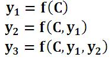{width="1.9270833333333333in" height="1.0408311461067365in"}

其中f是decoder的非线性变换函数。对于上面的公式，在生成目标句子的单词时，不论生成哪个单词，是y1,y2也好，还是y3也好，他们使用的句子X的**语义编码C都是一样的**，没有任何区别。如果拿机器翻译来解释这个分心模型的Encoder-Decoder框架更好理解，比如输入的是英文句子：Tom chase Jerry，Encoder-Decoder框架逐步生成中文单词：“汤姆”，“追逐”，“杰瑞”。在翻译“杰瑞”这个中文单词的时候，分心模型里面的每个英文单词对于翻译目标单词“杰瑞”贡献是相同的，很明显这里不太合理，显然“Jerry”对于翻译成“杰瑞”更重要，但是分心模型是无法体现这一点的，这就是为何说它没有引入注意力的原因。没有引入注意力的模型在输入句子比较短的时候估计问题不大，但是如果输入句子比较长，此时所有语义完全通过一个中间语义向量来表示，单词自身的信息已经消失，可想而知会丢失很多细节信息，这也是为何要引入注意力模型的重要原因。

### 注意力模型AM

引入AM模型的Encoder-Decoder框架如下图所示：

{width="5.768055555555556in" height="2.7913681102362204in"}

即生成目标句子单词的过程成了下面的形式：

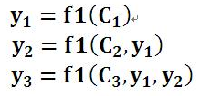{width="2.3958333333333335in" height="1.1041666666666667in"}

而每个Ci可能对应着不同的源语句子单词的注意力分配概率分布。可以理解为在翻译单词Y1时，输入单词X1、X2、X3、X4对其贡献的程度。

#### AM注意力分配概率计算：

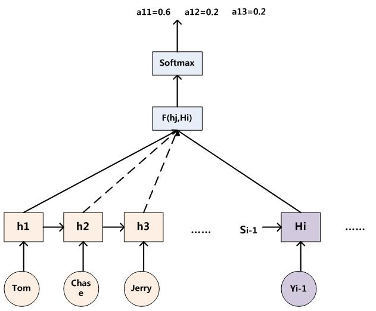{width="6.572916666666667in" height="5.427083333333333in"}

对于采用RNN的Decoder来说，如果要生成yi单词，在时刻i，我们是可以知道在生成Yi之前的隐层节点i时刻的输出值Hi的，而我们的目的是要计算生成Yi时的输入句子单词“Tom”、“Chase”、“Jerry”对Yi来说的注意力分配概率分布，那么可以用i时刻的隐层节点状态Hi去一一和输入句子中每个单词对应的RNN隐层节点状态hj进行对比，即通过函数F(hj,Hi)来获得目标单词Yi和每个输入单词对应的对齐可能性，这个F函数在不同论文里可能会采取不同的方法，然后函数F的输出经过Softmax进行归一化就得到了符合概率分布取值区间的注意力分配概率分布数值。

#### 中间语义Ci的计算：

例如：输入：Tom Chase Jerry 输出：汤姆 追逐 杰瑞

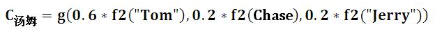{width="6.5in" height="0.5104166666666666in"}

其中，f2函数代表Encoder对输入英文单词的某种变换函数，比如如果Encoder是用的RNN模型的话，这个f2函数的结果往往是某个时刻输入xi后隐层节点的状态值；g代表Encoder根据单词的中间表示合成整个句子中间语义表示的变换函数,一般是加权和。对应的注意力模型权值分别是0.6,0.2,0.2。如果形象表示的话，翻译中文单词“汤姆”的时候，数学公式对应的中间语义表示Ci的形成过程类似下图：

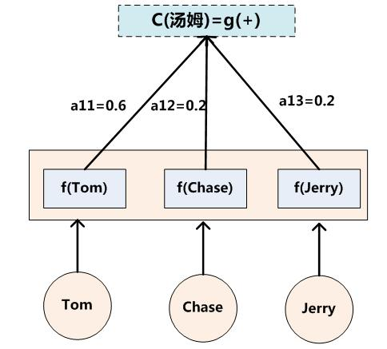{width="5.041666666666667in" height="4.552083333333333in"}

LSTM
====

**递归神经网络**（**RNN**）
---------------------------

> **参考文献：**[*http://blog.csdn.net/app\_12062011/article/details/54406225*](http://blog.csdn.net/app_12062011/article/details/54406225)
>
> **LSTM相关代码解释：**[*http://www.shareditor.com/blogshow/?blogId=116*](http://www.shareditor.com/blogshow/?blogId=116)

**递归神经网络**（**RNN**），是两种人工神经网络的总称，一种是**时间递归神经网络**（recurrent neural network），另一种是**结构递归神经网络**（recursive neural network）。现在大多数人把recurrent neural network称作循环神经网络，一般RNNs都指循环神经网络，也就是recurrent neural network。时间递归神经网络的神经元间连接构成有向图。，而结构递归神经网络利用相似的神经网络结构递归构造更为复杂的深度网络（大多数为无向图）。一般说的都是时间递归神经网络。

对于一些**有明显的上下文特征**的序列化输入，比如预测视频中下一帧的播放内容，那么很明显这样的**输出必须依赖以前的输入**， 也就是说网络必须拥有一定的**”记忆能力**”。为了赋予网络这样的记忆力，一种特殊结构的神经网络——**递归神经网络(Recurrent Neural Network)便应运而生了。**

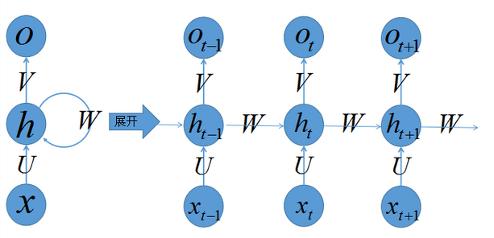{width="6.385416666666667in" height="3.0833333333333335in"}

右边是将左边按照时间展开的。

引入LSTM网络的原理
------------------

RNN不能解决我们所要**预测的内容和相关信息之间的间隔很大**的情况下，比如我们要预测“I grew up in France … (此处省略1万字)… I speak ?”这个预测的词应该是 Franch，但是我们是要通过很长很长之前提到的信息，才能做出这个正确的预测的呀，普通的 RNNs 很难做到这个。

**长短期记忆网络（Long Short Term Memory networks）** - 通常叫做 “LSTMs” —— 是 RNN 中一个特殊的类型。设计 LSTMs 主要是**为了避免前面提到的 长时期依赖 （long-term dependency ）的问题**。它们的本质就是能够记住很长时期内的信息，而且非常轻松就能做到。

下面是普通RNN与LSTM的内部结构图：

{width="6.018055555555556in" height="2.5723436132983375in"}

![C:\\Users\\zhangjing1\\AppData\\Roaming\\Tencent\\Users\\463261929\\QQ\\WinTemp\\RichOle\\(FZB\`)3\]\]}1A73OC\`\_@HU\[R.png](attention_ocr_images/media/image17.png){width="6.9284109798775155in" height="2.7604166666666665in"}

每个时序的神经网络可以理解为有四个神经网络层(图中黄色的激活函数部分)，最左边的是**忘记门**，它直接生效到记忆C上，第二个是**输入门**，它主要依赖于输入的样本数据，之后按照一定“比例”影响记忆C，这里的“比例”是通过**第三个层(tanh)**来实现的，因为它取值范围是\[-1,1\]可以是正向影响也可以是负向影响，最后一个是**输出门**，每一时序产生的输出既依赖于输入的样本x和上一时序的输出，还依赖于记忆C，整个设计几乎模仿了生物神经元的记忆功能，应该容易理解。

LSTMs 的核心思想
----------------

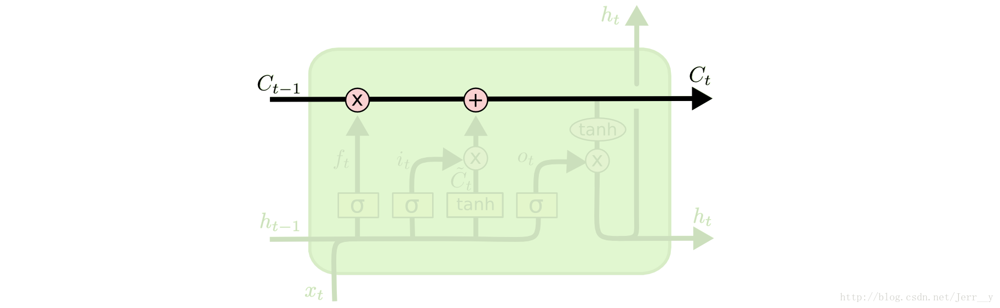{width="5.768055555555556in" height="1.7767115048118984in"}

LSTMs 最关键的地方在于 cell（整个绿色的框就是一个 cell） 的状态 和 结构图上面的那条横穿的水平线。

cell 状态的传输就像一条传送带，向量从整个 cell 中穿过，只是做了少量的线性操作。这种结构能够很轻松地实现信息从整个 cell 中穿过而不做改变。

若只有上面的那条水平线是没办法实现添加或者删除信息的。而是通过一种叫做 **门（gates）** 的结构来实现的。

### 遗忘门

首先是 LSTM 要决定让那些信息继续通过这个 cell，这是通过一个叫做“forget gate layer ”的sigmoid 神经层来实现的。它的输入是*ht*−1和*xt*，输出是一个数值都在 0，1 之间的向量（向量长度和 cell 的状态 *Ct*−1 一样），表示让 *Ct*−1 的各部分信息通过的比重。 **0 表示“不让任何信息通过”， 1 表示“让所有信息通过”。**

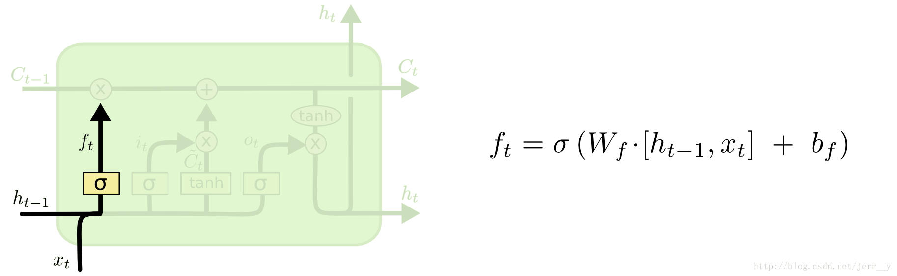{width="6.125in" height="1.8846161417322835in"}

### 传入门

下一步是决定让多少新的信息加入到 cell 状态 中来。实现这个需要包括两个 步骤：

首先，一个叫做“input gate layer ”的 sigmoid 层决定哪些信息需要更新；一个 tanh 层生成一个向量，也就是备选的用来更新的内容，*Ct*\~ 。在下一步，我们把这两部分联合起来，对 cell 的状态进行一个更新。

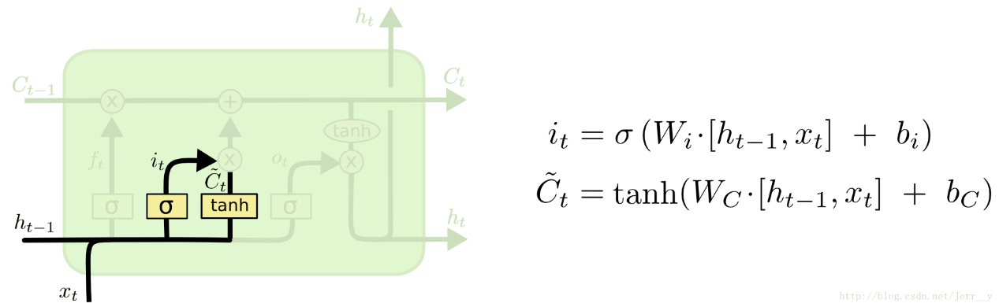{width="5.768055555555556in" height="1.7747867454068242in"}

在我们的语言模型的例子中，我们想把新的主语性别信息添加到 cell 状态中，来替换掉老的状态信息。\
有了上述的结构，我们就能够更新 cell 状态了， 即把*Ct*−1更新为 *Ct*。 从结构图中应该能一目了然， 首先我们把旧的状态 *Ct*−1和*ft*相乘， 把一些不想保留的信息忘掉。然后加上*it*∗*Ct*\~。这部分信息就是我们要添加的新内容。

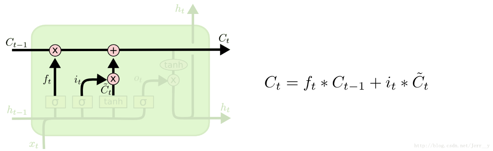{width="5.768055555555556in" height="1.7747867454068242in"}

### 输出门

最后，我们需要来决定输出什么值了。这个输出主要是依赖于 cell 的状态*Ct*，但是又不仅仅依赖于 *Ct*，而是需要经过一个过滤的处理。首先，我们还是使用一个 sigmoid 层来（计算出）决定*Ct*中的哪部分信息会被输出。接着，我们把*Ct*通过一个 tanh 层（把数值都归到 -1 和 1 之间），然后把 tanh 层的输出和 sigmoid 层计算出来的权重相乘，这样就得到了最后输出的结果。

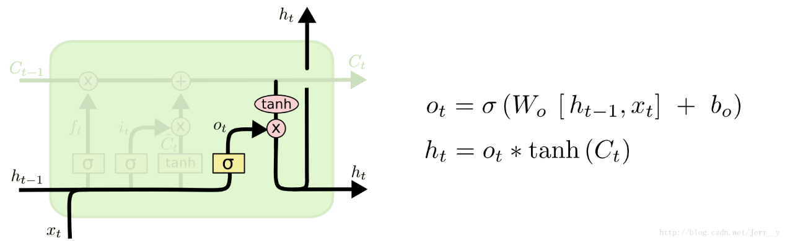{width="5.768055555555556in" height="1.7747867454068242in"}

三、Attention\_ocr
==================

Github: [*https://github.com/da03/Attention-OCR*](https://github.com/da03/Attention-OCR)

作者提供的模型：[*http://www.cs.cmu.edu/\~yuntiand/model.tgz*](http://www.cs.cmu.edu/~yuntiand/model.tgz)

**数据集**：（Synth 90k）包含900万的图像、9万的英语单词。

[*http://www.robots.ox.ac.uk/%7Evgg/data/text/\#sec-synth*](http://www.robots.ox.ac.uk/%7Evgg/data/text/#sec-synth)

Synth 90k数据集存放在100服务位置：/dataTwo/datasets/data/str/mnt/ramdisk/max/90kDICT32px

搭建环境
--------

1.  Keras 1.1.1 、tensorflow 0.11.0；

2.  安装distance，下载地址：[*http://www.cs.cmu.edu/\~yuntiand/Distance-0.1.3.tar.gz*](http://www.cs.cmu.edu/~yuntiand/Distance-0.1.3.tar.gz)

3.  安装PIL；之前遇到过使用作者提供的模型进行测试，结果准确率一直为0.0；原因是安装的PIL有问题使用的img.resize()函数内部出错，最后重新安装pip install Image,问题解决。

**备注**：关于运行环境以操作步骤，可参考作者的github。

测试
----

运行：python src/launcher.py --phase=**test** --visualize --data-path=../evaluation\_data/svt/test.txt --data-base-dir=../evaluation\_data/svt --log-path=test\_log.txt --load-model --model-dir=../model --output-dir=../results **--old-model-version**

**备注：**

1.  svt数据集的标签不区分大小写：如cropped/img/18\_01\_0.jpg door

2.  如果测试时不加**--old-model-version**， 数据集svt的准确率是29%；反之准确率是67%；

3.  作者提供训练的数据集Synth 90k的标签是区分大小写的，通过对作者提供的模型在/dataTwo/datasets/data/str/mnt/ramdisk/max/90kDICT32px/annotation\_test.txt

> 测试集上进行测试，发现作者提供的模型是不区分大小写的，意思就是大写也当小写处理，准确率是76%。

1.  annotation\_test.txt中标签是./3000/7/182\_**slinking**\_71711.jpg 71711 slinking是图像上的word，需要修改./src/data\_util/data\_gen.py/gen()函数，将word标签提取处理，改好的代码可参考/dataTwo/zhangjing/ocr/Attention\_OCR/Attention-OCR-master1/src/data\_util/data\_gen.py/gen(),主要是添加了is\_valid\_data（）函数。

训练
----

运行： ./train\_demo.sh

**备注：**需要修改训练数据集的路径、训练模型的存放位置等参数

Attention\_ocr代码解释
----------------------

### 1）数据预处理：

相关代码在./src/data\_util文件夹下面

1.  **图像**：不同的图片大小归一化到不同的w\*32（宽\*高）

2.  **标签**：代码只处理数字、小写字母，需要对标签重新进行编码，编码规则是根据字符的ASCII码将其重新编码到0\~38数字内，索引0\~2：padding、GO、EOS标志符；3\~12：数字0到9；13\~38：字母a到z；

**例如**：door 的重新编码是:\[GO，ord(d)-ord(a)+13，ord(o)-ord(a)+13，ord(o)-ord(a)+13，ord(r)-ord(a)+13，EOS\]=\[1,16,27,27,30,2\]

**注意**：ord(x)是求对应ASCII码；GO表示序列的开始；EOS是序列的结束。

**备注**：图像、标签预处理在./src/data\_util/data\_gen.py/read\_data()函数

1.  每个batch存放batch\_size个相同图像宽度的图像数据信息；

> **备注**：处理图像宽度的范围是（12,320）

1.  每个batch所包含的数据如下：

bucket\_id = batch\['bucket\_id'\] \#bucket的ID号，即下面分箱后属于哪个箱子

img\_data = batch\['data'\] \#图像数据

> zero\_paddings = batch\['zero\_paddings'\] \#np.array 大小(batch\_size, (encoder\_len-(w/4-1)),512) 目的是给特征图补零
>
> decoder\_inputs = batch\['decoder\_inputs'\] \#解码的输入，list、长度32、前几位是word标签的重新编码如\[1,16,27,27,30,2\]，后面全是0.真实标签；
>
> **备注**：
>
> **1）**对于测试我们是不需要真实标签的，它只用于准确率的计算，./src/model中grounds = \[a for a in np.array(\[decoder\_input.tolist() for decoder\_input in decoder\_inputs\]).transpose()\]
>
> 用于存放真实标签，计算基于字符的准确率。
>
> 2）需要注意下**参数forward\_only**，是一个布尔变量。
>
> False表训练意味着在解码器端，使用decoder\_inputs作为输入。例如，decoder\_inputs 是‘GO, W, X, Y, Z ’，正确的输出应该是’W, X, Y, Z, EOS’。假设第一个时刻的输出不是’W’，在第二个时刻也要使用’W’作为输入。
>
> 当设为true时，表示测试，只使用decoder\_inputs的第一个时刻的输入，即’GO’，以及解码器的在每一时刻的真实输出作为下一时刻的输入。
>
> 大家需要注意下虽然代码在测试时也输入了真实标签，实际代码里面是通过**参数forward\_only**将decoder\_inputs清空。
>
> target\_weights = batch\['target\_weights'\] \#list 大小32，前word重新编码后长度-1个1，后面全为0。
>
> encoder\_masks = batch\['encoder\_mask'\] \#list，大小编码长度，前w/4-1个1，后面全为0.

file\_list = batch\['filenames'\] \#图片路径

> real\_len = batch\['real\_len'\] \#图片宽度（归一化后的）

### 2) 分箱技术

Bucketing是一种有效处理不同长度的句子的方法。例如将英语翻译成法语时，输入具有不同长度的英语句子L1，输出是具有不同长度的法语句子L2，原则上应该为每一对（L1，L2 + 1）创建一个seq2seq模型。这会导致图很大，包括许多非常相似的子图。另一方面，我们可以用一个特殊的\_PAD符号填充每个句子。然后，只需要一个seq2seq模型。但是对于较短的句子，要编码和解码许多无用的PAD符号，这样的模型也是低效的。作为折中，使用多个buckets 并且将每个句子填充为对应的bucket的长度。

根据图像的宽度创建5个buckets ,也就是说将所有的图像分成5类用了5个seq2seq模型来进行处理的，训练、预测的有所不同。

**预测**：self.bucket\_specs = \[(64 / 4, word\_len + 2), (108 / 4, word\_len + 2),

(140 / 4, word\_len + 2), (256 / 4, word\_len + 2),

(img\_width\_range\[1\] / 4, word\_len + 2)\]

**=\[(16, 32), (27, 32), (35, 32), (64, 32), (80, 32)\] **

**训练：**self.bucket\_specs = \[(64 / 4, 9 + 2), (108 / 4, 15 + 2),

(140 / 4, 17 + 2), (256 / 4, 20 + 2),

(img\_width\_range\[1\] / 4, word\_len + 2)\]

**= \[(16,11), (27,17),(35,19),(64,22),(80,32)\]**

**备注：**可处理的word最大长度word\_len=30；可处理的图像宽度范围\[12,320\]; 对于预测模块中(16, 32)表示编码长度是16，解码长度是32。

### 3）attention\_ocr结构

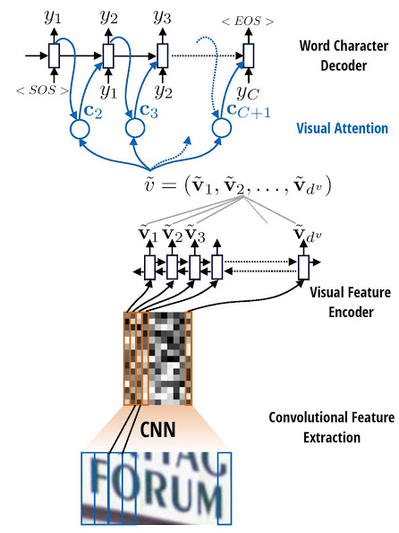{width="4.645833333333333in" height="6.197916666666667in"}

#### **特征提取：**

采样CNN网络结构提取图像特征，代码在./src/model/cnn.py，处理后的图像大小是（w/2\^2-1 ,h/2\^4-1）， 最终的输出（batch\_size, （w/2\^2-1）\*（h/2\^4-1）, 512）。

#### Encoder模块：

编码模块采用**双向LSTM**，代码在./src/model/ seq2seq\_model.py中。

**主要的代码解释：**

num\_hidden = attn\_num\_layers \* attn\_num\_hidden \#2\*128

\# **定义单个基本的LSTM单元**，这里分正向、反向两个LSTM单元；

\# num\_hidden是隐藏层的神经元个数；

\# 在LSTM单元中，有2个状态值，分别是c和h，当state\_is\_tuple=True的时候，state是**元组**形式，state=(c,h)。如果是False，那么state是一个由c和h拼接起来的**张量**，state=tf.concat(1,\[c,h\])。**BasicLSTMCell()返回2值，一个是h，还有一个state。**

lstm\_fw\_cell = tf.nn.rnn\_cell.**BasicLSTMCell**(num\_hidden, forget\_bias=0.0, state\_is\_tuple=False)

lstm\_bw\_cell = tf.nn.rnn\_cell.**BasicLSTMCell**(num\_hidden, forget\_bias=0.0, state\_is\_tuple=False)

\#**构建双向LSTM网络**

**输入**：

lstm\_fw\_cell, lstm\_bw\_cell： 前向、后向LSTM单元；

> lstm\_inputs：特征图，比如原图像大小是32\*100（h\*w）,CNN的输出是(batch\_szie,24,512), 进行变换补零lstm\_inputs的大小变成（27,batch\_size,512）, 27的原因是根据图像宽度选择buckets\_spec中（27,32）这对编解码组合，维度变换的目的是每个时刻输入一个描述字符特征的512大小的向量；
>
> **输出**：
>
> pre\_encoder\_inputs：是LSTM单元的状态值h，是list数据类型，大小encoder\_len，每个list又是tensor类型，大小为（batch\_size,512），该512=256个前向h+后向h.
>
> output\_state\_fw, output\_state\_bw：是LSTM单元状态值h，c的组合state，tensor类型，大小(batch\_size,512)，该512=256个h+256个c。

pre\_encoder\_inputs , output\_state\_fw, output\_state\_bw = tf.nn.**bidirectional\_rnn**(lstm\_fw\_cell, lstm\_bw\_cell, lstm\_inputs,initial\_state\_fw=None, initial\_state\_bw=None, dtype=tf.float32, sequence\_length=None, scope=None)

#### Decoder模块：

解码模块采用**双层LSTM**，代码在./src/model/ seq2seq\_model.py中。

**主要的代码解释：**

\# 先构建基本的LSTM单元，再**构建双层LSTM网络**

single\_cell=tf.nn.rnn\_cell**.BasicLSTMCell**(attn\_num\_hidden,forget\_bias=0.0, state\_is\_tuple=False)

cell = tf.nn.rnn\_cell.**MultiRNNCell**(\[single\_cell\] \* attn\_num\_layers, state\_is\_tuple=False)

\#**主要函数：**

1.  **embedding\_attention\_decoder()**函数，该函数实现了**解码和attention**两部分功能。

def **embedding\_attention\_decoder**(decoder\_inputs, initial\_state, attention\_states,cell, num\_symbols, embedding\_size, num\_heads=1,

output\_size=None, output\_projection=None, feed\_previous=False, update\_embedding\_for\_previous=True,

dtype=dtypes.float32, scope=None,

initial\_state\_attention=False, attn\_num\_hidden=128)

**输入的主要参数：**

1）attention\_states：为编码模块每个序列的输出；

2）initial\_state：编码模块最后序列的state；state=\[c,h\]

3）decoder\_inputs：解码模块每个序列的输入

> 训练时，feed\_previous为false，此时解码模块每个序列的输入为标签，此时，decoder\_inputs中的值为标签的编码；
>
> 测试时，feed\_previous为true，此时解码模块每个序列的输入为上一个解码节点的输出，此时，decoder\_inputs中的值只有第一位GO有意义，其余的值都不用。

4）embedding\_size：解码中每个序列的输入值用多少位表示。如识别26个小写英文字母和10个数字，embedding\_size 设置为10，表示每个字符用10位表示。

5）feed\_previous：控制解码中每个序列的输入值是真实标签值还是上一个解码节点的输出值。

6）num\_symbols：输出值的类别数。如识别26个小写英文字母和10个数字，那么num\_symbols就是39（还有三个标志位：GO,EOS,PADDING）。

7）cell：解码层基本单元的结构，即每个序列的结构。如两层LSTM。

**输出有三个值:**

1)outputs: 解码模块中每个序列的输出值，即最终的预测结果。

2)state: 解码模块最后的状态值，包括h(t)和C(t)。

3)attention\_weights\_history: 注意力的权重参数。包括每个解码序列对应编码序列中的权重。

embedding\_attention\_decoder函数的核心是调用**attention\_decoder**函数，实现了上述的注意力和解码功能。

1.  **attention\_decoder()**函数，该函数是实现了解码和attention两部分功能的核心。

def **attention\_decoder**(decoder\_inputs, initial\_state, attention\_states, cell, output\_size=None, num\_heads=1, loop\_function=None, dtype=dtypes.float32, scope=None,

initial\_state\_attention=False, attn\_num\_hidden=128)

这里大部分的参数和embedding\_attention\_decoder函数的参数一致，新增参数为有loop\_function。

**loop\_function**这个函数如果在训练阶段，就是个None，解码模块下一个序列的输入值就是decoder\_inputs中对应的值。如果在测试阶段，是个可以获取前一个序列输出值的函数。用该函数获取前一个序列输出值，然后作为下一个序列的输入值。

**attention\_decoder函数的输出结果的计算过程如下：**

1)**运行cell**，参数为decoder\_input的某个序列，以及前一个序列的状态，返回值为新序列的输出值和状态：

cell\_output, new\_state = cell(linear(input, prev\_attn), prev\_state)

input：解码模块某个序列的输入

prev\_attn：解码模块某个序列的前一个序列的注意力

prev\_state：解码模块某个序列的前一个序列的状态

2)**计算新序列的注意力权重**：

new\_at\_mk = softmax(V\^T \* tanh(W \* attention\_states + U \* new\_state))

new\_at\_mk为编码模块的每个序列的注意力权重。其中：

> attention\_states：为编码模块的每个序列的输出值，编码模块有多少个序列，这个值就有多少个。

new\_state：为当前解码序列的状态

new\_attn = new\_at\_mk\* attention\_states

new\_attn为新序列的注意力值，其中：

new\_at\_mk：为编码模块的每个序列的注意力权重；

attention\_states：为编码模块的每个序列的输出值；

后面有这部分实现的代码。其中，W \* attention\_states是通过卷积层实现的；U \* new\_state是通过linear函数实现的；

**3)计算output：**

output = linear(cell\_output, new\_attn)

解码的某个序列的最终预测值。

注意力计算公式如下：

$$a_{\text{ij}} = softmax(V^{T}*tanh(W*hidden\_ features\  + \ U*new\_ state\ \ ))$$

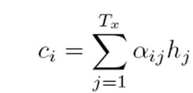{width="1.2041797900262468in" height="0.5820898950131234in"}

其中a为每个编码序列输出值对应的注意力权重，c为注意力的值。

下图是这部分具体代码的实现：

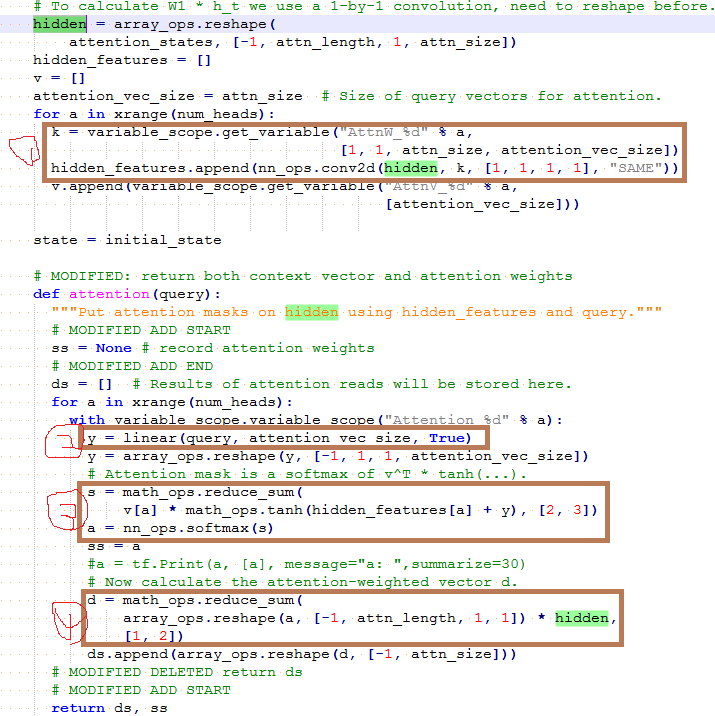{width="5.768055555555556in" height="5.768055555555556in"}

按照上面的序号，依次完成以下功能：

softmax(V\^T \* tanh(W \* attention\_states + U \* new\_state))

a.  k为上面公式中的W，conv2d(hidden, k, \[1, 1, 1, 1\], "SAME")实现了上面公式中的W \* attention\_states，其中W是个需要学习的权重参数。

b.  y为上面的new\_state，linear实现了U \* new\_state，这里隐藏了一个需要学习权重参数U；
